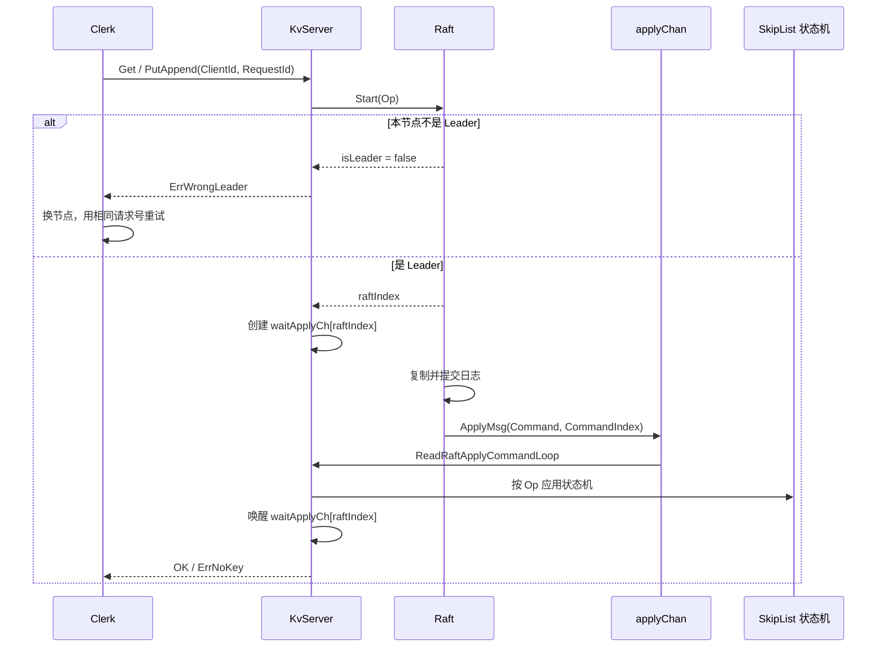

# KvServer 中的 Raft：快速上手

这份文档面向第一次阅读本项目 `KvServer` 的同学。目标是先建立一条完整的请求链路，再理解 `KvServer` 如何把 Raft 的已提交日志变成实际的 KV 状态。

## 先记住一句话

`KvServer` 是 **Raft 上层的复制状态机适配器**：它不直接把 RPC 写入本地数据库，而是先把请求包装成 `Op` 交给 Raft；只有该日志被多数节点提交、Raft 通过 `ApplyMsg` 交回后，它才修改本地 KV 数据。

因此可以把职责分成三层：

| 层 | 关键类型/文件 | 职责 |
| --- | --- | --- |
| 客户端 | `Clerk`，`src/raftClerk/clerk.cpp` | 生成稳定的 `ClientId + RequestId`，遇到非 Leader 时轮询重试。 |
| KV 服务 | `KvServer`，`src/raftCore/include/kvServer.h` | 提供 Get/Put/Append RPC、等待提交结果、去重、应用日志、生成/恢复快照。 |
| 共识层 | `Raft`，`src/raftCore/include/raft.h` | 选主、复制日志、推进 `commitIndex`，把已提交日志投递到 `applyChan`。 |

客户端 RPC 契约定义在 `src/raftRpcPro/kvServerRPC.proto`；Raft 节点间 RPC 则在 `raftRPC.proto`。两者是不同的通信面。

## 架构与数据流



这里最重要的关联键是 **Raft 日志索引**：`waitApplyCh[raftIndex]` 把一次 RPC 与同一条日志的应用结果关联起来。接到通知后，RPC 处理函数还会比较 `ClientId` 和 `RequestId`，防止 Leader 更替后同一索引已被别的日志占用而误报成功。

## KvServer 的状态

`KvServer` 的字段可按用途阅读：

| 字段 | 含义 |
| --- | --- |
| `m_raftNode` | 本节点的 Raft 实例。所有客户端操作都通过它进入复制日志。 |
| `applyChan` | `LockQueue<ApplyMsg>`，Raft 向 KV 状态机交付已提交命令或快照的单向通道。 |
| `m_skipList` | 当前实际使用的 KV 容器；`m_kvDB` 是遗留字段，当前执行路径不使用它。 |
| `m_lastRequestId` | `ClientId -> 最大已处理 RequestId`，用于抑制 Put/Append 的重复执行。 |
| `waitApplyCh` | `raftIndex -> LockQueue<Op>*`，正在等待提交结果的 RPC 对应的临时通知通道。 |
| `m_lastSnapShotRaftLogIndex` | 状态机已恢复快照覆盖到的 Raft 索引，避免重复应用早期日志。 |

命令载体 `Op` 定义于 `src/common/include/util.h`，包含 `Operation`、`Key`、`Value`、`ClientId`、`RequestId`。`Raft::Start` 将它序列化写入 `LogEntry.command`；应用端用 `Op::parseFromString()` 还原。

## 启动时发生了什么

构造函数 `KvServer::KvServer`（`src/raftCore/kvServer.cpp`）完成以下工作：

1. 创建该节点的 `Persister`、`applyChan`、`Raft` 对象和跳表。
2. 启动 `RpcProvider` 线程，并同时注册 `KvServer` 与 `Raft` 两个 Protobuf service。因此同一端口既接受客户端 KV RPC，也接受其他 Raft 节点的 AppendEntries、RequestVote、InstallSnapshot RPC。
3. 读取配置文件中的全部节点地址，为其他节点构建 `RaftRpcUtil`。
4. 调用 `m_raftNode->init(servers, m_me, persister, applyChan)`，把同一个持久化器和应用队列交给 Raft。
5. 从 `Persister` 读取最新 KV 快照，随后启动 `ReadRaftApplyCommandLoop()`。

当前实现采用固定 `sleep` 等待所有示例节点启动，且构造函数最后 `join` 应用线程。它适合作为演示程序的常驻服务生命周期，不是可随时构造/销毁的库式对象。

## 写请求：PutAppend 如何跨过 Raft

核心函数是 `KvServer::PutAppend`（约 212 行）。其逻辑可浓缩为：

```cpp
Op op = fromRpc(args);
raft->Start(op, &index, &term, &isLeader);
if (!isLeader) return ErrWrongLeader;

auto* channel = ensureWaitChannel(index);
if (!channel->timeOutPop(CONSENSUS_TIMEOUT, &appliedOp)) {
  return ifRequestDuplicate(op.ClientId, op.RequestId) ? OK : ErrWrongLeader;
}
return sameRequest(appliedOp, op) ? OK : ErrWrongLeader;
```

为什么这样写：

- `Raft::Start` 只表示 Leader 已把命令追加到**本地**日志，尚不代表多数派提交。
- RPC 线程必须等应用循环收到对应的 `ApplyMsg` 才能向客户端返回成功。
- 超时不等价于操作失败：命令可能刚好已经提交但通知迟到。对写操作，若 `m_lastRequestId` 说明该请求已执行，就安全返回 `OK`；否则交给 Clerk 重试。
- 即使按索引收到消息，也要比较请求标识。Leader 失去领导权后未提交日志可能被新 Leader 覆盖。

`Raft::Start`（`src/raftCore/raft.cpp` 约 947 行）本身做得很小：持有 Raft 互斥锁，拒绝非 Leader，生成 `LogEntry { command, currentTerm, newIndex }`，追加并持久化，然后返回索引与任期。日志复制和提交由 Raft 的心跳/复制路径异步完成。

## 读请求：Get 为什么也进入 Raft

`KvServer::Get`（约 79 行）同样构造 `Operation = "Get"` 的 `Op`，调用 `Start`，并等待同一日志索引被应用。这样读取排在已提交写入之后，意图是让读到的状态与 Raft 提交顺序一致。

收到通知后，RPC 线程才调用 `ExecuteGetOpOnKVDB` 从跳表读取值，设置 `OK` 或 `ErrNoKey`。Get 的超时分支会在请求已被记录且本节点仍是 Leader 时再次读取；否则返回 `ErrWrongLeader` 促使 Clerk 重试。

注意：`GetCommandFromRaft` 对 Get 不直接读取状态机，也不把 Get 记为已完成；读取及 `m_lastRequestId` 更新发生在等待线程的 `ExecuteGetOpOnKVDB` 中。这是本项目当前的实现分工。

## 已提交日志如何应用

### 1. Raft 投递 ApplyMsg

`Raft::applierTicker` 持锁调用 `getApplyLogs()`，取出 `m_lastApplied` 到 `m_commitIndex` 范围内的命令，释放锁后逐个 `Push` 到 `applyChan`。`ApplyMsg` 的格式见 `src/raftCore/include/ApplyMsg.h`：

- `CommandValid + Command + CommandIndex` 表示一条已提交业务命令。
- `SnapshotValid + Snapshot + SnapshotTerm + SnapshotIndex` 表示需要状态机安装快照。

### 2. KvServer 消费并分派

`ReadRaftApplyCommandLoop` 是永久循环：阻塞 `Pop()` 一条消息，命令走 `GetCommandFromRaft`，快照走 `GetSnapShotFromRaft`。因此状态机的变更集中在一个应用入口，而不发生在 RPC 收包时。

### 3. GetCommandFromRaft

`GetCommandFromRaft`（约 166 行）是状态机的关键函数：

```cpp
Op op = deserialize(message.Command);
if (message.CommandIndex <= m_lastSnapShotRaftLogIndex) return;

if (!ifRequestDuplicate(op.ClientId, op.RequestId)) {
  if (op.Operation == "Put") ExecutePutOpOnKVDB(op);
  if (op.Operation == "Append") ExecuteAppendOpOnKVDB(op);
}

maybeSnapshot(message.CommandIndex);
SendMessageToWaitChan(op, message.CommandIndex);
```

这里体现两个 Raft 上层必须维护的不变量：

- **只应用已提交日志**：Raft 保证投递时机；KvServer 不在 `Start` 后直接改数据库。
- **写请求至多执行一次**：同一客户端的旧请求号不再执行 Put/Append，但仍会发送通知，让重试中的 RPC 能结束。

`SendMessageToWaitChan` 在互斥锁保护下查找 `waitApplyCh[index]`，存在时把实际应用的 `Op` 推入。找不到时返回 `false`，例如该请求已超时并清理了通道，或该节点本来就没有对应的本地 RPC。

## 状态机的实际行为

- `ExecutePutOpOnKVDB` 调用 `m_skipList.insert_set_element(key, value)`，然后更新最后请求号。
- `ExecuteAppendOpOnKVDB` 目前也调用同一个 `insert_set_element`。
- `ExecuteGetOpOnKVDB` 调用 `search_element`，并更新最后请求号。

因此，代码中名为 `Append` 的路径**当前行为是覆盖该键的值，而不是将新值拼接到旧值后面**。原因是 `SkipList::insert_set_element` 的实现会先删除旧节点，再插入新值。理解或扩展语义时应以此实际实现为准。

## 快照路径

快照把“状态机已经拥有的数据”交给 Raft，以便截断旧日志并在重启或落后节点时恢复。

1. `GetCommandFromRaft` 在每条命令应用后调用 `IfNeedToSendSnapShotCommand`。
2. 当 `Raft::GetRaftStateSize()` 超过阈值时，`MakeSnapShot` 调用 `getSnapshotData()`：跳表导出为字符串，再与 `m_lastRequestId` 一起经 Boost 序列化。
3. `Raft::Snapshot(index, snapshot)` 更新快照边界、裁剪对应日志，并由 `Persister::Save` 原子保存 Raft 状态和快照。
4. 重启时构造函数读取快照，`ReadSnapShotToInstall` 反序列化去重表并恢复跳表。
5. Raft 通过 `ApplyMsg(SnapshotValid)` 交付远端安装快照时，`GetSnapShotFromRaft` 调用 `CondInstallSnapshot` 后恢复状态机，并更新 `m_lastSnapShotRaftLogIndex`。

当前快照实现有两点值得优先阅读时留意：

- `IfNeedToSendSnapShotCommand` 接收 `proportion` 参数但条件实际使用固定的 `m_maxRaftState / 10.0`；传入的 `9` 并未影响阈值。
- `Raft::CondInstallSnapshot` 当前直接返回 `true`，其中的过期快照校验逻辑仍是注释。因此它是学习/继续完善快照语义的明确入口。

## 并发与正确性要点

| 问题 | 当前处理方式 |
| --- | --- |
| 多个 RPC 和应用循环同时访问状态 | `m_mtx` 保护跳表、去重表和 `waitApplyCh`。等待通道时主动释放锁，避免阻塞应用循环。 |
| 客户端超时重试 | Clerk 保持相同 `ClientId/RequestId`，服务端用 `m_lastRequestId` 去重。 |
| Leader 更替 | 非 Leader 立即返回 `ErrWrongLeader`；等待结果时再次校验请求标识，超时后让 Clerk 重新找 Leader。 |
| 重启恢复 | Raft 恢复任期/投票/日志，KvServer 恢复跳表和去重表快照。两者共享同一个 `Persister`。 |

一个阅读上的关键提醒：按 `raftIndex` 创建等待通道发生在 `Start` 返回之后，而提交与应用是异步的。成熟实现通常会特别审视“命令已应用但通道尚未创建”和“超时清理与晚到通知”两类竞态。本项目通过超时和请求号校验缓解结果不确定性，但这也是后续改进最值得加测试的区域。

## 推荐阅读顺序

1. `src/raftRpcPro/kvServerRPC.proto`：明确客户端请求和应答字段。
2. `src/common/include/util.h` 中的 `Op`：理解到底是哪份命令进入日志。
3. `src/raftCore/include/kvServer.h`：先把字段按上表分类。
4. `src/raftCore/kvServer.cpp`：依次读构造函数、`PutAppend`、`Get`、`ReadRaftApplyCommandLoop`、`GetCommandFromRaft`、快照函数。
5. `src/raftCore/raft.cpp` 的 `Start`、`applierTicker`、`Snapshot`：理解 Raft 对上层暴露的三个关键边界。
6. `src/raftClerk/clerk.cpp`：回看客户端如何用稳定请求号处理 `ErrWrongLeader`。

如果只调试一条 Put 链路，建议在 `KvServer::PutAppend`、`Raft::Start`、`Raft::applierTicker`、`KvServer::GetCommandFromRaft` 和 `KvServer::SendMessageToWaitChan` 依次断点。你会看到同一个 `ClientId/RequestId` 从客户端 RPC 进入日志，最终在已提交后回到原来的 RPC 等待者。
