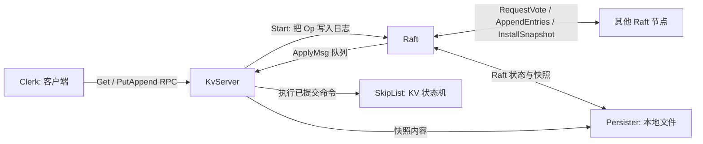

# 从 `t.detach()` 开始理解 Raft KV

本文从 `KvServer` 构造函数中的 `t.detach()` 开始。目标不是逐字解释代码，而是回答四个问题：

1. 一个 KV 节点启动后，怎样成为一个可通信的 Raft 节点？
2. `KvServer`、`Raft`、RPC 和本地 KV 数据各自负责什么？
3. 一次 `Put`、`Append`、`Get` 如何走完整条链路？
4. 接下来应该按什么顺序学习和验证这个集群？

涉及的主要源码：

- `src/raftCore/kvServer.cpp`，尤其是 377--450 行
- `src/raftCore/include/kvServer.h`
- `src/raftCore/include/raft.h` 与 `src/raftCore/raft.cpp`
- `src/raftCore/raftRpcUtil.cpp`
- `src/raftRpcPro/raftRPC.proto` 与 `src/raftRpcPro/kvServerRPC.proto`

## 先建立全局图

一个进程只创建一个 `KvServer`，但这个对象同时带着两层服务：



其中最重要的边界是：

- `KvServer` 不自己决定命令顺序。它把业务命令交给 `Raft`。
- `Raft` 不理解 key 和 value。它只负责让各节点以相同顺序提交命令。
- 只有命令经 `Raft` 提交，并通过 `ApplyMsg` 返回后，`KvServer` 才修改本地 KV 状态机。

这就是“复制状态机”：每个节点执行相同命令序列，因此得到相同的 KV 数据。

## 一、`t.detach()` 后构造函数做了什么

下面是 `KvServer::KvServer` 在 `t.detach()` 之后的实际顺序。

| 阶段 | 代码位置 | 做的事 | 目的 |
| --- | --- | --- | --- |
| 等待 | `kvServer.cpp:401-403` | `sleep(6)` | 等其他进程先启动 RPC 服务 |
| 读配置 | `405-417` | 读取 `node0ip/node0port`、`node1ip/node1port` 等 | 找到集群所有节点地址 |
| 建代理 | `419-432` | 为其他节点创建 `RaftRpcUtil` | 后续能向其他 Raft 节点发 RPC |
| 再等待 | `433` | 等待所有节点互相建好代理 | 避免立刻发送 RPC 时对方还没监听 |
| 初始化 Raft | `434` | 调用 `m_raftNode->init(...)` | 恢复状态并启动选举、心跳、应用循环 |
| 初始化 KV 恢复点 | `444-448` | 从 `Persister` 读快照并恢复 | 让状态机回到快照记录的内容 |
| 消费应用消息 | `449-450` | 运行 `ReadRaftApplyCommandLoop()` | 不断把已提交日志真正执行到 KV 数据库 |

最后的 `t2.join()` 很重要：`ReadRaftApplyCommandLoop()` 是无限循环，因此构造函数不会返回。这是该演示程序让子进程持续运行的方式。`example/raftCoreExample/raftKvDB.cpp` 中构造完成后的 `pause()` 在正常情况下也就到不了。

### 1. `t.detach()` 之前已经发生的事

构造函数前半段完成了本节点最基础的对象创建：

```cpp
std::shared_ptr<Persister> persister = std::make_shared<Persister>(me);
applyChan = std::make_shared<LockQueue<ApplyMsg>>();
m_raftNode = std::make_shared<Raft>();
```

随后启动的线程创建 `RpcProvider`，并注册两个服务：

```cpp
provider.NotifyService(this);               // KV 客户端 RPC
provider.NotifyService(m_raftNode.get());   // Raft 节点间 RPC
provider.Run(m_me, nodeInforFileName, port);
```

所以同一个监听端口接收两类 RPC：

- `kvServerRpc.Get` 和 `kvServerRpc.PutAppend`，由客户端调用；
- `raftRpc.RequestVote`、`raftRpc.AppendEntries`、`raftRpc.InstallSnapshot`，由其他 Raft 节点调用。

`detach()` 的含义是让这个 RPC 接收线程在后台继续跑。因为 `provider.Run()` 会阻塞等待网络请求，构造函数主线程不能在这里等待它结束。

### 2. 为什么先启动 RPC 服务，再连接其他节点

每个节点既是服务器，也是客户端：

- 它必须先监听，才能接收别人的投票、心跳和日志；
- 它也必须保存到每个同伴的调用代理，才能主动发投票、心跳和日志。

`RaftRpcUtil` 是这个“主动调用代理”。构造时它为指定的 `ip:port` 创建 Protobuf Stub：

```cpp
stub_ = new raftRpcProctoc::raftRpc_Stub(new MprpcChannel(ip, port, true));
```

以后 `Raft` 调用 `m_peers[i]->AppendEntries(...)`，最终就是通过这个 Stub 向第 `i` 个节点发网络请求。

`servers[m_me]` 被放成 `nullptr`，因为节点不需要通过网络调用自己。节点编号和配置文件中的 `nodeN` 顺序必须一致，这是 `m_peers` 数组正确工作的前提。

### 3. 两处 `sleep` 的真实作用与局限

`sleep(6)` 和 `sleep(ipPortVt.size() - me)` 是启动时序的临时协调手段，并不是 Raft 算法的一部分。它们试图避免“节点 A 已经开始发 RPC，但节点 B 还没监听”的情况。

学习时可以把它理解成“演示程序的启动屏障”，但不要把它当成可靠的集群成员发现方案。真实系统通常会使用配置中心、重试连接、健康检查或显式启动协调。

## 二、重要成员：先分清属于谁

### `KvServer` 的成员

| 成员 | 定义位置 | 含义 | 何时使用 |
| --- | --- | --- | --- |
| `m_mtx` | `kvServer.h:27` | KV 服务自己的互斥锁 | 保护状态机、去重表和等待表 |
| `m_me` | `:28` | 当前节点编号 | 日志、配置和 RPC 服务启动 |
| `m_raftNode` | `:29` | 当前节点内嵌的 Raft 核心 | 客户端请求调用 `Start`；快照调用 Raft 接口 |
| `applyChan` | `:30` | `Raft -> KvServer` 的阻塞队列 | Raft 只把已提交命令放入这里 |
| `m_maxRaftState` | `:31` | 希望控制 Raft 状态大小的阈值 | 决定是否请求制作快照 |
| `m_skipList` | `:35` | 当前真正使用的本地 KV 容器 | `Put`、`Append`、`Get` 和快照 |
| `m_kvDB` | `:36` | 另一个 `unordered_map` 版本的 KV 容器 | 当前实现中相关代码被注释，没有参与实际读写 |
| `waitApplyCh` | `:38` | `raftIndex -> LockQueue<Op>*` 映射 | 让一个 RPC 请求等待“自己的日志已提交” |
| `m_lastRequestId` | `:41` | `clientId -> 最大 requestId` | 客户端重试时避免重复写入 |
| `m_lastSnapShotRaftLogIndex` | `:44` | 已装入状态机的快照边界 | 忽略该边界之前再次送来的日志 |

有一个容易误读的细节：构造函数里的 `m_skipList;`、`waitApplyCh;`、`m_lastRequestId;` 只是表达式语句，不是重新初始化。它们本来已经由成员默认构造完成。真正显式赋值的是 `m_lastSnapShotRaftLogIndex = 0`。

### `Raft` 的成员

| 成员 | 含义 | 为什么重要 |
| --- | --- | --- |
| `m_peers` | 指向其他节点的 `RaftRpcUtil` 列表 | 所有节点间 RPC 的出口 |
| `m_persister` | 本节点的文件持久化器 | 保存 Raft 状态和快照 |
| `m_me` | 本节点编号 | 确定自己在 `m_peers` 中的位置 |
| `m_currentTerm` | 当前任期 | 识别新旧领导者，Raft 的第一层安全边界 |
| `m_votedFor` | 当前任期投给谁 | 保证每个节点每任期至多投一票 |
| `m_logs` | 尚未被快照截断的日志 | 保存待复制、待提交的 `Op` 命令 |
| `m_commitIndex` | 已被多数派确认的最大日志索引 | 不大于它的日志才允许交给状态机 |
| `m_lastApplied` | 已经交给状态机的最大日志索引 | 防止同一条日志重复投递 |
| `m_nextIndex[i]` | 领导者下次要向节点 `i` 发送的日志索引 | 日志不匹配时向前回退并重试 |
| `m_matchIndex[i]` | 已确认节点 `i` 拥有的最大日志索引 | 帮助领导者判断是否已有多数副本 |
| `m_status` | `Follower`、`Candidate` 或 `Leader` | 决定节点会等待、拉票还是复制日志 |
| `applyChan` | 与 `KvServer` 共享的应用队列 | 把“已提交”转化为“执行到状态机” |
| 两个时间点 | 选举和心跳的最近重置时间 | 驱动选举超时和领导者心跳 |
| 快照索引与任期 | `m_lastSnapshotIncludeIndex/Term` | 说明被截断日志的边界，维持日志索引连续性 |
| `m_ioManager` | 协程调度器 | 运行选举超时和心跳定时循环 |

最需要牢记的三个索引不是一回事：

```text
日志已复制到多数派:        m_commitIndex
日志已交给 KV 状态机执行:  m_lastApplied
快照已经覆盖到哪里:        m_lastSnapshotIncludeIndex
```

通常有 `lastSnapshotIncludeIndex <= lastApplied <= commitIndex`。把这三个值混在一起，是读 Raft 快照代码时最常见的困难。

### `ApplyMsg` 与 `Persister`

`ApplyMsg` 是 Raft 和业务状态机之间唯一的数据边界：

- `CommandValid == true`：`Command` 中是可执行的序列化 `Op`，`CommandIndex` 是其 Raft 日志索引；
- `SnapshotValid == true`：携带快照数据、边界任期和边界索引。

`Persister` 保存两块内容：

- Raft 自己的元数据和日志：任期、投票对象、快照边界、日志；
- 由 `KvServer` 制作的状态机快照：跳表内容和去重表。

Raft 不解析快照内部的 KV 格式；它只保存、传输和在需要时让上层安装它。这种分工很重要。

## 三、`Raft::init` 如何把普通对象变成节点

`KvServer` 在 `kvServer.cpp:434` 调用：

```cpp
m_raftNode->init(servers, m_me, persister, applyChan);
```

这四个参数分别是：同伴 RPC 代理、自己的编号、持久化对象和应用消息队列。

`Raft::init`（`raft.cpp:988`）做的工作按顺序是：

1. 保存四个外部依赖到成员变量。
2. 设置一个新节点的内存初值：`Follower`、任期 `0`、未投票、空日志、`commitIndex = 0`、`lastApplied = 0`。
3. 为每一个节点位置准备 `m_nextIndex` 和 `m_matchIndex`。
4. 调用 `readPersist(m_persister->ReadRaftState())`，用之前保存的状态覆盖默认值。
5. 建立 `IOManager`，启动两个长期运行的协程任务：心跳循环和选举超时循环。
6. 启动并分离 `applierTicker` 线程，持续将 `[lastApplied + 1, commitIndex]` 的日志包装成 `ApplyMsg` 推给 `applyChan`。

这里的关键概念是：**`Raft::Start` 不等于命令已执行**。`Start` 只是领导者把命令放入自己的日志；真正执行至少还要经历复制、多数派确认、推进 `commitIndex`、`applierTicker` 投递、`KvServer` 消费五步。

## 四、Raft 节点之间怎样沟通

节点通信协议以 `src/raftRpcPro/raftRPC.proto` 为准。不要手改 `*.pb.h` 或 `*.pb.cc`，修改协议应从 `.proto` 开始。

| RPC | 发起者 | 用途 | 最关键字段 |
| --- | --- | --- | --- |
| `RequestVote` | Candidate | 拉票并尝试成为 Leader | `Term`、候选者 ID、最后日志的 index/term |
| `AppendEntries` | Leader | 心跳和日志复制 | `PrevLogIndex/Term`、`Entries`、`LeaderCommit` |
| `InstallSnapshot` | Leader | 给严重落后的 Follower 发送状态快照 | 快照边界 index/term 与 `Data` |

### 选举流程

当 Follower 在随机选举超时内没有收到有效心跳时，`electionTimeOutTicker()` 调用 `doElection()`：

1. 变成 `Candidate`，`m_currentTerm++`；
2. 投票给自己，并持久化任期和投票信息；
3. 把自己的最后日志位置放入 `RequestVoteArgs`；
4. 用一个线程向每个同伴调用 `sendRequestVote()`；
5. 接收方只有在“候选者日志不落后”且“本任期尚未投给别人”时才投票；
6. 票数达到多数后，候选者变为 `Leader`，并把每个 `nextIndex` 初始化为“自己最后日志索引 + 1”；
7. 新 Leader 立即发送一次心跳，宣布自己的领导权。

所有收到的 RPC 请求和响应都要比较 `term`。如果发现更大的任期，当前节点必须降为 `Follower`，更新任期并清除 `m_votedFor`。这条规则散落在 `RequestVote`、`AppendEntries1` 和两个发送函数中，是阅读 Raft 时应反复检查的不变量。

### 日志复制与提交流程

Leader 的 `leaderHearBeatTicker()` 定时调用 `doHeartBeat()`。每次对每个 Follower：

1. 查看该 Follower 的 `m_nextIndex[i]`；
2. 用它的前一个索引和任期填入 `PrevLogIndex/PrevLogTerm`；
3. 从 `nextIndex[i]` 开始，附上该 Follower 尚未确认的所有日志；没有日志时就是心跳；
4. 发送 `AppendEntries`；
5. 成功后更新该 Follower 的 `matchIndex` 和 `nextIndex`；
6. 已有多数派确认当前任期的一条日志时，推进 `m_commitIndex`；
7. Follower 收到后检查前一条日志是否匹配。匹配则写入新日志，并把 `commitIndex` 推进到 `min(LeaderCommit, lastLogIndex)`；不匹配则返回建议的回退位置。

`m_nextIndex` 是追赶慢节点的核心。失败不是简单报错，Leader 要依据回复回退位置，再用更早的日志重新发送。若 `nextIndex` 已经落在快照边界之前，就改用 `InstallSnapshot`。

### 从提交到 KV 执行

`applierTicker()` 不参与网络通信。它只查看本地的两个值：

```text
lastApplied < commitIndex
```

每满足一次，它就取出下一条日志，生成：

```cpp
ApplyMsg{ CommandValid = true, Command = ..., CommandIndex = ... }
```

然后压入 `applyChan`。`KvServer::ReadRaftApplyCommandLoop()` 一直阻塞读取该队列：

- 普通命令交给 `GetCommandFromRaft()`；
- 快照消息交给 `GetSnapShotFromRaft()`。

因此网络复制结束后，命令仍然必须经过一个本地队列，才会落到跳表中。这正是 Raft 层和 KV 层的连接点。

## 五、一次 `Put` 的完整路径

以客户端调用 `client.Put("x", "7")` 为例：

1. `Clerk` 构造含 `ClientId` 和 `RequestId` 的 `PutAppendArgs`，并调用某个节点的 `kvServerRpc.PutAppend`。
2. `KvServer::PutAppend` 把请求转成内部 `Op`，调用 `m_raftNode->Start(op, ...)`。
3. 如果接收者不是 Leader，`Start` 返回 `isLeader = false`，KV 服务回复 `ErrWrongLeader`；客户端换节点重试，且必须保留原来的 `ClientId/RequestId`。
4. 如果是 Leader，`Start` 把序列化后的 `Op` 加入 `m_logs`，保存状态，并返回这个日志的 `raftIndex`。
5. `KvServer` 以 `raftIndex` 为键，在 `waitApplyCh` 建一个等待队列，然后带超时等待。
6. Leader 后续心跳携带新日志，各 Follower 通过 `AppendEntries` 接收；多数派确认后 Leader 推进 `m_commitIndex`。
7. 每个节点的 `applierTicker` 将该已提交日志送入本地 `applyChan`。
8. 每个节点的 `KvServer::GetCommandFromRaft` 检查去重表；若是新请求，执行 `ExecutePutOpOnKVDB`，即写入 `m_skipList`。
9. Leader 上对应的 `GetCommandFromRaft` 还调用 `SendMessageToWaitChan(op, raftIndex)` 唤醒第 5 步等待的 RPC。
10. RPC 处理函数再次对比返回 `Op` 的 `ClientId/RequestId`；一致才回复 `OK`，避免领导者切换后把另一条日志误当成自己的成功结果。

`Append` 的链路完全相同，`Get` 也先提交一个 `Get` 命令，再等待它在 Raft 顺序中落地。这是比较直观但成本较高的线性一致读做法。

## 六、KV 数据库、去重与快照初始化

### 当前真正的 KV 数据库是跳表

`ExecutePutOpOnKVDB` 和 `ExecuteGetOpOnKVDB` 实际使用的是：

```cpp
SkipList<std::string, std::string> m_skipList;
```

虽然类中还保留了 `m_kvDB`，但所有 `unordered_map` 的读写代码当前均被注释。因此学习和调试时，应以跳表内容为准。

`m_lastRequestId` 是去重状态。网络请求可能在服务端已经执行、但响应丢失；客户端重试同一个请求时，Raft 日志中可能再次出现该操作。执行前用 `clientId + requestId` 判断是否已经执行，才能避免重复写。

### 当前 `Append` 的实际语义

从名字看 `Append` 应当把新值接到旧值后面，但 `ExecuteAppendOpOnKVDB` 和 `ExecutePutOpOnKVDB` 都调用：

```cpp
m_skipList.insert_set_element(op.Key, op.Value);
```

而 `insert_set_element` 的实现是“键存在则删除旧节点，再插入新值”。所以当前版本中 `Append` 实际上是覆盖写，和 `Put` 没有区别。学习主流程时可以先忽略这个差异；验证 KV 语义时必须把它列为待修正点。

### 快照中保存什么

`KvServer::MakeSnapShot()` 调用 `getSnapshotData()`：

1. `m_skipList.dump_file()` 把跳表数据变成字符串；
2. Boost 序列化该字符串和 `m_lastRequestId`；
3. 把结果交给 `Raft::Snapshot(index, snapshot)`。

这说明快照必须同时保存：

- KV 数据，否则重启后键值丢失；
- 去重表，否则重启后可能把旧请求再执行一次。

恢复时，`ReadSnapShotToInstall()` 调用 `parseFromString()`，重建去重表并让跳表 `load_file()` 恢复数据。

## 七、当前代码中应带着问题阅读的地方

这些不是抽象的“优化建议”，而是会影响你实验结论的当前实现事实。

| 位置 | 当前事实 | 学习时应怎样理解 |
| --- | --- | --- |
| `Persister::Persister`，`Persister.cpp:70-80` | 构造函数用 `trunc` 清空状态文件和快照文件 | 因此当前代码的“重启恢复”意图存在，但重新构造 `Persister` 会先删掉旧数据，不能据此验证真正的崩溃恢复 |
| `CondInstallSnapshot`，`raft.cpp:172` 附近 | 直接 `return true` | 快照有效性检查尚未完成，先学习消息传递流程，不要把它当成完整安全实现 |
| `IfNeedToSendSnapShotCommand`，`kvServer.cpp:342-347` | 触发阈值写成 `m_maxRaftState / 10.0` | 名称和实际阈值不完全直观，实验时观察真实触发大小 |
| 构造函数两次 `sleep` | 依赖固定等待时间 | 启动慢或节点数变化时可能不稳定；这是演示用的协调方式 |
| `t2.join()` | KV 应用循环永不退出 | 进程生命周期和线程停止机制还没有被工程化管理 |

这些点不妨碍学习核心结构。更好的顺序是先跑通“选举 -> 复制 -> 应用”，再把它们作为改进练习逐项修正。

## 八、推荐学习顺序与可验证的小实验

建议不要一开始就通读整份 `raft.cpp`。按下面顺序，每一步只回答一个问题。

1. 读 `kvServer.cpp:377-450` 和 `raft.h` 的成员定义。
   目标：能画出上面的总图，知道谁拥有谁、队列从哪里来。
2. 读 `raftRPC.proto`、`raftRpcUtil.h/.cpp`。
   目标：知道三个 RPC 的方向和每个字段解决什么问题。
3. 读 `Raft::init`、`electionTimeOutTicker`、`doElection`、`RequestVote`、`sendRequestVote`。
   目标：能讲清为什么随机超时后会选出一个 Leader。
4. 读 `Raft::Start`、`doHeartBeat`、`AppendEntries1`、`sendAppendEntries`、`applierTicker`。
   目标：能从一条 `Op` 追到 `ApplyMsg`。
5. 回到 `KvServer::PutAppend`、`GetCommandFromRaft`、`SendMessageToWaitChan`。
   目标：理解为什么客户端收到 `OK` 前必须等待日志应用，以及为什么还要二次核对请求 ID。
6. 最后读快照：`MakeSnapShot`、`Raft::Snapshot`、`InstallSnapshot`、`ReadSnapShotToInstall`。
   目标：能区分“日志复制”和“状态快照追赶”。

可以用仓库提供的演示程序做三组小实验：

```bash
cmake -S . -B build
cmake --build build -j
bin/raftCoreRun -n 3 -f raft_nodes.conf
bin/callerMain -f raft_nodes.conf
```

实验重点不是只看最终 `get return`，而是观察日志并回答：

- 三个进程中，哪个节点先变成 Leader？
- 对一个 `Put`，日志索引在各节点上何时出现？
- 什么时候 `commitIndex` 前进，什么时候状态机打印出该键？
- 停掉 Leader 后，客户端为什么会重试并在新 Leader 上成功？

第一轮实验建议只做 3 节点、单客户端、少量写入。确认每一步之后，再引入 Leader 退出、请求重试和快照。这样比直接在大量日志里找问题更有效。

## 最后用一句话记住主线

客户端请求先到 `KvServer`；只有 Leader 能把它交给 `Raft`；Raft 用节点间 RPC 让多数副本确认日志；每个节点再通过 `ApplyMsg` 按同一顺序执行命令到自己的跳表；KV 服务最后才向客户端确认成功。
