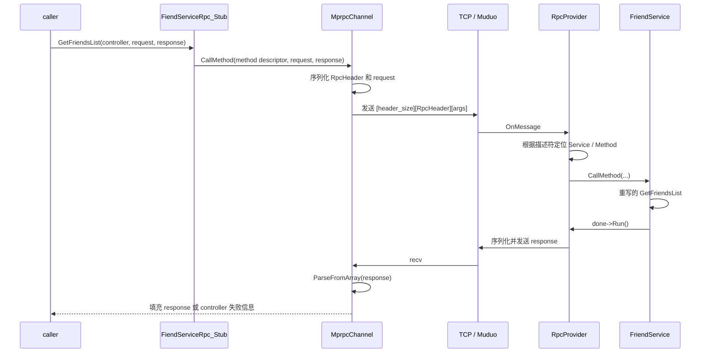

# Protobuf 在 C++ 与本项目 RPC 中的工作原理

> 本文从 `example/rpcExample` 出发，说明 Protobuf 在本项目中实际承担什么职责、生成的 C++ 代码如何把一次 `Stub` 调用转成远程函数调用，以及为什么测试时 IP 必须保持一致。

## 1. 先建立边界：Protobuf、RPC 与 TCP 分别负责什么

这三个概念经常一起出现，但职责不同：

| 层次 | 在本项目中的对象 | 职责 |
| --- | --- | --- |
| 协议描述 | `*.proto` | 定义消息字段、字段编号、服务及方法名，是接口的唯一事实来源。 |
| Protobuf | `*.pb.h`、`*.pb.cc`、`libprotobuf` | 生成 C++ 类型；将消息编码为二进制字节；提供描述符、反射、`Service`、`Stub` 等能力。 |
| 项目 RPC 框架 | `MprpcChannel`、`RpcProvider`、`RpcHeader` | 决定如何封装调用、用 TCP 发送、在服务端找到业务方法并返回结果。 |
| 网络与事件循环 | socket、Muduo `TcpServer`、`EventLoop` | 建立 TCP 连接、监听端口、收发字节流。 |

因此，**Protobuf 不是网络协议，也不会自动建立连接**。即使请求和响应都能 `SerializeToString`，仍需要本项目的 `MprpcChannel` 和 `RpcProvider` 把字节送到对端。

本项目通过 `option cc_generic_services = true;` 使用 Protobuf C++ 的通用 Service/RPC API。它会生成 `google::protobuf::Service` 子类和 `_Stub` 客户端代理；真正的传输实现仍由项目提供的 `google::protobuf::RpcChannel` 子类 `MprpcChannel` 完成。这与现代 gRPC 的代码生成模式不同：gRPC 需要额外的 gRPC 插件和运行时，本项目并未使用它。

## 2. 从 `friend.proto` 开始

[`example/rpcExample/friend.proto`](../example/rpcExample/friend.proto) 是最小示例：

```proto
syntax = "proto3";

package fixbug;
option cc_generic_services = true;

message GetFriendsListRequest {
  uint32 userid = 1;
}

service FiendServiceRpc {
  rpc GetFriendsList(GetFriendsListRequest) returns(GetFriendsListResponse);
}
```

这里的含义如下：

- `syntax = "proto3"`：使用 proto3 的字段规则和默认值语义。
- `package fixbug`：在生成的 C++ 中对应 `fixbug` 命名空间。
- `message`：定义可序列化的数据结构；`GetFriendsListRequest` 会生成同名 C++ 类。
- `userid = 1`：`1` 是**字段编号**，不是 C++ 成员下标。它构成二进制格式的一部分，发布后不能为了“排序”随意改变。
- `repeated bytes friends = 2`：生成重复字段 API；`bytes` 是任意字节，不承诺 UTF-8 文本。
- `service` / `rpc`：定义一个远程接口。由于开启 `cc_generic_services`，生成服务端基类和客户端 Stub。

生成命令可写为：

```bash
protoc --cpp_out=. friend.proto
```

它产生 `friend.pb.h` 与 `friend.pb.cc`。项目当前直接把这些文件纳入各自目标的 CMake 源列表。它们是生成物：应修改 `.proto` 后重新生成，**不要手改 `*.pb.h` 或 `*.pb.cc`**。生成器和链接的 Protobuf 运行时也应保持兼容版本。

## 3. 生成的消息类：普通 C++ 对象如何变成字节

生成后，`GetFriendsListRequest` 提供了类似 `set_userid(1000)`、`userid()`、`SerializeToString`、`ParseFromString`、`ParseFromArray` 的接口；`GetFriendsListResponse` 还提供 `mutable_result()`、`add_friends()`、`friends_size()` 等嵌套和重复字段 API。

例如：

```cpp
fixbug::GetFriendsListRequest request;
request.set_userid(1000);

std::string bytes;
request.SerializeToString(&bytes);
```

此时 `bytes` 不是文本，而是 Protobuf wire format。对于这个单字段消息，常见编码为 `08 e8 07`：

1. `08` 是字段标签：字段号 `1` 与 `uint32` 对应的 varint wire type `0` 组合而成；
2. `e8 07` 是整数 `1000` 的变长整数（varint）编码。

字段编号让接收方能识别字段，wire type 告诉接收方该字段如何读取。未知字段通常可跳过，这正是 Protobuf 能进行前向/后向兼容演进的基础。实际演进时应遵守这些规则：新增字段使用新编号；不复用删除字段的编号；不要改变已有字段编号或不兼容的类型；为删除字段保留编号和名称。

`SerializeToString` / `ParseFromString` 只解决“对象和字节的互转”，不提供一条 TCP 消息的边界。TCP 是连续字节流，一次 `send` 不保证对应对端的一次 `recv`。

## 4. 不止消息：`protoc` 还生成描述符、服务基类与 Stub

`friend.pb.h` 中可以看到三类关键产物：

1. **消息类**：`ResultCode`、`GetFriendsListRequest`、`GetFriendsListResponse`，均继承 Protobuf 的消息基类。
2. **描述符（Descriptor）**：运行时保存消息、服务、方法以及字段的结构信息。例如 `FiendServiceRpc::descriptor()` 能取得服务描述，`descriptor()->method(0)` 能取得 `GetFriendsList` 的方法描述。
3. **服务与代理**：`FiendServiceRpc` 继承 `google::protobuf::Service`；`FiendServiceRpc_Stub` 继承该服务接口，并保存一个 `google::protobuf::RpcChannel*`。

生成 Stub 的 `GetFriendsList` 本质上只有一层转发：

```cpp
channel_->CallMethod(descriptor()->method(0), controller, request, response, done);
```

这正是 Stub 的价值：业务调用方不必手写“服务名 + 方法名 + 参数序列化”的重复代码，而是以类型安全的普通函数形式调用 `stub.GetFriendsList(...)`。但 Stub 并不知道 socket、Muduo 或服务器地址；这些都由传入的 `RpcChannel` 决定。

## 5. `rpcExample` 的一次完整调用

调用链从 [`caller/callFriendService.cpp`](../example/rpcExample/caller/callFriendService.cpp) 开始：



### 5.1 客户端：Stub 把静态调用交给 `MprpcChannel`

caller 创建：

```cpp
fixbug::FiendServiceRpc_Stub stub(new MprpcChannel(ip, port, true));
```

随后调用 `stub.GetFriendsList(...)`。生成的 Stub 将方法描述符、请求和响应指针交给 [`src/rpc/mprpcchannel.cpp`](../src/rpc/mprpcchannel.cpp) 的 `MprpcChannel::CallMethod`。

`MprpcChannel` 做了以下工作：

1. 按需建立或复用到 `ip:port` 的 TCP 连接；
2. 从方法描述符获得 `service_name` 与 `method_name`；
3. 对业务 `request` 调用 `SerializeToString`；
4. 构造 [`src/rpc/rpcheader.proto`](../src/rpc/rpcheader.proto) 的 `RPC::RpcHeader`，写入服务名、方法名和参数字节长度；
5. 使用 `CodedOutputStream::WriteVarint32` 写入请求头长度，然后写入请求头字节和参数字节；
6. 通过 socket `send` 发出请求，`recv` 响应后用 `response->ParseFromArray` 还原响应对象。

请求帧是项目自定义的格式：

```text
+----------------------+-----------------------+------------------------+
| varint(header_size)  | RpcHeader protobuf    | request protobuf       |
+----------------------+-----------------------+------------------------+
```

这里有两层 Protobuf：业务参数是一个 Protobuf 消息，`RpcHeader` 也是另一个 Protobuf 消息。外部的 `header_size` 不是业务协议字段，而是用于在连续字节流中找出请求头边界的帧长度。

### 5.2 服务端：反射定位对象，再回到虚函数调用

服务端的 [`callee/friendService.cpp`](../example/rpcExample/callee/friendService.cpp) 定义 `FriendService`，并继承生成的 `fixbug::FiendServiceRpc`。它覆写 `GetFriendsList`，填充 `response` 后调用 `done->Run()`。

`RpcProvider::NotifyService` 接收该服务对象后，不需要认识 `FriendService` 的具体 C++ 类型：它从 `service->GetDescriptor()` 读取服务描述符，记录每个 `MethodDescriptor`，形成“服务名 → 服务对象 → 方法名 → 方法描述符”的注册表。

当 Muduo 收到请求，`RpcProvider::OnMessage` 会：

1. 解析头长度、`RpcHeader` 与参数字节；
2. 用服务名和方法名从注册表查找 `Service` 和 `MethodDescriptor`；
3. 通过 `GetRequestPrototype(method).New()` 和 `GetResponsePrototype(method).New()` 动态创建正确的消息类型；
4. 将参数字节解析到请求对象；
5. 调用 `service->CallMethod(method, ..., request, response, done)`；
6. 在 `done` 回调 `SendRpcResponse` 中序列化响应并发送。

第 5 步看似动态，最终仍会调用到你的业务实现。生成的 `FiendServiceRpc::CallMethod` 按 `method->index()` 分派到虚函数 `GetFriendsList`；`FriendService` 覆写了该虚函数，因此实际执行的是业务代码。这就是“反射找到方法”与“静态类型业务实现”在本项目中的连接点。

## 6. 本项目的 Stub 能否利用？答案是：已经在利用

### 6.1 `rpcExample` 中正确使用 Stub 的位置

[`caller/callFriendService.cpp`](../example/rpcExample/caller/callFriendService.cpp) 的 `FiendServiceRpc_Stub` 是正确的客户端代理：它携带 `MprpcChannel`，并实际调用 `GetFriendsList`。这个 Stub 使调用方只依赖 `.proto` 生成的接口，而不依赖服务端 `FriendService` 的实现类。

### 6.2 `callee` 中的 Stub 没有作用

[`callee/friendService.cpp`](../example/rpcExample/callee/friendService.cpp) 中也创建了：

```cpp
auto stub = new fixbug::FiendServiceRpc_Stub(new MprpcChannel(ip, port, false));
```

但该变量从未调用任何方法，且 `connectNow` 为 `false`。它既不决定服务器监听地址，也不参与 `RpcProvider::NotifyService`。服务端能提供服务的关键代码是：

```cpp
RpcProvider provider;
provider.NotifyService(new FriendService());
provider.Run(1, 7788);
```

因此 callee 中的 Stub 是无效的遗留代码，学习时应把它与服务发布路径区分开；后续整理示例时可以删除它。

### 6.3 Raft 与 KV 已把同一模式用于正式通信

`Stub` 并不只服务于好友示例：

| 使用处 | 生成的 Stub | 调用的方法 |
| --- | --- | --- |
| [`src/raftCore/raftRpcUtil.cpp`](../src/raftCore/raftRpcUtil.cpp) | `raftRpcProctoc::raftRpc_Stub` | `AppendEntries`、`RequestVote`、`InstallSnapshot` |
| [`src/raftClerk/raftServerRpcUtil.cpp`](../src/raftClerk/raftServerRpcUtil.cpp) | `raftKVRpcProctoc::kvServerRpc_Stub` | `Get`、`PutAppend` |

它们分别来自 [`src/raftRpcPro/raftRPC.proto`](../src/raftRpcPro/raftRPC.proto) 与 [`src/raftRpcPro/kvServerRPC.proto`](../src/raftRpcPro/kvServerRPC.proto)。每个远端节点封装一个 RPC 工具对象，工具对象持有对应 Stub；Raft 或 Clerk 调用工具方法时，最终仍会进入同一个 `MprpcChannel::CallMethod`。

换言之，本项目的复用边界是：**接口由 `.proto` 复用，调用形式由生成 Stub 复用，传输策略由 `MprpcChannel` 复用**。新增一个 RPC 方法的常规步骤是：修改 `.proto`、重新生成 C++ 文件、服务端继承并覆写生成的方法、客户端通过相应 Stub 调用；不要为每个方法重复手写 socket 协议。

## 7. 三处 IP 分别是什么，为什么必须一致

理解 IP 时，应先区分三个角色：

| 角色 | 代码位置 | 在本例中的含义 |
| --- | --- | --- |
| 监听（bind）地址 | `RpcProvider::Run` 的 `ip` | Muduo 在该地址和端口监听。 |
| 公布（advertise）地址 | `RpcProvider::Run` 写入 `test.conf` 的 `ip` | 其他 Raft/KV 节点以后会据此寻找该节点。当前实现把它与监听地址写成同一个值。 |
| 连接（connect）地址 | `MprpcChannel(ip, port, ...)` 的 `ip` | 客户端 socket 实际拨号到的目标。 |

`127.0.0.1` 与 `127.0.1.1` 都位于 `127.0.0.0/8` 回环网段，均只代表**本机**。它们不是外网 IP；不同机器上的 `127.*` 彼此不相通。

在当前 `rpcExample` 中：

- caller 的 `127.0.1.1` 是真实连接目标；
- `RpcProvider` 固定为 `127.0.1.1` 时，真正绑定并监听该地址；
- 所以 caller 连接 `127.0.1.1:7788` 可以成功；
- callee 中的 `std::string ip = "127.0.0.1"` 只传给了未使用的 Stub，不影响服务端监听，也不影响调用结果。

如果服务端绑定到某个具体回环地址，例如 `127.0.1.1`，客户端应连接同一个地址；改成 `127.0.0.1` 不应被当作“等价替换”。虽然两者都路由到 loopback 网卡，socket 的本地绑定地址仍是具体地址。

### 原自动取 IP 的写法为什么不可靠

原代码的逻辑是：

```cpp
gethostname(hname, sizeof(hname));
hent = gethostbyname(hname);
for (int i = 0; hent->h_addr_list[i]; i++) {
  ipC = inet_ntoa(*(struct in_addr*)(hent->h_addr_list[i]));
}
std::string ip = std::string(ipC);
```

它不是“取得当前机器正确网卡地址”，而是“把当前主机名交给名称解析器，并取解析结果列表中的最后一个 IPv4 地址”。结果受到 `/etc/hosts`、DNS、容器网络、VPN、网卡顺序和主机名配置影响。本机检查中，主机名的 IPv4 解析结果为 `127.0.0.2`，而不是 caller 使用的 `127.0.1.1`；于是服务可能监听 `127.0.0.2:7788`，caller 却连接 `127.0.1.1:7788`，连接自然被拒绝。

此外，该代码没有检查 `gethostname`、`gethostbyname` 的失败，也没有保证地址列表非空；`gethostbyname` 还是较旧的仅 IPv4 接口。把地址写死为 `127.0.1.1` 之所以暂时修复问题，是因为它让 bind 与 connect 恰好一致，而不是因为 `127.0.1.1` 有特殊的 RPC 含义。

对本机学习示例，最简单的约定是 provider 与 caller 都显式使用同一个地址（通常统一为 `127.0.0.1`）和端口。若要让其他机器访问，则应明确选择可达的局域网 IP 或配置的主机名；更完整的框架还应把“监听地址”和“对外公布地址”分开配置，避免多网卡/NAT 环境下混淆。

## 8. 当前 RPC 实现的学习型限制

本项目非常适合学习 Protobuf、反射和 RPC 的主路径，但还不是完整生产级传输层。阅读和扩展时尤其注意：

1. **请求分帧尚未完整实现。** 请求格式有长度信息，但 `RpcProvider::OnMessage` 直接 `retrieveAllAsString()`，没有保留半包、循环处理粘包或留下后续请求。TCP 分段/合并发生时可能解析失败或混淆请求。
2. **响应没有长度前缀。** `MprpcChannel` 以固定 `recv_buf[1024]` 接收一次，再直接解析一个 response。大响应、半包、粘包都不能被正确处理。
3. **同步模型。** `CallMethod` 忽略传入的 `done`，在当前线程内阻塞地 `send` / `recv`；长连接并不等同于异步、多路复用 RPC。
4. **没有请求编号。** 连接上同时存在多个请求时，当前响应无法可靠地与请求关联；因此不要在同一 `MprpcChannel` 上并发发起调用。
5. **Channel 所有权需明确。** 生成 Stub 的默认构造形式并不拥有传入的 `RpcChannel`；示例中 `new MprpcChannel(...)` 交给默认 Stub 后没有释放，进程退出时虽会回收，但长期运行会泄漏。应使用明确的所有权策略或 RAII 封装。
6. **地址发现仍是临时代码。** `RpcProvider` 以追加方式写 `test.conf`，重启后可能留下重复条目；节点发现、端口分配和多机部署应改为明确配置或注册中心机制。

这些限制不否定 Protobuf 的作用：Protobuf 已正确提供了类型、序列化和反射能力。它们说明传输层还需要在“字节流 → 完整消息 → 请求/响应匹配”之间补齐工程能力。

## 9. 推荐的阅读与实验顺序

1. 先读 `friend.proto`，再查看对应的 `friend.pb.h` 中消息、`FiendServiceRpc` 与 `_Stub` 的声明；只阅读生成代码，不编辑它。
2. 在 caller 的 `stub.GetFriendsList` 处开始单步跟踪，进入生成 Stub，再进入 `MprpcChannel::CallMethod`。
3. 对照 `rpcheader.proto` 观察请求帧的三个部分，理解“业务消息”和“RPC 元数据消息”为什么要分开。
4. 在 `RpcProvider::NotifyService` 与 `OnMessage` 处观察描述符、原型对象和 `CallMethod` 的反射分派。
5. 返回 `FriendService::GetFriendsList`，确认最终仍是正常的 C++ 虚函数覆写。
6. 将同一思路迁移到 `raftRPC.proto`、`RaftRpcUtil` 与 `raftServerRpcUtil`，把一次好友查询替换为一次 Raft `AppendEntries` 或 KV `PutAppend`。
7. 做地址实验：让 provider 与 caller 先使用同一 `127.0.0.1`，再只修改其中一端为 `127.0.1.1`，观察连接失败；最后检查本机主机名解析结果，验证“名称解析结果不等于可用服务端点”。

## 10. 小结

在本项目中，Protobuf 提供的是稳定的接口描述、二进制消息、生成类型、描述符/反射和 Stub/Service 抽象；`MprpcChannel` 与 `RpcProvider` 则把这些抽象接到 TCP/Muduo 上。`Stub` 不是可有可无的装饰：它正是 caller、Raft 节点互联和 Clerk 访问 KV 服务时共享的类型化调用入口。

理解这条链路后，新增 RPC 的重点就不再是手写网络字符串，而是先让 `.proto` 描述清楚接口，再让生成 Stub、Channel 和 Provider 各自承担其固定职责。地址问题也应按“绑定、公布、连接”三个角色排查，而不是把任意 `127.*` 地址看成可以混用的同一个值。
