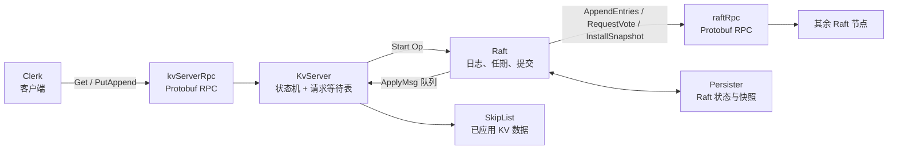
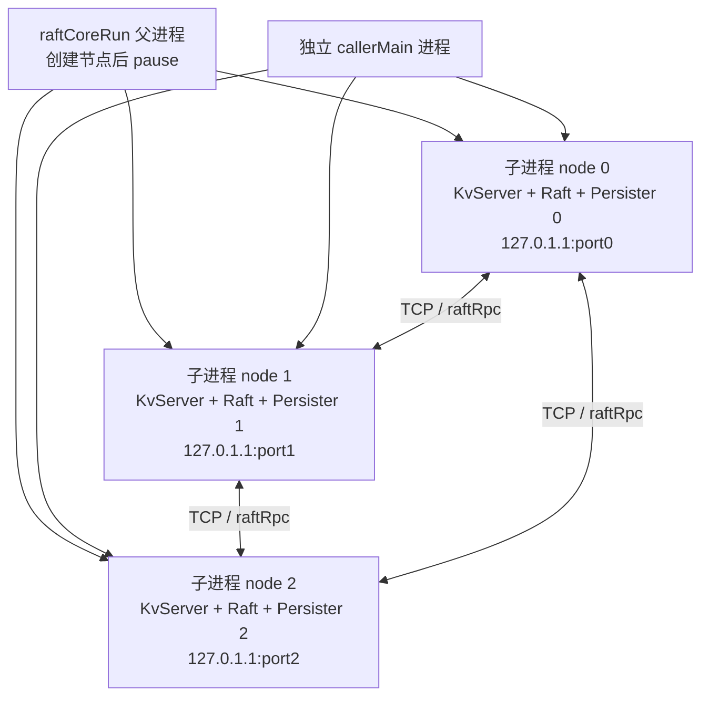
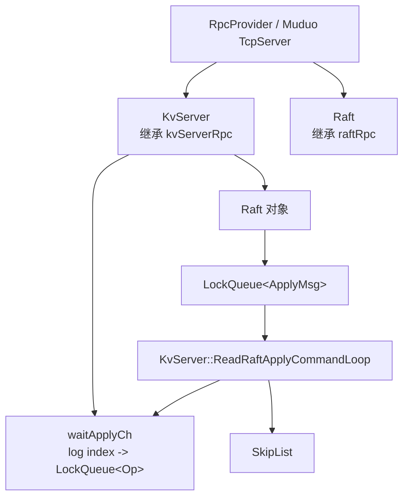
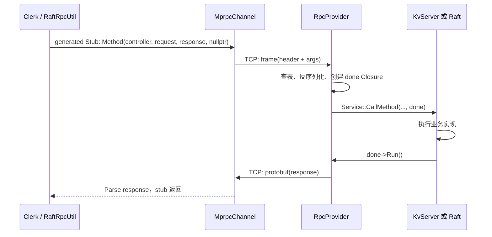
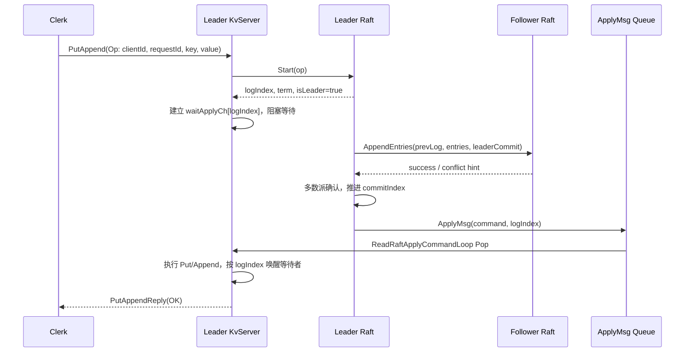
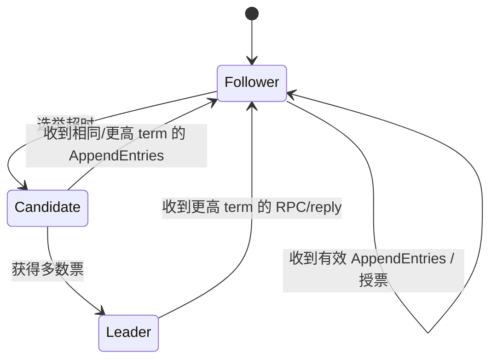

# Raft-KV 源码阅读与数据流指南

> 目标：用一条完整请求串起 RPC、Raft、KV 状态机、回调和持久化；读完后能够回答“一个 `Put` 为什么只有多数派确认后才返回成功”。
>
> 阅读约定：本文以当前仓库代码的实际执行路径为准，并在关键位置标注它对应的标准 Raft 语义。协议以 `.proto` 为接口源，不应编辑生成的 `*.pb.h`、`*.pb.cc`。

## 1. 先建立总览

这是一个 C++20 学习项目：每个进程启动一个 `KvServer`，而一个 `KvServer` 同时拥有两项职责：

1. 对客户端发布 `kvServerRpc`（`Get`、`PutAppend`）；
2. 持有一个 `Raft` 对象，并对其他节点发布 `raftRpc`（`RequestVote`、`AppendEntries`、`InstallSnapshot`）。

`Raft` 不理解 key 和 value，只把上层传入的 `Op` 当作命令字节串排序、复制和提交。`KvServer` 才是复制状态机：它在收到已提交的 `ApplyMsg` 后改动跳表，并把结果交还给等待中的客户端 RPC。



要始终区分下面三个时刻：

| 时刻       | 谁完成                            | 含义                           |
| -------- | ------------------------------ | ---------------------------- |
| RPC 请求送达 | `RpcProvider`                  | 对端收到字节并开始执行，不代表写入成功          |
| 日志被追加    | Leader 的 `Raft::Start`         | 仅领导者的未提交日志增加，不代表多数派已同意       |
| 状态机应用    | `KvServer::GetCommandFromRaft` | 命令已按 Raft 提交顺序执行，客户端才可得到成功结果 |

## 2. 推荐阅读流程

不要从 `raft.cpp` 第一行顺读。按下面顺序，每一步都带着上一步的问题进入下一层。

| 阶段 | 阅读文件 | 需要获得的答案 |
| --- | --- | --- |
| 0. 启动地图 | `CMakeLists.txt`、`example/raftCoreExample/raftKvDB.cpp`、`caller.cpp` | 哪些二进制启动服务端和客户端？ |
| 1. 协议边界 | `src/rpc/rpcheader.proto`、`src/raftRpcPro/*.proto` | 一次调用有哪几个服务、方法和字段？ |
| 2. 通用 RPC | `mprpcchannel.cpp`、`rpcprovider.cpp` | Protobuf stub 如何变成 TCP 字节流，又如何分派回业务函数？ |
| 3. 客户端重试 | `raftClerk/clerk.cpp`、`raftServerRpcUtil.cpp` | 请求如何记住 ID、寻找 Leader、在失败时重试？ |
| 4. KV 适配层 | `raftCore/include/kvServer.h`、`kvServer.cpp` | 业务请求如何等待 Raft 的提交结果？ |
| 5. Raft 状态机 | `raftCore/include/raft.h`、`raft.cpp` | 任期、投票、复制、提交、应用分别更新哪些状态？ |
| 6. 恢复与快照 | `Persister.*`、`ApplyMsg.h`、`Snapshot` 路径 | 如何裁剪日志，落后节点如何安装状态？ |
| 7. 并发基础 | `common/include/util.h`、`fiber/` | 队列、线程和协程分别承担什么工作？ |

建议先跑通第 0～4 步的请求流，再研究选举和日志冲突；否则很容易只记住术语，却不知道它们为什么存在。

### 2.1 面向“熟悉 C++/网络、初学 Raft”的阅读策略

你的前置知识足以跳过 C++ 基础、线程、TCP 和 Muduo 的通用教程。这个项目真正需要建立的是**分布式状态如何在多个独立节点间收敛**的直觉，而不是重新学习网络服务器。

推荐采用“先纵向、后横向”的两轮阅读，而非把 Clerk、服务端、Raft 三层完全拆开：

| 轮次 | 目标 | 只关注的问题 | 建议文件 |
| --- | --- | --- | --- |
| 第一轮：一条请求 | 建立因果链 | `Put` 如何从客户端变成所有副本上的相同数据？为什么不能立刻返回？ | `caller.cpp` → `clerk.cpp` → `kvServer.cpp` → `raft.cpp` 的 `Start` / `doHeartBeat` / `applierTicker` |
| 第二轮：按职责回看 | 建立模型 | RPC 怎么分派？Leader 如何选出？日志冲突怎样修复？快照如何替代旧日志？ | 三份 `.proto`、`rpc/`、`raft.h` / `raft.cpp`、`Persister.*` |

先读一条完整请求的原因是：`Clerk`、`KvServer` 和 `Raft` 不是三个并列功能模块，而是同一业务结果的三个阶段。仅分层阅读时，很容易知道 `AppendEntries` 的字段，却不知道它为何会影响一个阻塞中的 `PutAppend` RPC；仅端到端阅读而不回头分层，则会忽略任期、日志匹配和快照边界。

**Protobuf 不需要预先系统学习。** 在第一轮只掌握下面四点即可：

1. `.proto` 定义消息字段和 service 方法，生成的 `*_Stub` 是客户端代理，service 基类是服务端重写入口；
2. `request` / `response` 分别是序列化前后的业务参数；
3. `RpcController` 报告传输或编解码失败；业务结果写在 response 的 `Err`；
4. 服务端的 `Closure` 是“业务函数结束后发送 RPC 回复”的完成回调。

之后再阅读 `MprpcChannel::CallMethod` 和 `RpcProvider::OnMessage`，把它与你熟悉的 Muduo 模型对照：前者是客户端编解码与同步等待，后者是在 `TcpServer` 的 message callback 中解析、查表并派发业务函数。项目中自定义 RPC 的学习重点不是 Muduo 的连接生命周期，而是“Protobuf descriptor 如何把服务名/方法名路由到重写后的 C++ 成员函数”。

### 2.2 项目中值得顺手定位的 C++17/20 知识点

这些不是理解 Raft 的前置条件，但很适合在读到时复盘：

| 位置                        | 知识点                                                                    | 在本项目中的作用                                          |
| ------------------------- | ---------------------------------------------------------------------- | ------------------------------------------------- |
| `raft.cpp`、`kvServer.cpp` | `std::shared_ptr`、`std::make_shared`、`std::unique_ptr`                 | Raft peer、应用队列、IOManager 的共享/唯一生命周期               |
| `raft.cpp`                | `std::thread`、lambda、`detach`                                          | 并发发送投票/日志 RPC，启动应用线程                              |
| `common/include/util.h`   | `std::mutex`、`std::lock_guard`、`std::unique_lock`、`condition_variable` | 实现 `LockQueue<T>` 的阻塞与超时等待                        |
| `raft.cpp`                | `std::chrono`、随机数引擎                                                    | 选举超时随机化，降低同时竞选概率                                  |
| `raft.cpp`、`kvServer.cpp` | RAII 与项目的 `DEFER` 宏                                                    | 在有多个提前返回分支时保证持久化或解锁动作                             |
| 全工程                       | CMake 指定 C++20                                                         | 可用 C++20 编译环境；当前主逻辑主要采用传统线程/RAII，而非 `co_await` 协程 |

读并发代码时，把“线程安全的 C++ 对象”与“分布式一致性”分开：`mutex` 只能让一个节点内的状态不发生数据竞争；Raft 的 term、投票、多数派和日志匹配，才解决多个进程之间谁的状态可以被认可。

## 3. 启动与对象关系

### 3.1 两个示例进程

`raftCoreRun` 的入口是 `example/raftCoreExample/raftKvDB.cpp`：

1. 解析 `-n <节点数>`、`-f <配置文件>`；
2. 为每个节点随机分配一个端口并 `fork()`；
3. 每个子进程构造 `KvServer(me, 500, configFileName, port)`；
4. `KvServer` 注册并启动 RPC 服务，随后读取集群节点地址，创建到其他节点的 `RaftRpcUtil`，最后调用 `Raft::init`。

`callerMain` 的入口是 `example/raftCoreExample/caller.cpp`：构造 `Clerk`、读取 `test.conf`，并连续执行 `Put`、`Get`。

> 当前 `RpcProvider::Run` 会把节点地址追加写入固定文件 `test.conf`。因此示例实际应使用 `raftCoreRun -n 3 -f test.conf`，再另开终端运行 `callerMain`。该配置文件同时是节点之间与 Clerk 到节点的地址簿。

### 3.2 一台电脑如何运行“分布式” Raft

**它没有用多线程替代分布式。** `raftCoreRun` 在循环中调用 `fork()`，创建多个操作系统子进程；每个子进程随后独立构造自己的 `KvServer`。因此三个节点在同一台机器上仍具备分布式系统最关键的隔离边界：



每个节点拥有独立的：

- 虚拟地址空间、`Raft::m_logs`、`m_currentTerm`、`m_commitIndex` 和锁；
- Muduo `TcpServer` 与不同监听端口；
- `Persister(me)` 对应的 Raft 状态和快照文件；
- 与其他节点建立的 TCP 连接和通过网络获得的 RPC reply。

节点之间虽然使用回环地址 `127.0.1.1`，但 `AppendEntries` / `RequestVote` 仍经过 socket、序列化、内核 TCP 栈和对方进程的 `RpcProvider`；它们不共享 Raft 内存，也不能直接读取彼此的日志。把进程部署在不同机器时，协议层和 Raft 状态机的基本结构不变，变化的是 IP、端口、网络延迟与故障方式。

线程和 Fiber 仍然存在，但它们只处理**一个节点内部**的并发：例如 Raft ticker、向多个 peer 并发发 RPC、Muduo 工作线程和应用消息消费。它们绝不代表多个副本，也不能代替多数派确认。

#### 用单机做一次真实故障实验

1. 启动三个节点：`./bin/raftCoreRun -n 3 -f test.conf`；记下每个子进程打印的 PID 与端口。
2. 在另一终端执行 `./bin/callerMain`，确认客户端可持续 `Put` / `Get`。
3. 终止当前 Leader 所在子进程（可依据日志中 Leader 输出和 PID 判断）；不要停止父进程和另外两个节点。
4. 观察其余两个进程在随机选举超时后发起 `RequestVote`，其中一个获得多数票成为新 Leader。
5. 再次执行或继续执行客户端请求：Clerk 会因网络失败/`ErrWrongLeader` 轮询其他端口，最终缓存新的 `m_recentLeaderId`。

这就是单机模拟分布式的价值：它保留了独立进程、消息延迟/丢失、节点崩溃和重新选主等逻辑，同时省去多台机器的部署成本。它不能完整模拟跨主机网络分区、磁盘故障域和时钟差异，但足够学习 Raft 的主状态机。

### 3.3 一个节点内部的关系



重点是 `KvServer` 和 `Raft` 不是两个网络服务进程，而是同一节点进程中的两个 Protobuf service；二者通过内存中的 `LockQueue<ApplyMsg>` 通信。

## 4. RPC 调用：从 stub 到业务函数，再回到客户端

### 4.1 三份协议的分工

| 协议                                 | 服务            | 使用方              | 作用                              |
| ---------------------------------- | ------------- | ---------------- | ------------------------------- |
| `src/rpc/rpcheader.proto`          | 无业务 service   | 所有 RPC           | 自定义传输帧头：服务名、方法名、参数长度            |
| `src/raftRpcPro/kvServerRPC.proto` | `kvServerRpc` | Clerk ↔ KvServer | 客户端读写；包含 `ClientId`、`RequestId` |
| `src/raftRpcPro/raftRPC.proto`     | `raftRpc`     | Raft ↔ Raft      | 选举、日志复制、快照安装                    |

客户端侧的 `raftServerRpcUtil` / `RaftRpcUtil` 都把生成的 Protobuf stub 包起来。它们每次调用创建 `MprpcController`，调用 stub，最后以 `controller.Failed()` 把“网络或编解码失败”转换成 `bool`。业务失败（例如不是 Leader）则写在 reply 的 `Err` 字段中；这是两类不同的失败。

### 4.2 自定义请求帧

`MprpcChannel::CallMethod` 接收 Protobuf 生成的 stub 调用，完成如下序列化：

```text
Varint(header_size) | RpcHeader(service_name, method_name, args_size) | protobuf(args)
```

随后用 TCP `send` 发送，并同步 `recv` 服务端回复；回复直接解析为该方法的 response Protobuf。也就是说，当前客户端调用模型是**同步阻塞等待响应**：调用 stub 的线程在 `CallMethod` 返回前拿不到 reply。

服务端 `RpcProvider::OnMessage` 的反向过程是：

1. 从 Muduo `Buffer` 取出请求字节；
2. 读出帧头，按 `service_name`、`method_name` 在 `m_serviceMap` 中查找已注册 service 与 method descriptor；
3. 用 descriptor 创建 request / response 原型并反序列化请求；
4. 调用 `service->CallMethod(method, ..., done)`；
5. `done` 最终执行 `RpcProvider::SendRpcResponse`，序列化 response 并 `conn->send`。

### 4.3 RPC 响应回调模型

这里的“回调”是 Protobuf 的 `google::protobuf::Closure`，不是 Raft 的提交通知。



生成的 `kvServerRpc` / `raftRpc` 基类负责把 descriptor 调度到重写后的业务函数。两套重写函数都采用相同薄包装：

- `KvServer::PutAppend(controller, request, response, done)` 调用同名的业务重载，然后 `done->Run()`；
- `Raft::AppendEntries(controller, request, response, done)` 调用 `AppendEntries1`，然后 `done->Run()`；
- `RequestVote`、`InstallSnapshot` 同理。

因此，`done->Run()` 是“本地业务完成，可以把 RPC 回复发回”的明确边界。客户端 stub 传入 `nullptr` 作为自己的完成回调，实际由 `MprpcChannel` 同步接收 response。

## 5. 一次 Put 的完整数据流

下面是最重要的阅读主线。建议在编辑器中按编号逐步跳转函数。



### 5.1 客户端：稳定标识和 Leader 轮询

从 `Clerk::PutAppend` 开始：

1. `m_requestId` 自增一次，当前调用在全部重试中使用同一个 `requestId`；`m_clientId` 在构造 `Clerk` 时由 `Uuid()` 生成；
2. 先访问缓存的 `m_recentLeaderId`；
3. RPC 失败，或 response 是 `ErrWrongLeader` 时，按环形顺序尝试下一节点；
4. 得到 `OK` 后缓存该节点为近期 Leader。

这就是**至少一次传输 + 状态机去重**的组合：网络超时无法判断请求是否抵达，故客户端可重发同一 `(clientId, requestId)`；服务端用此对标识避免重复写入。标准 Raft 本身只保证日志顺序，不负责识别用户请求是否被客户端重复提交。

### 5.2 KvServer：把 RPC 转成待提交命令

`KvServer::PutAppend` 将 Protobuf 参数组装成 `Op`，调用：

```cpp
m_raftNode->Start(op, &raftIndex, &term, &isLeader);
```

若本节点不是 Leader，`Raft::Start` 不写日志，返回 `isLeader = false`，KV 层立刻回复 `ErrWrongLeader`。若是 Leader：

1. `Start` 以 Boost 文本归档把 `Op` 序列化为 `LogEntry.command`；
2. 新条目追加到 `m_logs`，并持久化 Raft 状态；
3. KV 层创建 `waitApplyCh[raftIndex]`，其中值为 `LockQueue<Op>`；
4. KV 层调用 `timeOutPop(CONSENSUS_TIMEOUT, ...)` 等待应用线程通知。

这个等待表是本项目的 **Raft → 原 RPC 请求的回调关联**：Raft 只能报告“索引 N 已可应用”，而不是直接持有某个网络连接；KV 层因此用日志索引找到发起 N 的 RPC，再用队列唤醒它。

### 5.3 日志复制与提交：Raft 的核心语义

Leader 的 `leaderHearBeatTicker` 定期调用 `doHeartBeat`。对每个 follower：

1. 根据 `m_nextIndex[peer]` 计算 `PrevLogIndex`、`PrevLogTerm`；
2. 组织从该位置到 Leader 尾部的 `AppendEntriesArgs.entries`；无 entries 时就是心跳；
3. 异步执行 `sendAppendEntries`；
4. follower 的 `AppendEntries1` 验证 term 和前序日志，必要时覆盖冲突日志，更新自己的 `commitIndex`；
5. Leader 收到成功 reply 后更新该 peer 的 `m_matchIndex`、`m_nextIndex`；达到多数派且条目属于当前任期时推进 `m_commitIndex`。

这对应标准 Raft 的日志复制规则：只有拥有相同 `(prevLogIndex, prevLogTerm)` 前缀的 follower 才接受后续 entries；Leader 通过 `nextIndex` 退回并重试来修复分叉；多数派复制后才提交。当前实现中，`Start` 追加日志后依赖下一次心跳周期开始复制，而不是立即单独发送一次 AppendEntries。

### 5.4 应用、去重和唤醒

独立线程 `Raft::applierTicker` 反复检查 `m_lastApplied < m_commitIndex`：

1. `getApplyLogs` 按索引顺序生成 `ApplyMsg{CommandValid=true, Command, CommandIndex}`，并推进 `m_lastApplied`；
2. 将消息压入 `applyChan`；
3. `KvServer::ReadRaftApplyCommandLoop` 阻塞 `Pop`；
4. `GetCommandFromRaft` 反序列化 `Op`，若是未处理过的 `Put` / `Append` 则执行状态机操作、更新 `m_lastRequestId`；
5. `SendMessageToWaitChan(op, CommandIndex)` 推送 `Op` 到对应索引的等待队列；
6. 原 RPC 处理函数被唤醒，确认返回的 `(ClientId, RequestId)` 与自己的请求一致，然后写 `OK`。

最后一步的标识核对很重要：若领导者变化，原 Leader 未提交的日志位置可以被新 Leader 的不同日志覆盖；“等到了同一索引”本身不能证明等到的是原请求。

### 5.5 Get 的路径

当前 `KvServer::Get` 也会创建 `Op{"Get", ...}` 并调用 `Raft::Start`，等待该读取命令经 Raft 提交后，再从跳表查询并返回结果。它没有使用 ReadIndex 或 leader lease 等读优化。

这是一种容易理解的线性一致读思路：读取被放进日志顺序中，故它看见的是先前已提交写入后的状态。与标准 Raft 的关系是：Raft 论文核心定义日志复制；线性一致读取通常由上层服务选择“日志化读取”或额外的 quorum/lease 协议来实现。本项目选择前者。

> 代码实际的 `Append` 与 `Put` 都调用 `SkipList::insert_set_element`，该函数对已有 key 是删后重插，也就是覆盖值；若你要学习标准 KV 中“Append = 拼接旧值”，应把它作为一个待验证/改造点，而不要只按接口名称推断行为。

## 6. 选举：谁成为 Leader

标准 Raft 把节点分为 Follower、Candidate、Leader；本项目的状态枚举也正是这三种，保存在 `Raft::m_status`。



相关代码的控制流如下：

1. `Raft::init` 初始化 follower、任期、投票、日志和两个时间点，并启动 `electionTimeOutTicker`；
2. ticker 使用 `getRandomizedElectionTimeout()`（`config.h` 中当前为 300～500 ms）判断是否超时；
3. `doElection` 将自己置为 Candidate，`m_currentTerm++`，投票给自己，持久化，并向其他节点并发发送 `RequestVote`；
4. 接收方 `Raft::RequestVote` 只在候选人日志至少同样新（`UpToDate`）且自己尚未投给别人时授票；
5. `sendRequestVote` 统计多数票后把自身设为 Leader，初始化每个 peer 的 `nextIndex = lastLogIndex + 1` 与 `matchIndex = 0`，然后立即发起一次 `doHeartBeat`；
6. 任意 RPC 请求或回复携带更高 term 时，节点更新 term、清空投票选择并退回 Follower。

对应的 Raft 不变量是：term 单调增长；同一 term 每个节点至多投一票；只有日志不落后的节点能获得票。阅读 `RequestVote` 时应优先检查这三个条件，而非先陷入输出日志。

## 7. 快照、持久化与恢复

### 7.1 持久化什么

`Raft::persistData` 序列化下面的 Raft 持久状态：

- `m_currentTerm`、`m_votedFor`；
- 快照边界 `m_lastSnapshotIncludeIndex`、`m_lastSnapshotIncludeTerm`；
- 剩余日志 `m_logs`。

`Persister` 将 Raft 状态和快照写入 `raftstatePersist<me>.txt`、`snapshotPersist<me>.txt`。KV 快照由 `KvServer::MakeSnapShot` 创建：跳表导出的内容和 `m_lastRequestId` 一起经 Boost 序列化，因此恢复时能同时恢复数据与去重水位。

### 7.2 本地制作快照

`GetCommandFromRaft` 在应用命令后检查 `GetRaftStateSize()`；超过 `m_maxRaftState / 10.0` 时：

```text
KvServer::MakeSnapShot
  -> Raft::Snapshot(appliedIndex, snapshotBytes)
  -> 截掉 index 及其之前的日志
  -> Persister::Save(raftState, snapshot)
```

标准 Raft 中快照的目的不是“再备份一次”，而是把已应用的日志前缀折叠为状态，使日志无限增长时仍可恢复和追赶。快照边界之后，逻辑日志索引与 `m_logs` 的物理下标不同；`getSlicesIndexFromLogIndex` 正是完成此换算的关键函数。

### 7.3 向落后节点安装快照

Leader 发现 `m_nextIndex[peer] <= m_lastSnapshotIncludeIndex` 时，`doHeartBeat` 不再发送旧日志，而是启动 `leaderSendSnapShot`，向该 peer 发送 `InstallSnapshot`。接收方：

1. 比较 term，必要时转 Follower；
2. 忽略不比本地新快照更靠后的快照；
3. 截断/清空旧日志，推进 `commitIndex` 与 `lastApplied`；
4. 向 `applyChan` 投递 `SnapshotValid=true` 的 `ApplyMsg`；
5. `KvServer::GetSnapShotFromRaft` 调用 `CondInstallSnapshot` 后恢复业务状态机。

这对应标准 Raft 的“日志太落后时以快照状态为基准重新对齐”语义；它与普通 `AppendEntries` 互补。

## 8. 关键状态与函数速查

| 名称 | 所在对象 | 何时改变 | 学习含义 |
| --- | --- | --- | --- |
| `m_currentTerm` | `Raft` | 发起新选举、收到更高 term | 版本号；所有 RPC/reply 都要比较 |
| `m_votedFor` | `Raft` | 自投、授票、收到更高 term | 限制一任期一票 |
| `m_logs` | `Raft` | Leader `Start`、Follower `AppendEntries1`、快照 | 未被快照折叠的命令序列 |
| `m_nextIndex[peer]` | Leader Raft | 复制成功或冲突 | 下次向 peer 发送日志的起点 |
| `m_matchIndex[peer]` | Leader Raft | peer 复制成功 | peer 已匹配到的最大索引 |
| `m_commitIndex` | 所有 Raft | Leader 多数派确认；Follower 接收 leaderCommit | 已安全提交的最大日志索引 |
| `m_lastApplied` | 所有 Raft | `getApplyLogs` | 已交给 KV 状态机的最大索引 |
| `applyChan` | Raft ↔ KvServer | Raft 应用/安装快照 | 共识层到状态机的单向边界 |
| `waitApplyCh[index]` | `KvServer` | 接收 RPC、收到应用消息 | 把提交索引关联回阻塞的业务 RPC |
| `m_lastRequestId[client]` | `KvServer` | 执行写命令 | 防止客户端重试重复修改状态 |

## 9. 并发模型：哪些地方是线程，哪些地方是队列

项目并非所有逻辑都运行在同一种并发单元中：

- Muduo `TcpServer` 处理 RPC 网络事件，并配置 4 个工作线程；
- `Raft::init` 使用 `monsoon::IOManager` 调度选举与心跳 ticker；
- 选举投票、AppendEntries、快照发送分别用 `std::thread` 并发执行；
- `applierTicker` 是独立线程，顺序向 `applyChan` 推送已提交日志；
- `KvServer::ReadRaftApplyCommandLoop` 是独立线程，阻塞消费 `applyChan`；
- `LockQueue<T>` 用互斥量与条件变量实现 `Push`、阻塞 `Pop`、超时 `timeOutPop`。

读代码时优先确认锁和队列边界：Raft 内部状态受 `Raft::m_mtx` 保护；KV 数据、等待表、去重表受 `KvServer::m_mtx` 保护；两层间不要通过持锁直接调用对方，而通过 `ApplyMsg` 队列交接。

## 10. 项目当前如何验证

仓库没有 CTest 或单元测试框架；验证主要由可执行示例和人工分布式实验组成。

### 10.1 已有验证入口

| 入口 | 验证内容 |
| --- | --- |
| `example/rpcExample` | 先单独理解 Protobuf service、provider、consumer 的基础 RPC 调用 |
| `example/fiberExample/test_scheduler` | Fiber 调度基本行为 |
| `example/fiberExample/test_iomanager`、`test_hook` | I/O 事件和 Hook 行为 |
| `test/defer_run.cpp` | `DEFER` 工具的 C++20 编译与运行 |
| `raftCoreRun` + `callerMain` | 多节点启动、选举、客户端写读、Leader 缓存和失败重试 |

构建方式：

```bash
cmake -S . -B build
cmake --build build -j
```

最小端到端实验：

```bash
# 终端 1：启动三个节点；该进程会一直运行
./bin/raftCoreRun -n 3 -f test.conf

# 终端 2：发起 Put / Get
./bin/callerMain
```

### 10.2 建议按 Raft 语义做的手工检查

| 场景 | 观察点 | 说明 |
| --- | --- | --- |
| 正常三节点写读 | `Put` 后 `Get` 读到新值 | 验证客户端 → 复制 → 应用 → 回复主链路 |
| 启动后等待 | 一个节点当选 Leader 且持续发送心跳 | 验证随机选举超时和多数票 |
| 杀掉 Leader 再请求 | Clerk 轮询节点后恢复成功 | 验证 `ErrWrongLeader` / 网络失败重试与重新选举 |
| 同一请求重复发送 | 只产生一次状态机写入 | 验证 `(ClientId, RequestId)` 去重 |
| 某 follower 落后再恢复 | Leader 补日志或安装快照 | 验证 `nextIndex` 回退和快照分支 |
| 长时间写入 | 生成并恢复快照 | 验证日志裁剪、状态恢复和索引换算 |

分布式功能不能只以“单节点能返回”判断正确：网络调用成功、日志持久化、多数派提交、状态机应用、RPC 回复分别是不同阶段。排错时应按第 5 节的顺序打点或阅读日志。

## 11. 学习时应主动识别的实现边界

下列内容不妨碍理解整体结构，但应避免把它们误认为完整生产实现：

- RPC 客户端同步 `send`/`recv`，回复没有独立长度帧；学习协议时应注意 TCP 是字节流，生产版本需要完善分帧、部分读写与连接管理；
- `Persister` 当前构造时会截断对应文件，故“重启恢复”路径的设计意图能从 `readPersist` / 快照恢复代码学习，但实际进程重启持久性需要额外验证；
- 集群地址登记采用固定 `test.conf` 和启动时 `sleep` 协调，适合示例，不是服务发现机制；
- 当前读请求同样写入 Raft 日志，简单但成本较高；这是理解线性一致读的入口，也提示后续可学习 ReadIndex、租约读等优化；
- `Append` 的当前状态机操作表现为覆盖值，若要实现传统字符串追加语义，需要调整 `ExecuteAppendOpOnKVDB`。

## 12. 一小时复盘清单

完成阅读后，尝试不看代码回答：

1. `PutAppend` 收到 `OK` 前，究竟经过了哪两种“回调”？
2. 为什么 Clerk 重试必须复用相同 `requestId`？
3. 为什么 `waitApplyCh` 的 key 是 Raft 日志索引，而不是 client ID？
4. Follower 拒绝 `AppendEntries` 后，Leader 通过什么状态调整重试位置？
5. 为什么 Leader 不能仅因自己追加了日志就回复客户端成功？
6. `commitIndex` 与 `lastApplied` 各代表什么，为什么必须分别存在？
7. 什么情况下走 `InstallSnapshot` 而不是 `AppendEntries`？
8. `done->Run()` 和 `SendMessageToWaitChan()` 分别完成哪一层的响应？

若这八题都能对应到具体文件和函数，就已经掌握了本项目的主干；之后可按兴趣深入 Fiber 调度、日志冲突优化、快照索引和 RPC 传输完善。
