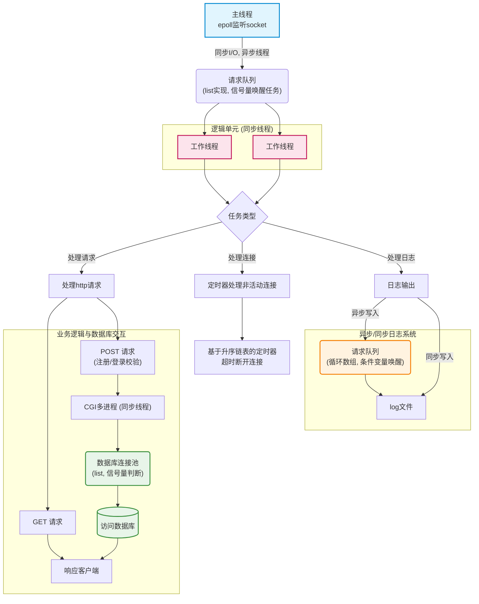
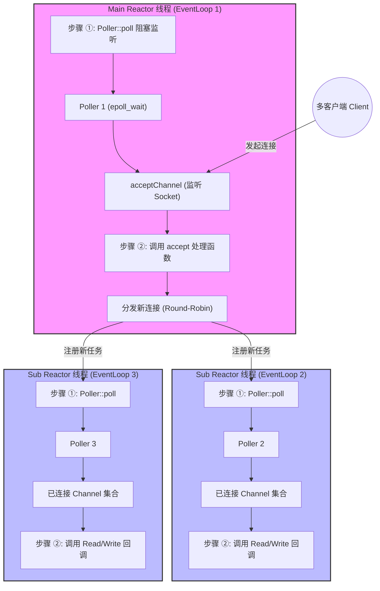
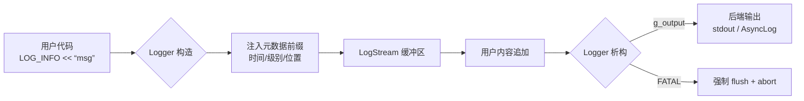
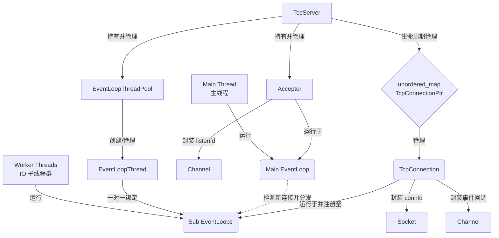

# 项目架构图
**C++ 高并发 Web 服务器 (基于半同步/半反应堆模式)** 的架构图

# Multi-reactor框架

 这个框架图就更加简洁明了，在 WebServer 中，许多 client 在 MainReactor 中得到了连接请求的响应，并与 WebServer 建⽴具体的连接。然后通过⼀个叫 Acceptor 的模块，将具体的连接分配给到⼀些叫做 SubReactor 的 模块，在 SubReactor 中对具体的连接进⾏读、编码、计算、解码和写操作（即对 client 请求的响应）。这也是 muduo ⽹络库中所提出的 Multi-Reactor 并发框架。
 > [!abstract] **连接建立阶段 (Main Reactor)**
> 
> 1. **Poller::poll**: `main reactor` 线程阻塞在 `epoll_wait`。
>     
> 2. **事件触发**: `Client` 发起连接，`acceptChannel` 变为可读。
>     
> 3. **handleEvent**: 调用 `Acceptor::handleRead` 执行 `accept` 拿到新 `sockfd`。
>     
> 4. **分发**: `TcpServer` 通过轮询从池中选出 `EventLoop 2` (Sub Reactor)。
>     

> [!info] **数据通信阶段 (Sub Reactor)**
> 
> 1. **注册**: 新连接的 `Channel` 被注册进 `EventLoop 2` 的 `Poller`。
>     
> 2. **Poller::poll**: `sub reactor` 线程在自己的循环里等待该连接的 `Read` 事件。
>     
> 3. **处理**: 当 `Client` 发送数据，`EventLoop 2` 唤醒，执行业务逻辑回调。

**为什么这么设计**
- **避免惊群效应**: 只有一个线程负责 `accept`，秩序井然。
- **负载均衡**: I/O 任务被分散到多个线程，充分利用多核 CPU。
- **高并发能力**: 即使某个连接的计算任务较重，也只会阻塞其中一个 Sub Reactor，不会导致整个服务器停止接收新连接。
- **线程安全**: 核心逻辑遵循 "固定对象属于固定线程"，极大地减少了加锁的开销。
# 项目文件整体结构
```Plaintext
kama-webserver/
├── img/                # 存放项目相关的图片、架构图
├── include/            # 所有的头文件 (.h / .hpp)
│   ├── EventLoop.h     # 建议将 reactor 核心头文件也放于此
│   └── ...
├── lib/                # 存放编译生成的静态库或共享库 (.a / .so)
├── log/                # 日志管理模块
│   └── log.cc          # 日志系统的具体实现
├── memory/             # 内存管理模块 (如内存池)
│   └── memory.cc       # 内存管理逻辑实现
├── src/                # 业务源代码目录
│   ├── main.cpp        # 程序启动入口
│   ├── Acceptor.cc     # 连接接收器实现
│   ├── TcpServer.cc    # 服务器主控逻辑
│   └── ...             # 其他源文件
├── CMakeLists.txt      # 整个项目的 CMake 构建配置文件
├── LICENSE             # 开源许可证
└── README.md           # 项目文档与使用说明
```
# Reactor架构代码解析
核心是一个基于非阻塞 IO 和 epoll 的主从 Reactor 模型。它的底层封装主要由三个核心类构成:channel、eventloop、poller。
“**当一个客户端连接进来，到最终处理数据，整个流程是怎样的？**”
1. **启动阶段：** `TcpServer` 启动，在 Main Reactor（主线程）创建 `Acceptor` 对象，并将 `listenfd` 封装成一个 `Channel`，注册到主线程的 `EpollPoller` 中，监听可读事件。
2. **新连接到达：** 客户端发起连接，`listenfd` 触发可读事件。主线程的 `EventLoop` 醒来，调用 `Acceptor` 的 `ReadCallback`（本质上是调用 `accept()` 获取新连接的 `connfd`）。
3. **连接分发 (Round-Robin)：** `TcpServer` 获取到新的 `connfd` 后，将其封装成一个 `TcpConnection` 对象。然后通过**轮询（Round-Robin）**算法，从 Sub Reactors（工作线程池）中挑出一个工作线程（`EventLoop`）。
4. **跨线程注册：** 主线程将这个新的 `TcpConnection` 丢给选中的 Sub Reactor，Sub Reactor 会将 `connfd` 封装成 `Channel` 并注册到自己的 `EpollPoller` 中。（至此，主线程完成任务，继续监听新连接）。
5. **数据收发：** 之后客户端发送数据，对应的 Sub Reactor 的 `epoll_wait` 被唤醒，拿到活跃的 `Channel`，触发 `MessageCallback`，最终进入用户自定义的业务逻辑层。
## 从框架细节来看
![[多线程(主从)Reactor 网络模型|800]]
 在高并发场景下，传统的“一个客户端分配一个服务端线程”的模式会因为线程数量的限制和上下文切换开销，导致服务器崩溃。因此，现代 WebServer 引入了非阻塞 IO、多路复用以及 EventLoop 机制来异步处理请求。
 因此，muduo 使⽤**⾮阻塞**的poll/epoll（**IO multiplexing 多路复⽤**）轮训监听(Reactor)有⽆ SOCKET 读写IO事件，将IO事件的处理回调函数分发到线程池中，实现异步返回结果。
 - **IO 多路复用 (epoll)**：它的核心是“集中化管理”。服务端不再为每个连接创建独立线程，而是用**少量线程**通过 `epoll` 集中监控成千上万个文件描述符（Socket）。只有当某个 Socket 真正发生读写事件时，`epoll` 才会通知应用程序去处理。
- **非阻塞 (Non-blocking)**：这是针对 Socket 本身的属性设置。在默认的阻塞模式下，如果程序去读取一个暂时没数据的 Socket，线程会被死死卡住（挂起休眠）。**非阻塞**的意义在于：当程序尝试读写时，如果缓冲区没有数据，系统调用（如 `read`）会立刻返回一个错误状态（如 `EAGAIN`）而不是挂起线程。这样，该线程就能立刻抽身，无缝切换去处理 `epoll` 监听队列里的下一个活跃连接，保证了线程的高效运转。
 在多线程编程模型中采⽤了 "**one loop per thread + thread pool**" 的形式。
 即：⼀个线程中有且仅有⼀个**EventLoop**（也就是说每⼀个核的线程负责循环监听⼀组**⽂件描述符的集合**），这个线程称之为 IO 线程。
 - **EventLoop 的本质**：在代码层面，它就是一个包裹着 `epoll` 调用的**无限死循环（`while(true)`）**。
- **它的工作职责**：在这个循环内部，它主要交替做两件事：
    1. 调用 `epoll_wait` 阻塞等待属于它负责的那批 Socket 发生读写事件。
    2. 一旦有网络事件发生，立刻将事件**分发（Dispatch）** 给对应的回调函数去执行具体的业务逻辑。
- **One Loop Per Thread**：这意味着每一个被分配用来处理 IO 的子线程（即你图中的 SubReactor），其生命周期内只运行这一个 EventLoop。它就像一个专职的接线员，心无旁骛地只负责接听分配给它的一组电话线，避免了多线程之间抢夺资源的锁竞争。
 如果⻓时间没有事件发⽣，IO线程将处于空闲状态，这时可以利⽤IO线程来执⾏⼀些额外的任务（利⽤定时器任务队列来处理超时连接），这就要求⾮阻塞的 poll/epoll 能够在⽆ IO事件但有任务到来时能够被唤醒。
- **为什么要被唤醒？**
- **问题的产生**：如果此时网络极其空闲，没有任何客户端发数据，EventLoop 中的 `epoll_wait` 就会进入休眠（阻塞等待网络信号）。但是，这个 IO 线程除了处理网络读写，往往还肩负着**执行定时器任务**（比如清理超时断开的短连接）或者**处理其他线程投递过来的计算任务**。如果它睡死了，这些额外任务就会被搁置。
- **跨线程唤醒机制 (Wake-up)**：为了解决这个问题，框架会在 `epoll` 的监听列表中悄悄注册一个特殊的触发器（在 Linux 中通常使用 `eventfd` 机制）。当有定时任务到期，或主线程派发了新任务时，系统会向这个特殊的 `eventfd` 中写入一点数据（哪怕只是 1 个字节）。休眠中的 `epoll_wait` 一旦检测到这个可读事件，就会立刻被“惊醒”，进而去清空待办任务队列中的额外任务。
## 基础结构
在最基础的实现中，核⼼的结构部分就是 **EventLoop** 、 **Channel** 以及 **Poller** 三个类，其中EventLoop 可以看作是对**业务线程**的封装，⽽ Channel 可以看作是对每个**已经建⽴连接的封装**（即 accept(3) 返回的⽂件描述符），三者的关系⻅下图。 
- **`Channel`（事件分发器/通道）：** 负责封装底层的文件描述符（File Descriptor, FD）。它并不拥有 FD，但它记录了该 FD 关注的 I/O 事件类型（如可读 `EPOLLIN`、可写 `EPOLLOUT`）以及当事件发生时应当执行的回调函数（Callbacks）。每一个建立的 TCP 连接或监听端口，在系统中都对应一个 `Channel` 实例。
- **`Poller`（I/O 多路复用解耦器）：** 负责封装底层的 I/O 多路复用系统调用（如 Linux 的 `epoll_wait` 或 `poll`）。它是整个事件循环的监听引擎，负责对注册在其上的所有 `Channel` 的事件进行集中监控，并在 I/O 事件就绪时，将活跃的 `Channel` 提取出来交付给上层。
- **`EventLoop`（事件循环驱动器）：** Reactor 模式的核心，代表了其实例所在的线程环境。它维护着一个事件循环，负责协调 `Poller` 和 `Channel`。它确保了所有的 I/O 事件监听和业务回调的执行都在同一个线程内有序、串行地完成，从而避免了单线程环境下的并发冲突。
![[Channel&Poller&EventLoop三者关系|800]]
### 细节说明
1. **阻塞等待（Wait）：** `EventLoop` 进入 `loop()` 循环，首先调用 `Poller::poll()`。此时线程让出 CPU 资源，等待操作系统内核通知文件描述符的状态变化。
2. **事件通知（Notify）：** 当底层网卡接收到数据或连接状态发生改变时，内核唤醒 `epoll_wait`。`Poller` 将发生状态变更的文件描述符所对应的 `Channel` 实例收集起来，形成一个“活跃通道集”（Active Channels）。
3. **事件分发（Dispatch）：** `EventLoop` 获取到这个活跃通道集后，开始遍历。针对每一个活跃的 `Channel`，`EventLoop` 会调用其核心方法 `handleEvent()`。
4. **业务处理（Handle）：** `Channel::handleEvent()` 方法内部会根据当前就绪的具体事件类型（读、写、挂起或错误），动态地执行在初始化时绑定的具体业务回调函数（例如读取 Socket 缓冲区的数据）。处理完成后，循环往复。
通过这种设计，底层的监听机制（`Poller`）与具体的业务逻辑处理（`Channel`）被完全解耦，而 `EventLoop` 则充当了调度它们的引擎。
## 从底层开始： Poller & EPollPoller
对于`EventLoop`而言，他只知道`Poller`，而他并不清楚这个`Poller`底层调用的`Api`是`Epoll`还是`Poll`。这种统一基类接口对外，派生类封装向内，且基类继承、选择实例化构造、不同类型单独封装，就是所谓的`静态工厂`。
### Poller -> 对EPoll & Poll 两种API的基类 / 统一 I/O 多路复用的外部接口
根据之前的架构框图我们可以发现，在 `Reactor 模型（One Loop Per Thread）`中，一个 `Poller` 必须、且只能属于一个具体的 `EventLoop`。
因此基类的`Poller`中维护了一个`private`的`*ownerLoop_`，用来保存具体所在的`EventLoop`，同时其派生类`EPollPoller`无法进行修改。
同时其维护了一个供**所有派生类**一起使用的`std::unordered_map<int, Channel *> channels_;`以及函数`bool hasChannel(Channel *channel) const;`，这种利用基类维护成员变量的做法，让其不管底层派生类使用的是 `epoll` 还是 `poll`，任何一种 I/O 多路复用机制，都**必须**在用户态记住自己当前正在监听哪些 `fd`，以及这个 `fd` 对应哪个 `Channel`。这种写法减少了逻辑复用，同时提高了可维护性。
特别的，`Poller`这一基类中维护了一个**静态工厂模式**，其中维护了一个派生类构造函数。
```cpp
// .h 中：
static Poller *newDefaultPoller(EventLoop *loop);
// .cc中：
Poller *Poller::newDefaultPoller(EventLoop *loop)
{
    if (::getenv("MUDUO_USE_POLL")) {
        return nullptr; // 生成poll的实例
        // 实际工程中这里 return new PollPoller(loop);
    } else {
        return new EPollPoller(loop); // 生成epoll的实例
    }
}
```
**问题一：为什么是`static`?**
	因为此时我们还没有 `Poller` 对象，我们就是**需要调用这个方法来生成一个 `Poller` 对象**。
	**依赖倒置原则 (DIP)**：这段代码让 `EventLoop` 只依赖基类 `Poller`。`EventLoop` 根本不需要 `#include "EPollPoller.h"`，它只需要调用 `Poller::newDefaultPoller`，拿到一个基类指针即可。极大地降低了代码耦合度。同时所有的`poller`调用都是由派生类自己解决。
**问题二：`getenv()`的作用？**
	C 标准库函数`getenv()`，向当前的 Linux 操作系统查询，是否存在一个名为 `MUDUO_USE_POLL` 的环境变量。是一个**环境检查操作**，根据环境决定返回的`Poller`类型。
**问题三：为什么`Poller`基类的派生类构造函数可以返回`EPollPoller`类型指针？**
	由于`EPollPoller`是`Poller`的基类，因此有：$EPollPoller \ is\ a \ Poller$,这在 C++ 中称为 **向上转型（Upcasting）**，是天然安全的，且由编译器自动完成隐式转换。
	虽然我们拿着的是 `Poller*` 的指针，但当我们调用 `poller_->poll()` 时，C++ 的**虚函数表 (vptr/vtbl)** 机制会去检查这个对象**真正在内存里的类型**。发现它是 `EPollPoller`，于是就会精准地调用 `EPollPoller::poll()`。这就实现了：调用方只管发指令，底层自己决定怎么执行。
**问题四：既然静态工厂模式返回了`Poller`的基类指针，如果外部使用 delete 删除这个指针会发生什么？**
	因为基类`Poller`中加入了虚析构函数：`virtual ~Poller() = default;`，因此当触发`delete Poller_`时，会根据虚指针查询虚函数表，找到具体需要触发的析构函数地址，然后**由子类到父类**依此执行。且多个`Poller`会在虚函数表中有自己的地址，不会冲突。
**问题五：虚析构与虚函数与实例的关系。**
	无论实例化多少个对象，该类的虚函数表（vtable）在内存中**只有一份**，通常在**只读数据区**；但每个对象实例在**堆内存中都有属于自己的虚指针**（vptr）和成员变量。多态删除时，是通过各自对象内部的 vptr 去查询那一共有的 vtable，并将对象各自的 this 指针作为上下文传入，所以多个实例在析构时完全独立，互不干扰。
### EPollPoller -> Poller的派生类 工厂的造物 封装底层 `epoll` 的具体实现
通过对`Poller`以及静态工厂的分析，我们可以发现构造`EPollPoller`的基本流程：
![[Poller的初始化流程|800]]
特别的，在 C++ 中，非静态成员变量是**跟着对象实例（Instance）走**的。
当你创建了 4 个 `EventLoop` 实例，每个 `EventLoop` 都会去 `new EPollPoller()`。
- 这意味着在堆内存中，开辟了 4 块完全不同的物理内存。每块内存里都有自己的一份 `channels_`。
- 如果想让它们共享，他必须得加上 `static` 关键字（变成 `static ChannelMap channels_;`），但在这里绝对没有加，且不能加，因为`Muduo`库最基本的概念就是**One Loop Per Thread（一线程一循环）**。
在学习`EPollPoller`前，需要理解更为底层的Linux 系统调用（API）：`EPoll`。
#### Epoll
##### 定义
epoll是**Linux 2.5.44版本引入的一种高效的I/O多路复用机制**，广泛应用于处理高并发场景。 相比传统的 select 和 poll ，epoll通过优化内存拷贝和事件通知机制，能够轻松应对百万级并发连接的场景。
[EPoll的wikipedia](https://zh.wikipedia.org/wiki/Epoll)
**核心思想**：
> 只在 **有事件发生时通知程序**，避免每次都遍历所有 fd。

##### 创建、监听以及等待
**创建/实例化**
```cpp
int epoll_create(int size);
int epoll_create1(int flags);
```
这两者都是用来在内核中创建一个 epoll 实例（创建一个文件描述符来代表这个实例）。
1. **`epoll_create(int size)`**
    - **历史遗留**：在早期的 Linux 内核中，`size` 参数用来告诉内核底层使用哈希表时的“预期最大数量”，以便内核预分配空间。
    - **现状**：从 Linux 2.6.8 开始，epoll 底层数据结构从哈希表换成了**红黑树（Red-Black Tree）**。红黑树是可以动态扩展的，因此 `size` 参数**已经被废弃不再起作用**了。但为了保持向后兼容，调用时 `size` 必须填入一个大于 0 的数。
2. **`epoll_create1(int flags)`**
    - **引入标志位**：因为 `size` 被废弃，Linux 在 2.6.27 引入了 `epoll_create1`。它舍弃了 `size`，换成了更实用的 `flags` 参数。
    - **`EPOLL_CLOEXEC`**：目前 `flags` 最常用的值是 `EPOLL_CLOEXEC`。如果设置了它，当你的进程被 `fork` 出子进程并调用 `exec` 执行新程序时，这个 epoll 的文件描述符会自动被系统关闭，防止文件描述符泄露给子进程。如果不设（传 `0`），它的行为就和当前的 `epoll_create` 完全一样。
在现代 Linux 编程中，**推荐优先使用 `epoll_create1(0)` 或`epoll_create1(EPOLL_CLOEXEC)`**。
当调用 `epoll_create` 返回一个文件描述符（通常命名为 `epfd`）时，内核其实在空间里创建了一个 `eventpoll` 对象。这个对象主要包含两个核心数据结构：
- **红黑树（RB-Tree）**：用来高效地存储和管理所有被监听的文件描述符（FD）。插入、删除、查找的时间复杂度都是 $O(\log N)$。
- **就绪链表（Ready List）**：一个双向链表，用来存放“已经发生了事件”的文件描述符。

**监听**
该函数用来向 epoll 实例的红黑树中添加、修改或删除需要监听的 FD。
```cpp
int epoll_ctl(int epfd, int op, int fd, struct epoll_event *event);
```
- `epfd`：epoll 实例的文件描述符，后续所有需要监控的 fd 都会加入这个 epoll 实例。
- `op`：操作类型。包括 `EPOLL_CTL_ADD`（添加）、`EPOLL_CTL_MOD`（修改）、`EPOLL_CTL_DEL`（删除）。
- `fd`：你要操作的具体文件描述符（比如一个 Socket）。
- `event`：你要监听什么事件？比如 `EPOLLIN`（可读）、`EPOLLOUT`（可写）。
不同于 `select/poll` 每次调用都要把所有监听的 FD 从用户态全量拷贝到内核态，`epoll_ctl` 是按需调用的。**FD 的拷贝只发生在这单独的一次，极大地降低了性能开销。**

**等待**
该函数阻塞等待事件发生，或者在有事件发生时立即返回。
```cpp
int epoll_wait(int epfd, struct epoll_event *events, int maxevents, int timeout);
```
- `epfd`：epoll 实例的文件描述符，后续所有需要监控的 fd 都会加入这个 epoll 实例。
- `events`：**这是一个由用户分配的数组**。当函数返回时，内核会把“就绪链表”里的事件拿出来，按顺序复制到这个数组里供你处理。
- `maxevents`：告诉内核这个数组有多大（最多能一次返回多少个事件）。
- `timeout`：超时时间（毫秒）。`-1` 表示永久阻塞，`0` 表示非阻塞（查完立刻返回）。
`epoll_wait` 返回的**全都是实打实发生了事件的活跃 FD**。用户程序拿到数组后直接遍历处理即可，不需要像 `select/poll` 那样去轮询成千上万个空闲连接。时间复杂度为 $O(1)$。

##### 触发模式
epoll 支持两种事件触发模式，这是其高度灵活的体现：
1. **水平触发** (Level-Triggered, LT) - **默认模式**
	- **机制**：只要文件描述符还有数据没处理完（缓冲区不为空），每次调用 `epoll_wait`，它**都会一直提醒你**这个 FD 是就绪的。
	- **比喻**：你的快递到了驿站。只要你没去拿（或者没拿完），驿站老板每天都会给你打电话：“你的快递还在我这，快来拿！”
	- **特点**：开发简单，不易漏处理数据。支持阻塞和非阻塞套接字。`select` 和 `poll` 只有这种模式。

2. **边缘触发** (Edge-Triggered, ET)
	- **机制**：只有当文件描述符的状态**发生改变**（例如：从“无数据”变成“有新数据到来”）时，`epoll_wait` **才提醒你一次**。如果这次你没把数据读完，下次调用 `epoll_wait` 时，它不会再提醒你，除非再有**新的**数据到达。
	- **比喻**：你的快递到了驿站，老板给你发了**一条**短信通知。如果你只拿走了一半快递，老板不会再提醒你，直到你有**下一个新快递**到了，他才会发第二条短信。
	- **使用要求**：
	    1. **必须使用非阻塞 Socket**（Non-blocking I/O）。
	    2. 读写数据时，必须在一个循环中持续调用 `read` 或 `write`，**直到返回 `EAGAIN` 错误码**为止，确保数据被彻底清空。    
	- **特点**：减少了 `epoll_wait` 的系统调用次数，在高并发场景下效率极高（如 Nginx 默认就是 ET 模式），但代码编写难度相对较高。
##### EPoll、Poll、select对比

| **API**      | **select**                      | **poll**                        | **epoll**                                      |
| ------------ | ------------------------------- | ------------------------------- | ---------------------------------------------- |
| **底层数据结构**   | 数组 (位图 `fd_set`)                | 链表 / 数组                         | **红黑树** (存储 FD) + **双向链表** (就绪事件)              |
| **最大连接数限制**  | 有，通常受限于 `FD_SETSIZE` (默认 1024)  | 无限制，基于内存大小                      | 无限制，上限为系统最大文件描述符数                              |
| **FD 拷贝开销**  | **每次调用**都需要将 FD 集合从用户态拷贝到内核态    | **每次调用**都需要从用户态全量拷贝到内核态         | **只在 `epoll_ctl` 时拷贝一次**，`epoll_wait` 不用拷贝监听列表 |
| **事件获取复杂度**  | $O(N)$，返回后需**线性遍历全量 FD** 来确认谁就绪 | $O(N)$，返回后需**线性遍历全量 FD** 来确认谁就绪 | $O(1)$，直接返回**已就绪的活跃事件数组**，无需全量遍历               |
| **触发模式**     | 仅支持水平触发 (LT)                    | 仅支持水平触发 (LT)                    | **支持水平触发 (LT) 和 边缘触发 (ET)**                    |
| **效率随连接数增加** | 线性显著下降 (因每次都要拷贝+遍历所有 FD)        | 线性显著下降                          | **不受总连接数影响**，仅与“活跃连接数”有关                       |
| **适用场景**     | 跨平台兼容性强，适合连接数极少的场景              | 适合连接数一般，且平台不支持 epoll 的情况        | **海量并发连接、高活跃**场景的绝对标准（如 Nginx/Redis）           |

#### EPollPoller的构造
在`EPollPoller`的构造中，有很多需要注意的点，关系`Poller`的底层逻辑。
```cpp
EPollPoller::EPollPoller(EventLoop *loop)
    : Poller(loop)
    , epollfd_(::epoll_create1(EPOLL_CLOEXEC)) 
    , events_(kInitEventListSize)
{
    if (epollfd_ < 0)
    {
        LOG_FATAL<<"epoll_create error:%d \n"<<errno;
    }
}
```
每一个实例化的`EPollPoller`都管理着一个`epoll`，利用`EPollPoller`的函数来进行`epoll`的管理与调用。将`epoll`的使用与外部完全解耦并封装。
同时在构造实例化时，会构造一个封装着`epoll_event`的`vector`作为`epoll`内核的事件列表，便于`epoll_wait`的调用。
**`epoll_event`** ：这是 Linux 预先定义好的数据结构，专门用于**用户态程序和操作系统内核之间消息的传递**。
```cpp
struct epoll_event {
    uint32_t events;  // 发生的事件（EPOLLIN 有数据可读，EPOLLOUT 可以写数据了）
    epoll_data_t data;  // 用户自定义数据（Muduo 在这里存入了 Channel 对象的指针）
};
```
#### 监听poll()
监听函数实现了对`epoll`操作的封装，同时返回监听时间。
```cpp
Timestamp EPollPoller::poll(int timeoutMs, ChannelList *activeChannels)
```
在`poll()`函数中，利用`log`进行信息的记录，同时封装了`::epoll_wait`这一LinuxApi，使当前`EPollPoller`所实例的`epoll`进行监听操作。
在监听时，如果`epoll_wait()`**在出错时会返回 `-1` 并设置 `errno`**。`errno` 的值是 **由内核设置并通过系统调用返回到用户态的**。因此在这里保存`errno`进行后续判断，避免出现其他错误而重置了`errno`。
同时在监听到事件之后，利用封装函数来填写活跃的`channels`及其事件列表。
```cpp
void EPollPoller::fillActiveChannels(int numEvents, ChannelList *activeChannels)
```
如果我们要对某一`channel`进行监听，同时还需要知道回传事件`event`对应的`channel`，我们就需要实现更底层的内容：`channel`在`poller`中的注册。
#### updateChannel及注册update
##### channel的注册
`updateChannel` 负责管理 Channel 在 Poller 中的状态机流转。当传入的 Channel 尚未被监听（`kNew`）或之前被暂作停止监听处理（`kDeleted`）时，将触发底层注册逻辑：
```cpp
        channel->set_index(kAdded); // 标志位 标明该channel重新开始监听
        update(EPOLL_CTL_ADD, channel);
```
在注册新的channel时，该函数向`update()`函数传入了两个参数：`EPOLL_CTL_ADD, channel`，前者用于`::epoll_ctl`，指示系统将该 `Channel` 的文件描述符挂载至内核 `epoll` 的监听红黑树上。后者传入的是新注册的`channel`，在注册过程中，`Muduo`库定义该`channel`传回的事件中有一属性为：
```cpp
event.data.ptr = channel;
```
这一行代码就是`Muduo`库的改进，利用了 Linux 底层 `epoll_data` 联合体（Union）的特性，将 `Channel` 实例的物理内存地址（指针）直接与该事件绑定并传入内核。
这一改进的根本目的是：当 `epoll_wait` 唤醒并返回就绪事件时，上层能够通过提取该指针，零成本、直接获取事件对应的 `Channel` 上下文。此举彻底消除了传统网络模型中“利用返回的 fd 回调查询哈希表”的时间开销与寻址成本，实现了极致的性能优化。
最终有`channel`注册的过程：
![[channel的实例与poller的注册]]
##### channel在`epll`内核中的属性修改(取消监听)
当`updateChannel`触发(即当前`channel`被需求更新时)，发现该`channel`出现了以下情况：
1. `channel`被置为：`isNoneEvent()`，说明该`channel`被设置为不再监听，因此需要从`epoll`中移除，不需要监听，同时将`channel`的标识符改为`kDeleted`。-> 传入：`EPOLL_CTL_DEL`
2. `channel`并非需要注册，也不用删除，而是因为对`channel`中`event`的改变，更改了关注的事件。-> 传入：`EPOLL_CTL_MOD`
##### channel的剔除
同样的，有`channel`在`epoll`中的注册，也有其在`epoll`中的删除：
```cpp
void EPollPoller::removeChannel(Channel *channel)
```
在删除函数中，需要实现如下操作：
1. 从哈希表`channels_`中剔除。-> 唯一与`epoll`内核中剔除不同点。
2. 检测当前`channel`状态，如果不是**未注册/已删除**，需要执行`update(EPOLL_CTL_DEL, channel);`将`channel`从`epoll`中删除。
3. 将该`channel`重新注册为`kNew`，即未注册状态。
### 简单总结
Poller 就是 EventLoop 用来监听目标 channel 的一个控制工具，封装了对底层 Linux API (epoll/poll) 的控制逻辑，包括对目标 channel 的注册、修改、删除等操作。`Poller`就是一个抽象基类，定义了对外部暴露的接口(一些纯虚函数，其派生类一定要实现)，而所有的内部实现都由其派生类实现，完成了极致的封装、继承、多态用法。
`EPollPoller`和可以额外增加的API:`PollPoller`就是`Poller`这以函数的派生类构造，他们将对Linux的底层::epoll与::poll的控制、注册、修改、删除、监听等功能都封装向内，仅由基类`Poller`内定义的纯虚函数作为接口，向`EventLoop`开放连接。
这种模式就是**静态工厂**，`Poller`利用`Poller::newDefaultPoller`这个静态方法，构建了一个静态工厂，由本地环境的选择，生产出了`EPoll`或`Poll`两种产物作为底层。对于调用方 `EventLoop` 而言，它无需知晓底层究竟使用的是 `epoll` 还是 `poll`，它仅持有基类 `Poller` 的指针。这种依赖倒置通过 `Poller::newDefaultPoller` 这个**静态工厂方法**实现，由工厂方法在运行时决定实例化哪个具体的派生类。
## Channel
既然有了`Poller`，那么`EventLoop`就可以利用`Poller`控制`::epoll`进行监听，而 `epoll` 监听的具体目标，正是网络库中承上启下的核心组件——**`Channel`**。

在 Reactor 架构中，`Channel` 扮演着 **“事件处理器（Event Handler）”** 的角色。它绝不仅仅是一个单薄的回调分发器，而是**对文件描述符（fd）及其事件生命周期的高级抽象封装**。
- **从存储内容来看**：`Channel` 内部不仅封存了裸露的 `fd`(`Channel`仅负责管理该目标的事件)，还精准记录了应用层**期望监听的事件**（`events_`，如 `EPOLLIN`）以及内核实际返回的**就绪事件**（`revents_`）。更重要的是，它挂载了该 `fd` 对应的全套业务回调逻辑（读、写、关闭、错误）。
- **从架构意义来看**：`Channel` 实现了**底层多路复用机制与上层业务逻辑的彻底解耦**。底层 `Poller` 只需要面对标准化的 `Channel` 集合，完全无需知道背后绑定的是处理新连接的 `Acceptor`，还是处理数据收发的 `TcpConnection`；而上层业务也无需直接触碰晦涩的 epoll API，只需将对应的处理函数（Callback）绑定至 `Channel`，由 `Channel` 负责在合适的时机精准触发。
简而言之：**`Channel` 是封装了 fd、事件状态与回调行为的综合体，是连接底层网络 I/O 状态机与上层业务逻辑的唯一桥梁。**
整理流程图如下所示：
![[epoll、channel、fd之间的关系|800]]
### epoll中的事件控制：对`fd`的期望
`channel`封装了对上层`fd`返回事件控制，所有对该`fd`的事件都要经由`cannel`的检查，所有对`epoll`对`fd`的监听都需要经过`channel`的控制。
在`channel`中有一属性：`events_`，这是管理层对监听目标:`fd`的期望，代表了希望该`fd`发生的事件类型。同时在修改`events_`后，`channel`的封装函数会触发上层对`epoll`的控制，将该属性**注册/修改**到`epoll`中去。
需要注意的是：`epoll `严格遵循“**只返回注册的事件中实际发生的部分**”。如果未注册` EPOLLOUT`，写事件会被内核忽略，而不返回。
同时，一个`fd`可以在`epoll`中注册多种类型的返回事件，比如在`channel`中同时设置该`fd`可读可写。但是最好不要这样，可以持久打开`channel`的读，写事件最好遵循随用随开。
```cpp
event_ |= kReadEvent | kWriteEvent;
```
特殊的，$注册事件  \neq  返回事件$，除开用户注册的事件，内核还会返回强制事件：错误、挂起。
常用的内核事件标志位如下：

| 事件标志       | 类别    | 需显式注册 | 触发条件                                                                                 | 处理建议                                                                           | 关键备注                                |
| ---------- | ----- | ----- | ------------------------------------------------------------------------------------ | ------------------------------------------------------------------------------ | ----------------------------------- |
| EPOLLIN    | 读事件   | 是     | • 接收缓冲区有可读数据（≥低水位）  <br>• 监听 socket 有新连接到达 (`accept` 可用)  <br>• 对端关闭连接（`read` 将返回 0） | • 非监听 socket：调用 `read`/`recv`  <br>• 监听 socket：调用 `accept`  <br>• 读到 0 字节：关闭连接 | 所有连接型 socket 的基础监听事件                |
| EPOLLOUT   | 写事件   | 是     | 发送缓冲区有可用空间（≥低水位）                                                                     | • 尝试发送应用层缓冲区数据  <br>• 发送完成后立即调用 `disableWriting()`                             | ⚠️ TCP socket 初始通常可写，持续注册会导致 CPU 空转 |
| EPOLLRDHUP | 半关闭事件 | 是     | 对端关闭写端（收到 FIN 包）                                                                     | • 无需 `read` 即可感知连接关闭  <br>• 安全清理资源或关闭本端写端                                      | Linux ≥ 2.6.17；比“读到 0 关闭”更高效        |
| EPOLLPRI   | 紧急数据  | 是     | 有 TCP 带外数据 (OOB) 到达                                                                  | 使用 `recv(fd, buf, len, MSG_OOB)` 读取                                            | 现代应用极少使用；协议层已弃用                     |
| EPOLLERR   | 错误事件  | 否     | socket 发生错误（RST、ICMP 错误等）                                                            | • `getsockopt(fd, SOL_SOCKET, SO_ERROR, ...)` 获取错误码  <br>• 立即关闭连接              | 内核强制返回；即使未注册也会出现在 `revents`         |
| EPOLLHUP   | 挂起事件  | 否     | 对端完全关闭连接（管道/ socket）                                                                 | • 通常与 `EPOLLIN` 共现：先读剩余数据再关闭  <br>• 单独出现时直接关闭                                  | 内核强制返回；管道场景更典型                      |
因此我们注册读事件为：`kReadEvent = EPOLLIN | EPOLLPRI;`，写事件为：`kWriteEvent = EPOLLOUT;`。由于`EPOLLHUP`挂起事件的返回特殊性，在匹配事件与处理回调时，需要一一对应。
```cpp
void Channel::handleEventWithGuard(Timestamp receiveTime)
{
    LOG_INFO<<"channel handleEvent revents:"<<revents_;
    // 关闭
    if ((revents_ & EPOLLHUP) && !(revents_ & EPOLLIN)) { 
    // 返回挂起事件，且没有读事件 说明对端关闭
        if (closeCallback_) {
            closeCallback_();
        }
    }
    // 错误
    if (revents_ & EPOLLERR) {
    // 返回错误事件
        if (errorCallback_) {
            errorCallback_();
        }
    }
    // 读事件与紧急事件
    if (revents_ & (EPOLLIN | EPOLLPRI)) {
        if (readCallback_) {
            readCallback_(receiveTime);
        }
    }
    // 写事件
    if (revents_ & EPOLLOUT) {
        if (writeCallback_) {
            writeCallback_();
        }
    }
}
```
同时，也有对该`channel`对应的`fd`进行事件控制的函数，但是更新需要从其上层`EventLoop`进行回调，因为架构的分离。
```cpp
	void enableReading() { events_ |= kReadEvent; update(); }
    void disableReading() { events_ &= ~kReadEvent; update(); }
    void enableWriting() { events_ |= kWriteEvent; update(); }
    void disableWriting() { events_ &= ~kWriteEvent; update(); }
    void disableAll() { events_ = kNoneEvent; update(); }
```
### 对事件的处理：回调行为的封装
在内核返回就绪事件后，我们需要进行事件的处理，但是返回事件隶属的对象(fd类型)太多，如果将所有的对象类型的处理都放置到`channel`的执行中进行处理，就会造成代码耦合：**底层网络循环被迫知道了太多的上层业务细节**。且每增加一种新的 fd 类型，就要去修改底层的核心循环代码，完全违背了开闭原则（OCP）。
为此，在构造`channel`时，就需要利用**函数指针**的形式提前绑定对应的回调函数，且在对应的类中实现回调函数。这样`channel`只需要实现控制与触发的逻辑，而所有的回调实现其实都在自身的类中，而不是嵌套的实现。
例如我目前的`EventLoop`需要时间对`udp`与`tcp`事件的监听，就会有如下流程图：
![[epoll接收与channel内函数的回调|600]]
综上，基于底层 `epoll_wait` 的唤醒，整个 Reactor 的核心执行流如下：
1. **底层唤醒**：`EventLoop::loop()` 阻塞在 `poller_->poll()`。此时操作系统内核检测到网络事件，`epoll_wait` 返回活跃的事件数量。
2. **状态填充**：Poller 遍历内核返回的 `epoll_event` 数组，将触发的事件掩码（如 `EPOLLIN`）写入提取出来的 `Channel` 对象的 `revents_` 变量中，并将这些 `Channel` 放入 `activeChannels` 列表中。
3. **事件分发**：`EventLoop` 拿到填充好的 `activeChannels`，开始一个一个遍历，并统一调用 `channel->handleEvent(receiveTime)`。
4. **回调路由**：`Channel` 内部根据自身的 `revents_` 状态进行路由。如果是 `EPOLLIN`，就执行 `readCallback_`。
为了实现这种**组合优于继承**的设计思想，我们需要链接`channel`与其对应的`fd`类型，有函数如下：
```cpp
    using EventCallback = std::function<void()>;
    using ReadEventCallback = std::function<void(Timestamp)>;
    void setReadCallback(ReadEventCallback cb) { readCallback_ = std::move(cb); }
    void setWriteCallback(EventCallback cb) { writeCallback_ = std::move(cb); }
    void setCloseCallback(EventCallback cb) { closeCallback_ = std::move(cb); }
    void setErrorCallback(EventCallback cb) { errorCallback_ = std::move(cb); }
```

### 多线程的保护：tie 机制与弱引用探活

在 Reactor 模型中，`Channel` 仅负责事件的分发，它通过 `std::function` 绑定了上层对象（如 `TcpConnection`）的回调函数，但并不管理上层对象的生命周期。这就引入了一个致命的**多线程并发安全问题**：
如果在极短的时间窗口内，上层对象因连接断开等原因被其他线程销毁，而此时内核刚好唤醒了该 fd 的活跃事件，`Channel` 就会去调用早已失效的回调函数，引发经典的 **"Use-After-Free"（悬垂指针）** 崩溃。
为了解决这一问题，Muduo 引入了基于 C++11 智能指针的 `tie()` 探活与保活机制：
**1. 破除循环引用的绑定 (`tie`)**
上层对象在创建 `Channel` 后，调用 `tie(shared_from_this())` 将自身传入。`Channel` 内部采用 `std::weak_ptr<void> tie_` 接收。
* **为什么用 weak_ptr？** 因为 `TcpConnection` 已经持有了 `Channel`（强引用），如果 `Channel` 也强引用上层对象，会造成**循环引用**，导致内存泄漏。`weak_ptr` 既能感知对象存活状态，又不会增加对象的引用计数。

**2. 线程安全的探活与延寿 (`lock`)**
在触发真正的业务回调 `handleEventWithGuard` 之前，`Channel` 必须先调用 `tie_.lock()`：
* **提升失败 (`guard == nullptr`)**：说明上层 `TcpConnection` 已经销毁，此时绝对不能执行回调，`Channel` 直接默默丢弃该事件，成功拦截了一次极其隐蔽的崩溃。
* **提升成功 (`guard != nullptr`)**：说明对象当前依然存活。此时 `guard`（一个临时的 `shared_ptr`）的诞生，使得上层对象的引用计数**原子性地加 1**。这意味着，在整个 `handleEventWithGuard` 执行期间，即使其他线程试图析构该对象，它也会被 `guard` 强行“续命”，直到当前回调结束，`guard` 离开作用域被释放。

**总结**：`tie` 机制完美展现了现代 C++ 的防御性编程思想，通过 `weak_ptr::lock()` 实现了对上层对象的 **“弱引用探活”** 与 **“临时强引用延寿”** ，实现了异步回调过程中的绝对线程安全。
于此同时，在网络库中，并非所有组件的生命周期都像 `TcpConnection` 那样脆弱和不可控。根据组件性质，分为两类：
1. **绝对安全的组件（不需要 tie）**：
    - **`Acceptor` (负责监听新连接)**：它的生命周期贯穿整个服务器的运行期。只要 `EventLoop` 还在轮询，`Acceptor` 就一定存在。
    - **`EventLoop` 自带的 `wakeupChannel_`**：用于线程间唤醒，它本身就是 `EventLoop` 的成员变量，两者同生共死。
    - 这类组件在初始化 `Channel` 时，**故意不去调用 `tie()`**（`tied_` 默认为 false）。在回调时直接执行，省去了 `weak_ptr::lock()` 内部原子操作（Atomic Operations）的性能开销，这也是一种微操级别的性能优化。
2. **随时会断开的组件（必须 tie）**：
    - **`TcpConnection` (负责客户端通信)**：客户端可能随时拔网线、发送 FIN 包。这个对象的销毁时机完全不可控，极易与 `EventLoop` 的回调发生多线程数据竞争（Race Condition）。
    - 这类组件在创建后，必须强制调用 `channel->tie(...)` 进行弱引用绑定，走强有力的生命周期安全检查。
## EventLoop
在`EventLoop`的构造中，采取了继承：`noncopyable`。
### `noncopyable.h`
```cpp
/**
 * noncopyable被继承后 派生类对象可正常构造和析构 但派生类对象无法进行拷贝构造和赋值构造
 **/
class noncopyable // 作为基类存在
{
public:
    // = delete C++11语法 不要为我生成这个函数，如果有人尝试调用它，请直接报错
    noncopyable(const noncopyable &) = delete; // 删除 拷贝构造函数
    noncopyable &operator=(const noncopyable &) = delete; // 删除 赋值构造函数
    // void operator=(const noncopyable &) = delete;    // 将返回值变为 void
protected:
    noncopyable() = default; // 允许构造和析构
    ~noncopyable() = default;

};
```
在实际项目中，我们通常会让管理唯一资源（如文件句柄、网络连接、互斥锁）的类继承它。在 C++ 中，如果不显式声明，编译器会自动生成拷贝构造函数。如果类里有一个指向堆内存的指针（如 `char* buffer`），默认的“浅拷贝”会导致两个对象指向同一块内存。当它们析构时，会触发 **Double Free** 错误。继承 `noncopyable` 从源头上杜绝了这种低级错误。
- **为什么不用 `std::unique_ptr` 替代？** 
	- 虽然 `unique_ptr` 也能实现唯一性，但 `noncopyable` 是一种**设计模式**。它直观地告诉阅读代码的人：这个对象代表一个不可复制的实体（如一条线程或一个磁盘文件）。
- **“如果我不继承这个类，还有什么办法禁止拷贝？”**
    - 回答：直接在目标类内部 `= delete` 拷贝构造和赋值函数；或者在 C++98 中将其声明为 `private`。
- **“为什么析构函数不需要是 `virtual` 的？”**
    - 回答：因为 `noncopyable` 采用了 `protected` 权限。这意味着你无法通过 `noncopyable* ptr = new SubClass()` 的方式来使用它，也就规避了通过基类指针销毁对象时可能产生的内存泄漏风险。这体现了**最小化开销**的设计原则。
- **“什么是空基类优化 (EBO)？”**
    - 回答：即使类是空的，C++ 也会给它 1 字节的大小。但如果它作为基类被继承，编译器可以优化掉这 1 字节。继承 `noncopyable` 通常不会增加子类的大小。
### using Functor = std::function<void()>
在这个类`muduo`的网络库编写中，不难发现，他大量使用了
`using Functor = std::function<void()>;`
在这里就需要引出几个概念：
#### 1. using
`using`: `using`与`typedef`、`define`、`inline`类似，整体对比如下表：

| 特性                 | 作用                     | 类型检查          | 作用时间                  | 示例                                                                                             | 备注                                               |
| ------------------ | ---------------------- | ------------- | --------------------- | ---------------------------------------------------------------------------------------------- | ------------------------------------------------ |
| **`using`** （类型别名） | 为现有类型创建别名，支持模板别名       | 是（编译时类型安全）    | **编译期**               | `using Functor = std::function<void()>;`<br>`template<typename T> using Vec = std::vector<T>;` | C++11 起可用，可替代 `typedef`，作用域规则与普通声明一致             |
| **`#define`**      | 预处理器宏，文本替换             | 无（仅文本替换）      | **预处理期**              | `#define PI 3.14`  <br>`#define MAX(a,b) ((a)>(b)?(a):(b))`                                    | 不参与语法分析，可能引起双重求值等问题，通常用 `const` / `constexpr` 替代 |
| **`inline`**       | 建议编译器内联展开函数（或变量 C++17） | 是（函数/变量自身有类型） | **编译期**（内联决定可能延迟到链接期） | `inline int square(int x) { return x * x; }`                                                   | 仅为提示，现代编译器优化已很智能；C++17 可内联变量解决 ODR 问题            |
| **`typedef`**      | 传统类型别名定义               | 是（编译时类型安全）    | **编译期**               | `typedef std::function<void()> Functor;`                                                       | 不能用于模板别名，作用域规则与 `using` 相同，C++11 后推荐用 `using`    |
同时还有补充说明：
- **`using` vs `typedef`**：两者功能重叠，但 `using` 语法更清晰且支持模板别名（如 `template<typename T> using Vec = std::vector<T>;`），因此 C++11 之后优先使用 `using`。
- **`#define` 的缺点**：无作用域、无类型检查、易产生副作用（如多次求值），调试困难。现代 C++ 中尽量用 `const`/`constexpr`/`inline`/`using` 替代。
- **`inline` 的实质**：只是对编译器的建议，最终是否内联由编译器决定。类内定义的成员函数默认是 `inline` 的。
#### 2. std::function
##### 定义
用一句话统一定义：**`std::function` ：是 C++11 提供的一个通用的、多态的函数封装器（Polymorphic Function Wrapper）。**
**统一的签名格式**：它的语法是 `std::function<返回值类型(参数类型列表)>`。例如 `std::function<void(int, string)>` 表示接受一个 int 和一个 string，且没有返回值的操作。
**万物皆可装（Callable 对象）**：你可以把它想象成一个“容器”。只要符合上述签名的**任何可调用对象（Callable）**，都可以塞进这个容器里。
它支持以下四种东西： 
1. **普通函数** (Normal Functions) 
2. **Lambda 表达式** (Lambda Expressions) 
3. **仿函数** (Functors，即重载了 `operator()` 的类对象) 
4. **类的成员函数** (Member Functions，通常需要配合对象实例、`std::bind` 或 Lambda 使用)
##### 使用方式
```cpp
using Functor = std::function<void()>;
// 构建一个运行类
class TaskProcessor {
public:
    // 接收任何符合 void() 签名的回调
    void addTask(Functor task) {
        tasks_.push_back(std::move(task)); // 使用 std::move 避免不必要的复制
    }
    void runAll() {
        for (auto& task : tasks_) {
            if (task) task(); // std::function 可以像指针一样判断是否为空
        }
    }
private:
    std::vector<Functor> tasks_;
};

int main(){
    // 绑定一个显式表达的lambda
    auto explicitLambda = []() -> void {
        std::cout << "Executing explicit lambda task!" << std::endl;
    };
    processor.addTask(explicitLambda);
    // 运行所有任务
    processor.runAll();
    
    // 也可以构建一个 std::function 对象并直接传递
    Functor functionRunner;
    functionRunner = globalTask;
    functionRunner(); /// 直接调用 std::function 对象 类似于调用函数指针
    
    return 0;
}
```
##### 介绍与区别
在没有 `std::function` 之前，我们要实现回调只能用**函数指针**。但函数指针不能保存“状态”（比如对象的成员变量）。`std::function` 配合 Lambda 可以捕获局部变量，这让底层库（如网络库）完全不需要知道业务逻辑的具体实现，只需要在特定时刻执行这个 `Functor` 即可。
同时，`std::function`维护了代码安全。函数指针如果指向非法地址会崩溃，而 `std::function` 未初始化时调用会抛出 `std::bad_function_call` 异常，且可以通过 `if (func)` 进行检查是否合法。
- **“std::function 和普通函数指针有什么区别？”**
    - **回答**：函数指针只能指向普通函数；`std::function` 是一个类模板，可以封装包括 Lambda、成员函数在内的所有可调用对象，并且可以携带状态（捕获变量）。
- **“std::function 的性能开销如何？”**
    - **回答**：由于采用了**类型擦除**和可能的**动态内存分配**（存储捕获的内容），它的调用开销比直接调用函数略大（多了虚函数查找或间接跳转的开销）。但在大多数业务场景下，这种开销相对于它带来的灵活性是可以忽略不计的。
- **“什么是 std::bind？它和 std::function 什么关系？”**
    - **回答**：`std::bind` 用来适配参数（将一个多参数函数转换成 `void()` 这种特定签名）。虽然现代 C++ 推荐直接用 Lambda 替代 `std::bind`，但理解它们的配合使用是基础。

**`std::function` 与 函数指针 的类型对比**

| 特性          | 普通函数指针              | `std::function`                                  |
| ----------- | ------------------- | ------------------------------------------------ |
| **可调用对象类型** | 仅能指向普通函数（全局/静态函数）   | 可存储任何可调用对象：函数指针、lambda、函数对象、`bind` 表达式等，只要调用签名兼容 |
| **成员函数支持**  | 不能直接指向非静态成员函数       | 可通过 `std::bind` 或 lambda 包装成员函数                  |
| **状态**      | 无状态，只是一个地址          | 可以携带状态（例如捕获了变量的 lambda）                          |
| **空状态检查**   | 可比较是否为 `nullptr`    | 支持 `if (f)` 检查是否为空                               |
| **复制/移动**   | 仅复制指针本身             | 复制时会复制内部存储的可调用对象（可能涉及动态内存）                       |
| **运行时开销**   | 极小（直接函数调用）          | 有轻微额外开销（类型擦除和虚函数调用）                              |
| **类型安全性**   | 严格匹配函数签名（参数类型和返回类型） | 更灵活：支持隐式转换和兼容签名                                  |
##### 如何实现
- `std::function` 通过**类型擦除**统一处理各类可调用对象，内部使用**虚函数表**实现多态调用。
- **虚函数调用**：每次调用 `std::function` 都会有一次间接跳转（通过虚表），比直接函数指针略慢。
- **动态分配**：若可调用对象较大，可能触发堆分配；小对象优化（通常 2~3 个指针大小）可避免此开销。
- **拷贝成本**：拷贝 `std::function` 可能深拷贝内部对象，比拷贝函数指针代价高。
### CurrentThread.h
在`EventLoop.h`中有一行代码如下所示：
```cpp
bool isInLoopThread() const { return threadId_ == CurrentThread::tid(); }
```
`CurrentThread::tid();`是调用手写的`CurrentThread`库，其中构造了内联函数`tid()`以及缓存变量`t_cachedTid`。
需要注意的是`t_cachedTid`的定义：
```cpp
extern thread_local int t_cachedTid;
```
需要注意的有：
#### **`thread_local`** 
`thread_local` (线程局部存储 TLS, Thread Local Storage)： 
这是 C++11 引入的关键字。普通的全局变量是所有线程共享的，而 `thread_local` 变量在**每个线程创建时都会单独生成一份拷贝**。可以把它理解为每个线程都有一个“私有背包”，`t_cachedTid` 就装在这个背包里。
#### `__builtin_expect()`
`__builtin_expect` (分支预测优化)：这是 GCC 编译器提供的一个底层指令。
`__builtin_expect(t_cachedTid == 0, 0) `告诉编译器：
	“t_cachedTid == 0 这个条件大概率是 假 (0) 的。” 
编译器在生成汇编代码时，会将 `return t_cachedTid; `的指令紧挨着放在前面，避免 CPU 流水线（Pipeline）在执行时发生跳转冲刷（Flush），从而极致榨取 CPU 性能。
#### `syscall(SYS_gettid)`
::syscall(SYS_gettid) (真实线程 ID)： 在 Linux 中，这叫 **LWP** (Light Weight Process) ID。
它与 pthread_self() 不同，它是操作系统内核真正用来调度的唯一标识。
#### CurrentThread的构造原理
为什么线程间需要缓存：`extern thread_local int t_cachedTid`?
系统调用（System Call）是非常昂贵的。调用 `SYS_gettid` 需要发生**用户态到内核态的上下文切换（Context Switch）**，耗费数百甚至上千个 CPU 周期。 而在高并发网络库中，`isInLoopThread()` 会被极其频繁地调用（每秒成千上万次）。通过 `thread_local` 缓存，除了线程生命周期内的第一次调用，后续每一次调用都只是读取普通的内存变量，耗时几乎为 0。这是典型的“**空间换时间**”策略。
### EventLoop的核心组件
在`EventLoop.h`中可以发现，`EventLoop`维护了如下数据结构，以保护该**one loop per thread**结构。
1. **身份与状态标记 (Identity & State)**
    - `const pid_t threadId_`: 记录对象被**创建时**的线程 ID。这是判断 `isInLoopThread()` 的唯一基准。
    - `std::atomic_bool looping_, quit_`: 使用 **CAS (Compare-And-Swap)** 底层机制的原子变量，保证状态判断的线程安全，无需加锁。
    - `thread_local EventLoop *t_loopInThisThread` (位于 `.cc` 中): 这是一个**线程局部指针**，它确保了“一个线程最多只能创建一个 EventLoop 对象”。
2. **I/O 复用核心 (IO Multiplexing)**
    - `std::unique_ptr<Poller> poller_`: 对 `epoll` 或 `poll` 的封装。它是整个循环的心脏，负责阻塞等待事件发生。
    - `ChannelList activeChannels_` (`std::vector<Channel*>`): 每次 `poller_->poll()` 醒来后，把收集到的“活跃事件”放进这个动态数组里，供后续遍历处理。
3. **跨线程通信枢纽 (Inter-thread Communication)**
    - `int wakeupFd_`: 通过 Linux 提供的 `eventfd` 系统调用创建的极其轻量级的文件描述符。
    - `std::unique_ptr<Channel> wakeupChannel_`: 把 `wakeupFd_` 也包装成一个 `Channel`，交给 `Poller` 去监听它的读事件。
4. **任务队列与并发控制 (Task Queue & Concurrency)**
    - `std::vector<Functor> pendingFunctors_`: 待处理的回调任务队列。当其他线程想让这个 Loop 做事时，会把任务打包扔进这个队列。
    - `std::mutex mutex_`: 一把互斥锁。**这是 EventLoop 中为数不多需要加锁的地方**，专门用来保护对 `pendingFunctors_` 的多线程读写。
#### Eventfd
`eventfd`是Linux特有的系统调用，用于创建一个事件文件描述符（eventfd），主要用于：
- 线程间通信
- 唤醒阻塞在`epoll_wait`等系统调用上的事件循环
##### 它的本质是：
- Linux内核提供的轻量级事件通知机制
- 创建一个特殊的文件描述符，内核维护一个64位无符号计数器
- 通过`read()`/`write()`操作这个计数器
- 对于epoll来说，它表现为普通fd，可以触发EPOLLIN事件
在初始化一个`EventLoop`变量时，会调用：`creatEventfd()`函数设定`eventfd`的**初始状态**：
##### 初始状态
- 计数器初始值为0
- 创建时设置为非阻塞（EFD_NONBLOCK）和自动关闭（EFD_CLOEXEC）
- 是一个"可以放数字进去并能让epoll感知变化"的内核计数器
```cpp
int createEventfd()
{
    int evtfd = ::eventfd(0, EFD_NONBLOCK | EFD_CLOEXEC);
    if (evtfd < 0)
    {
        LOG_FATAL<<"eventfd error:%d"<<errno;
    }
    return evtfd;
}
```
##### 唤醒函数
下面介绍是如何利用`eventfd`进行`EventLoop`唤醒的。
在`wakeup()`函数中有：
```cpp
void EventLoop::wakeup()
{
    uint64_t one = 1;
    ssize_t n = write(wakeupFd_, &one, sizeof(one));
    if (n != sizeof(one))
    {
        LOG_ERROR<<"EventLoop::wakeup() writes"<<n<<"bytes instead of 8";
    }
}
```
其中有：`ssize_t n = write(wakeupFd_, &one, sizeof(one));`
- 这里`write()`是Linux系统调用
- 向`wakeupFd_`写入一个64位整数（这里是1）
- 这个操作会触发`wakeupFd_`变为可读状态
##### 初始化Channel
在`EventLoop`的构造函数中有这么一条：
```cpp
wakeupFd_(createEventfd());
...
wakeupChannel_->setReadCallback(
        std::bind(&EventLoop::handleRead, this));
wakeupChannel_->enableReading();
```
对于`Channel`,其`df_`指向了`wakeupFd_`。
`enableReading()`函数会将wakeupFd_注册到Poller，设置为只监听可读事件（EPOLLIN），这使得当wakeupFd_变为可读时，EventLoop可以收到通知。
##### eventfd/wakeup_ 变化时的流程
**当触发write()后channel的应对流程**：
当其他线程需要唤醒EventLoop时，会执行类似这样的操作：
1. **写入eventfd**：
    - 向`wakeupFd_`写入1（64位整数）
    - 内核计数器+1（从0变为1）
    - `wakeupFd_`变为可读状态
2. **Poller检测事件**：
    - `epoll_wait`（或其他Poller的等待函数）检测到`wakeupFd_`变为可读
    - 将`wakeupFd_`的事件返回给EventLoop
3. **EventLoop处理事件**：
    - EventLoop遍历活跃的Channel列表
    - 发现`wakeupChannel_`的`revents_`包含`EPOLLIN`（可读事件）
    - 调用`wakeupChannel_->handleEvent()`
4. **Channel处理事件**：
5. **handleRead()处理**：
	- 从`wakeupFd_`读取数据，内核计数器-1（从1变为0）
	- 读取后，`wakeupFd_`变为不可读状态
	- 清除可读状态，避免EventLoop陷入空转
6. **EventLoop继续执行**：
    - EventLoop从阻塞状态退出
    - 可以继续处理之前添加的任务队列
    - 可以处理其他就绪的事件
### EventLoop最终实现了什么？
在Reactor模型的实现中，每一个线程只有一个event，他内部维护了一个`poll`与一些`channel`，即将业务分开。当`poll`监听到`channel`内有事件，或其他线程向该`EventLoop`中传入了待处理事件，则进行处理函数。同时利用`Epoll`与阻塞时长，他也不会恒定阻塞。
在维护`EventLoop`时，需要注意`EventLoop`的线程维护与多线程插入操作。
# 日志系统的构建
服务器的日志系统是一个：多生产者、单消费者的场景，因此如果只用一个缓冲区，不光要同步各个生产者，也要同步生产者与消费者。最重要的是要确保生产者与消费者之间的并发：在前端不断写入到缓冲区时，后端可以把缓冲区写入文件。
整体日志需要完成的内如如下图所示：
![[日志系统|500]]
## 整体目录
在代码中，日志系统可以区分为前端与后端进行理解。整理目录如下：
#### 1. 前端模块（前端业务线程调用，负责格式化日志）
业务代码（如你的 WebServer 请求处理）直接调用的就是这些类，它们负责把各种类型的数据转化为字符串，并暂存起来。
- **`Logger.h / Logger.cc`**: 日志系统的对外接口。包含了日志级别的定义（INFO, ERROR, WARN 等），以及类似 `LOG_INFO << "message"` 这样的宏定义。
- **`LogStream.h / LogStream.cc`**: 重载了 `<<` 运算符。它的作用类似 `std::cout`，负责把整型、浮点型、字符串等格式化并写入到内部缓冲区中。
- **`FixedBuffer.h`**: 这是一个非类型模板类，实现了一个固定大小的字符数组。它是 `LogStream` 底层存储数据的缓冲区。
#### 2. 后端模块（独立线程，负责将日志异步刷入磁盘）
这是异步日志的核心，负责把前端写好的大量缓冲区数据收集起来，批量写入文件。
- **`AsyncLogging.h / AsyncLogging.cc`**: 异步日志的核心大管家。它内部维护了一个日志线程和多个缓冲区（也就是**双缓冲区 Double Buffering** 机制）。前端写满的 Buffer 会交由它，由它的后台线程慢慢写磁盘，从而不阻塞业务线程。
#### 3. 文件输出模块（负责底层文件 I/O）
后端模块拿到数据后，最终要靠这几个类写到硬盘文件里，并处理日志文件的滚动（Rolling）。
- **`LogFile.h / LogFile.cc`**: 负责管理日志文件。比如当文件大小超过限制，或者到了第二天，它会自动创建新的日志文件（Log Rolling）。内部会调用 `FileUtil`。
- **`FileUtil.h / FileUtil.cc`**: 最底层的文件操作封装（AppendFile），封装了底层的 `write` 或 `fwrite_unlocked` 系统调用，提供高效的文件追加写入能力。
#### 4. 辅助模块
- **`Timestamp.h / Timestamp.cc`**: 时间戳类。日志每一行都需要精确到微秒的时间，这个类提供了高效获取当前时间的方法。
- **`CurrentThread.h / CurrentThread.cc`**: 缓存当前线程的 tid（线程ID）。在多线程服务器中，日志必须打印出是哪个线程产生的，为了避免每次都系统调用获取 tid，这里做了缓存优化。
## FixedBuffer
一个缓冲区类的定义。定义了4KB与4MB两种大小，并用模板来实现缓冲区的构造。
可以看到，在定义可用的缓冲区大小时，采用了`constexpr`。这是因为`constexpr`是针对“编译期”这个更严格的限制，而代码采用模板来实例化：
```cpp
template <int buffer_size>
class FixedBuffer : noncopyable
```
在c++中，**模板的实例化是在编译期完成的**。因此，传递给模板的参数（这里的 `buffer_size`）**必须严格是一个编译期就能确定的常量表达式**。
虽然在 C++ 中，全局的 `const int x = 4000;` 也会被编译器优化为常量表达式从而允许传入模板，但使用 `constexpr` 是一种**更强烈的声明和约束**。它强制编译器去检查等号右边的值是否能在编译期算出来。如果算不出来，直接编译报错，而不是把错误留到运行期。
更加确定的是：在标准的 C++ 中，**定义在栈上或对象内部的原生数组，其长度必须是编译期常量**，如果你仅仅用 `const`，在某些复杂的上下文下（比如把外部传进来的变量赋给 `const`），编译器可能会把它当成运行期常量，这时候用来定义 `data_[buffer_size]` 就会导致编译失败。`constexpr` 从源头上掐断了这种可能性，保证了内存布局在编译期就绝对确定下来了。
```cpp
char data_[buffer_size]; // 定义固定大小的缓冲区
```
同时，在这个类中，封装了对缓存区写入的定义：`append()`，他利用一个指向定义数组空间的指针，来实现缓冲区写入。同时通过管理写入大小，来快速判断是否可以写入该缓冲区。
## LogStream
`LogStream`类用于管理日志流输出，他管理了一个`kSmallBufferSize`大小的缓冲区，利用非类型模板参数构造。他的主要功能就是封装一个小缓冲区，并重载了流式运算符，替代了ostream的一部分作用。
它重载了针对几乎所有 C++ 基础数据类型的 `operator<<`。这使得业务侧在写日志时，可以像使用 `std::cout`拼接各种数据：
```cpp
logStream << "Error code: " << 404 << ", is_fatal: " << true;
```
由于写入的数据字符类型较多，因此都先转换为char字符再写入。在处理数字时，如int类型比较简单，但是浮点数或指针就较为困难。
这里引入了：`formatInteger()`函数来处理负整数的情况
在这个函数中，定义了一个全局数组：
```cpp
static const char digits[] = "9876543210123456789";
```
这个数字让0在中间，再重新定义一个`char`字符指针：`static const char *zero = digits + 9;`,实现对负数的转换。
例：当`num = -5`时，$zero[-5]$正好指向5，即实现取余。
对于**double**与**float**类型，利用库函数进行实现，最长保存12位有效数字：
```cpp
LogStream &LogStream::operator<<(double number) {
    char buffer[32];
    snprintf(buffer, sizeof(buffer), "%.12g", number);
    buffer_.append(buffer, strlen(buffer));
    return *this;
}
```
## 前端模块总结
以上就是前端会调用的模块，前端只会往其构造的小缓冲区中写入，同时重载了写入类型，让其允许更多类型的数据写入log，且格式统一。
但是前端写入数据之后还需要进行统一的维护，因此就有后端模块：异步线程。
## AsyncLogging
后端通过一个单独的线程来实现日志的写入，同时构造了双缓冲区。当缓冲区写满时，就会进行交换，让后端自己读取并写入日志文件，因为I/O太慢了。
通过移动语义交换`unique_ptr`的形式，让前端的写入可以快速实现，同时利用
```cpp
cond_.notify_one()
```
来唤醒正在休眠的写入线程函数。
同时在线程函数：`threadFunc()`中利用`unique_lock<>()`进行加锁。在一般情况下，`unique_lock`可以实现延迟加锁与统一加锁：
```cpp
std::unique_lock<std::mutex> lock1(mtx1, std::defer_lock);
std::unique_lock<std::mutex> lock2(mtx2, std::defer_lock);
std::lock(lock1, lock2); // 一次性加锁，避免死锁
```
总之：该函数封装了一个交换的逻辑，维护了一个长度为16的工作区，且利用`move()`语义，避免多次`new`新的缓存区，而是实现缓存区复用。
## Logfile + FileUtil
`LogFile` 类是一个日志文件管理类，负责日志的写入、滚动（按大小和时间）以及刷新等操作。
`FileUtil`类是一个文件工具，封装了文件流的打开关闭与写入。
因此Logfile管理了文件的更换、刷新，而其维护了一个`FileUtil`，才是实际根据文件名称写入目标的写入工具。
`FileUtil`实际上利用内部缓冲区`buffer`，减少了`IO`写入次数，直到利用`::fflush()`才会将栈中的内容一并写入磁盘中。
```cpp
::setbuffer(file_, buffer_, sizeof(buffer_));
```
## Logger
将`LogStream`封装，作为上层调用的书写，用来与异步写入的`AsyncLogging`联动。
同时，由于其写入时间戳，重新连接输出等方法，在每次`LOG << info`时，都会构建一个临时的`logger`对象，补充完整的日志信息，最后将自己析构，在析构的时候调用输出回调，利用异步写入文件中。

**Logger 是 Muduo 日志架构中承上启下的「智能装配工」**：  
它不生产缓冲区（由 `LogStream` 提供），不负责持久化（由后端处理），而是将**运行时上下文**与**用户内容**精准组装为标准化日志条目，并通过 RAII 机制确保生命周期安全。
# 内存池
该内存池系统采用分层架构设计，具体可划分为以下三个逻辑层级：
### 1. 第一级：路由分配层（HashBucket）
- **功能本质**：该层级自身不参与物理内存的直接分配，仅负责基于对象大小进行哈希映射与请求路由。
- **数据结构**：其内部封装了一个包含64个内存池实例的静态数组（`static MemoryPool memoryPool[64];`）。
- **分配逻辑**：当业务侧发起13字节的内存申请时，路由层通过向上对齐算法 `((13 + 7) / 8) - 1 = 1`，将请求精确映射至 `Pool[1]`（即负责16字节粒度的内存池实例）。
### 2. 第二级：管理控制层（MemoryPool）
- **功能本质**：上述静态数组中的每一个元素均代表一个独立的内存池实例。这64个实例并行运作，互不耦合。
- **粒度特性**：
    - `Pool[0]`：统筹8字节内存分配。
    - `Pool[1]`：统筹16字节内存分配。
    - ...
    - `Pool[63]`：统筹最高512字节的小对象内存分配。
### 3. 第三级：物理存储层（Block 与 Slot）
- **物理内存块（Block, `BlockSize_` = 4096）**：作为底层大颗粒度的内存载体。当特定级别的内存池资源告罄时，系统会向操作系统一次性申请大小为4096字节的连续物理内存块。
- **物理内存槽（Slot, `SlotSize_`）**：作为面向业务侧的最小分配单元。系统按照该内存池的粒度规则，将4096字节的内存块等分为若干规整的内存槽以供分配。
## 如何调用
以业务侧调用 `memoryPool::newElement<MyData>()` 请求16字节空间为例，其内部执行流程如下：
### 步骤 1：路由映射与请求转发（HashBucket 层面）
1. 编译期获取请求对象大小：`sizeof(MyData) == 13`。
2. 触发底层分配接口 `HashBucket::useMemory(13)`。
3. 依据对齐算法计算目标数组索引：`index = 1`。
4. 委托目标内存池进行分配：调用 `getMemoryPool(1).allocate()`。
### 步骤 2：基于优先级的分配调度（MemoryPool 层面）
进入 `Pool[1]` 的执行上下文后，系统将依据性能优先级策略检索可用内存：
- **优先级 1（Fast-Path）：检索空闲对象链表（`freeList_`）** 若此前存在被释放回收的16字节内存槽，`freeList_` 将非空。系统采用常数时间复杂度（$O(1)$）的单链表头删法直接提取内存并返回。 _操作代码：_ `Slot* temp = freeList_; freeList_ = freeList_->next; return temp;`
- **优先级 2（Slow-Path）：游标推进与新槽切割** 若 `freeList_` 为空（即无回收复用的槽位），系统将检查当前分配游标 `curSlot_` 是否已触达当前物理块的逻辑尾边界 `lastSlot_`。若未触达，表明当前4096字节内存块内尚有连续的未分配空间。系统将游标向后推进一个跨度（16字节），并返回当前地址。 _操作代码：_ `temp = curSlot_; curSlot_ += (16 / 8); return temp;`
- **优先级 3（Block-Allocation）：申请全新物理内存块（`allocateNewBlock`）** 若当前内存块已消耗殆尽（`curSlot_ >= lastSlot_`），系统将触发物理扩容机制：
    1. 调用全局 `operator new(4096)`，向操作系统堆区申请一块全新的4096字节物理连续内存。
    2. 采用头插法将其链接至 `firstBlock_` 链表的头部。该设计旨在为生命周期终结时（即调用 `~MemoryPool`）的遍历释放提供寻址路径，以规避内存泄漏风险。
    3. 执行指针地址对齐计算（`padPointer`），将 `curSlot_` 重新定向至新内存块的首个有效槽位，并将 `lastSlot_` 定位至该块的物理边界。
    4. 切分首个内存槽并返回至调用方。
# 高效的定时器
> “最初我考虑/使用了**小根堆**（`std::priority_queue`）来管理定时器，因为获取最早到期时间的时间复杂度是 $O(1)$。但随后考虑到实际业务中可能会出现**提前取消定时器**的需求，小根堆删除中间任意节点的复杂度高达 $O(N)$，因此最终代码重构为了基于**红黑树**（`std::set`）的实现，以保证插入、删除操作的复杂度稳定在 $O(\log N)$。”
## 1. 核心知识点 (Core Mechanics)
- **`timerfd` 机制 (Linux 特性)**：代码中使用了 `::timerfd_create` 和 `::timerfd_settime`。这是 Linux 提供的一种将“时间流逝”转化为“文件描述符（FD）读事件”的机制。
- **统一事件源 (Unified Event Source)**：通过 `Channel` 类（通常配合 `epoll` 使用），定时器的文件描述符 `timerfd_` 被交由 I/O 多路复用系统统一监听。这使得系统无需为定时器单独开启线程，避免了线程上下文切换开销。
- **RAII 资源获取即初始化**：`TimerQueue` 的构造函数中创建 `timerfd_`，析构函数中调用 `::close(timerfd_)` 并释放所有 `Timer*` 裸指针内存。
- **回调函数持有**：`using TimerCallback = std::function<void()>;`。定时器到期时执行的业务逻辑被封装在 `std::function` 中，支持 Lambda 表达式或通过 `std::bind` 绑定的类成员函数。
## 2. 调用方式与上下文 (Usage & Context)
该定时器队列必须依附于一个事件循环（**EventLoop**）运行。典型调用链路如下：
```cpp
#include "EventLoop.h"
#include "TimerQueue.h"
#include "Timestamp.h"
#include <iostream>

void onTimeout() {
    std::cout << "定时器触发！" << std::endl;
}
int main() {
    EventLoop loop;
    // 假设当前时间之后 2.0 秒触发，且是周期性触发（间隔 2.0 秒）
    Timestamp expiration = addTime(Timestamp::now(), 2.0);
    // 添加定时器操作会被安全地转移到 loop 所在的线程执行
    loop.timerQueue()->addTimer(onTimeout, expiration, 2.0);
    // 启动事件循环，底层开始 epoll_wait
    loop.loop(); 
    return 0;
}
```
**输入**：回调函数，首次触发的绝对时间戳（`Timestamp`），以及重复间隔（`interval`）。 **输出**：无直接返回值。系统会准时通过 `timerfd` 的可读事件唤醒 `epoll`，并由底层执行对应的回调。
## 3. 为什么这么写？ (Design Rationale)
- **为什么使用 `std::set` 管理数据？**
    - 定时器的核心诉求是：**快速找到最近（最早）要超时的任务**。`std::set` 默认按键值（这里是 `Timestamp`）升序排列，因此 `timers_.begin()` 永远指向最近要到期的定时器。
    - 使用 `std::pair<Timestamp, Timer*>` 作为键值是为了处理同一时刻有多个定时器到期的极端情况（指针地址不同，保证了 Set 元素的唯一性）。
- **为什么只需要向系统（`timerfd`）注册最早的一个超时时间？**
    - 代码逻辑中 `earliestChanged` 变量非常关键。当且仅当新插入的定时器比目前队列中所有定时器都要早时，才调用 `resetTimerfd` 去更新系统的 `timerfd`。
    - 这是为了减少系统调用的开销。系统只需负责在最近的时间点唤醒进程即可，唤醒后应用层代码会自行遍历取出当前时间节点下所有已经超时的定时器（见 `getExpired` 函数）。
- **为什么使用栈内存管理结构体 `timespec` 但使用堆内存分配 `Timer*`？**
    - 由于 `TimerQueue` 需要长期持久地管理多个定时器的生命周期，必须在堆上分配 `new Timer(...)`。
    - 而与操作系统交互的 API 结构体（如 `struct itimerspec newValue`）仅用于配置传递，使用栈内存可以避免内存碎片和分配开销。

```mermaid
graph TD
    %% 添加定时器流程
    subgraph "插入流程 (addTimer)"
    A[调用 addTimer] --> B[实例化 new Timer 对象]
    B --> C[调用 insert 插入红黑树 timers_]
    C --> D{是否是最早到期的定时器?}
    D -- 是 earliestChanged == true --> E[调用 ::timerfd_settime 更新系统内核定时器]
    D -- 否 earliestChanged == false --> F[结束插入操作]
    end

    %% 触发定时器流程
    subgraph "触发与执行流程 (handleRead)"
    G[系统时间到达, timerfd 产生可读事件] --> H[epoll_wait 返回, 触发 Channel 读回调]
    H --> I[执行 TimerQueue::handleRead]
    I --> J[调用 ReadTimerFd 消耗掉 8 字节读事件]
    J --> K[调用 getExpired 截取并移除所有已超时的 Timer]
    K --> L[遍历已超时的集合: timer->run 执行回调]
    L --> M[调用 reset 函数处理超时后的定时器]
    M --> N{是否为周期性定时器 timer->repeat?}
    N -- 是 --> O[计算下一次超时时间并重新 insert 入树]
    N -- 否 --> P[使用 delete 释放 Timer 内存]
    O --> Q[如果重新插入导致最早时间变更, 更新 timerfd]
    end
```

# EventLoop的线程池 -> Reactor 主从模式与线程池
## Reactor 主从模式是什么？
在主从模式中，Reactor（即 `EventLoop`）被分为两种角色：
1. **Main Reactor（主 Reactor）**：
    - **对应源码**：`EventLoopThreadPool` 中的 `baseLoop_`。
    - **运行位置**：主线程（Main Thread）。
    - **职责**：只负责监听外部的新连接（Acceptor）。当有新客户端连接时，它负责把连接建立好。
2. **Sub Reactors（从 Reactors）**：
    - **对应源码**：`EventLoopThreadPool` 中的 `loops_` 数组，由 `EventLoopThread` 独立线程运行。
    - **运行位置**：各个 IO 工作线程（Worker Threads）。
    - **职责**：专门负责已建立连接的 I/O 读写事件以及计算任务。
**联动核心**：主线程每收到一个新连接，就会像发牌一样，通过 **轮询（Round-Robin）** 算法从线程池里挑一个 Sub Reactor，把这个新连接全权交托给它。
同时，在创建 **`EventLoop`** 这个对象时，会将线程的运行绑定上一个`threadFunc`，其中就包含了该子`EventLoop`的运行。

# 完整项目的生命周期与执行流
一个完整的服务器从启动到处理客户端消息，其流转过程如下：
### 阶段 1：服务器初始化与启动 (`TcpServer::start`)
1. 用户在 `main` 函数中创建 `EventLoop`（主 Loop）和 `TcpServer`。
2. 用户向 `TcpServer` 注册业务回调函数（`onConnection`, `onMessage` 等）。
3. 调用 `TcpServer::start()`：
    - 启动 `EventLoopThreadPool`，底层开始 `new std::thread`，各个子线程启动并在栈上实例化自己的 `EventLoop`，随后陷入 `epoll_wait` 阻塞。
    - 主 Loop 调用 `Acceptor::listen`，将 `listenfd` 注册到主 Loop 的 `epoll` 中。
4. 主线程调用 `loop.loop()`，开启 MainReactor 的死循环监听。
### 阶段 2：新连接到达与跨线程移交 (`Acceptor` -> `TcpServer` -> `TcpConnection`)
1. 客户端发起 `connect`。主 Loop 从 `epoll_wait` 唤醒，`Acceptor` 底层的 Channel 触发读事件。
2. `Acceptor` 调用 `accept` 系统调用拿到 `connfd`，并调用 `TcpServer::newConnection`。
3. **负载均衡**：`TcpServer` 通过 `threadPool_->getNextLoop()` 轮询取出一个子 Loop。
4. **对象构建**：使用 `connfd` 和子 Loop 构造 `TcpConnection` 对象。此时 `TcpConnection` 内部构建了自己的 `Channel`，并将读写处理函数（`handleRead/Write`）绑定到 `Channel` 上。
5. **跨线程注册**：`TcpServer` 调用 `ioLoop->runInLoop(connectEstablished)`。
    - _注意：此处主线程工作结束，主线程继续回去监听新连接。_
6. 子线程被唤醒，执行 `connectEstablished`。调用 `channel_->enableReading()` 将该 `connfd` 的 EPOLLIN 事件注册到子线程的 `epoll` 树上，随后**调用用户层配置的连接成功回调**。
### 阶段 3：消息接收、处理与发送 (`TcpConnection` 读写流)
1. 客户端发送数据，子 Loop 从 `epoll_wait` 唤醒，发现某 `TcpConnection` 的 `Channel` 可读。
2. 触发 `TcpConnection::handleRead`。
3. 数据被读取到 `inputBuffer_` 中。
4. **触发用户回调**：调用 `messageCallback_`，用户侧从 `inputBuffer_` 中提取数据进行业务处理（如反序列化、计算逻辑）。
5. 用户调用 `conn->send(msg)` 回写数据：
    - 如果此时正处于子 Loop 线程（通常是这样），直接调用 `sendInLoop`。
    - 如果底层 TCP 发送缓冲区未满，直接 `write` 进系统内核；如果写不完，则将剩余数据压入 `outputBuffer_`，并向 `epoll` 注册 `EPOLLOUT` 写事件，等待内核发送缓冲区有空间后，通过 `handleWrite` 自动排空数据。
总而言之，就是利用TCPServer管理一个主的`EventLoop`，当该`EventLoop`得到信息时，就会利用线程池查找可以进行连接的子`EventLoop`进行连接，同时注册`TCPConnect`以及对应的`channel`，利用线程内部的绑定，让线程运行绑定上`EventLoop`的`loop`函数，这样就可以保持监听了。
当线程内部没有事件时，会阻塞在`epoll_wait()`，等待下次链接或是`TCP`接受到内容，触发唤醒，然后处理积压在`queue_event`内的事件。