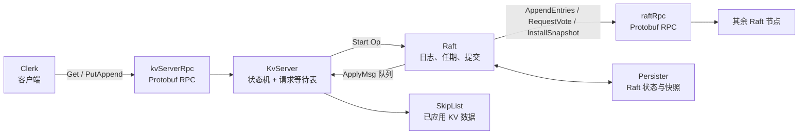
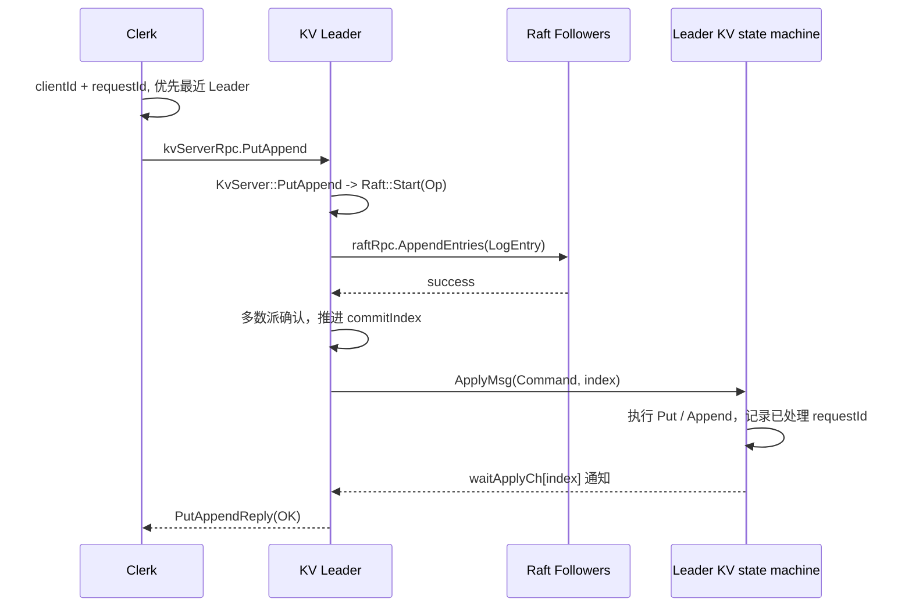

# 环境配置
## 我的环境与版本记录
由于我的电脑是cachyOS，因此我做了一些调整，其实大差不差，都是工具，当然由于muduo库的protobuf有要求，整体和目录都一致。
- 系统：CachyOS（Arch Linux 系）
- g++ ：(GCC) 16.1.1 20260625
- CMake：`3.26.4` 因为项目基于这个版本，所以我都架构在这个版本之上
- Protobuf：拉取git指定版本
- Boost：最新版
- Muduo：由本地 `muduo-master.zip` 构建，头文件位于 `/usr/local/include/muduo`，库位于 `/usr/local/lib`
# 框架梳理
这是一个 C++20 学习项目：每个进程启动一个 `KvServer`，而一个 `KvServer` 同时拥有两项职责：
1. 对客户端发布 `kvServerRpc`（`Get`、`PutAppend`）；
2. 持有一个 `Raft` 对象，并对其他节点发布 `raftRpc`（`RequestVote`、`AppendEntries`、`InstallSnapshot`）。

`Raft`节点  不理解 key 和 value，只把上层传入的 `Op` 当作命令字节串排序、复制和提交。`KvServer` 才是复制状态机：它在收到已提交的 `ApplyMsg` 后改动跳表，并把结果交还给等待中的客户端 RPC。

### 一个程序是如何进行测试raft集群的
参照`example/raftCoreExample/raftKvDB.cpp`的内容。
 `raftCoreRun` 在循环中调用 `fork()`，创建多个操作系统子进程；每个子进程随后独立构造自己的 `KvServer`。因此三个节点在同一台机器上仍具备分布式系统最关键的隔离边界：
![[Raft集群测试|1000]]
每个节点拥有独立的：
- 虚拟地址空间、`Raft::m_logs`、`m_currentTerm`、`m_commitIndex` 和锁；
- Muduo `TcpServer` 与不同监听端口；
- `Persister(me)` 对应的 Raft 状态和快照文件；
- 与其他节点建立的 TCP 连接和通过网络获得的 RPC reply。

节点之间虽然使用回环地址 `127.0.1.1`，但 `AppendEntries` / `RequestVote` 仍经过 socket、序列化、内核 TCP 栈和对方进程的 `RpcProvider`；它们不共享 Raft 内存，也不能直接读取彼此的日志。把进程部署在不同机器时，协议层和 Raft 状态机的基本结构不变，变化的是 IP、端口、网络延迟与故障方式。

线程和 Fiber 仍然存在，但它们只处理**一个节点内部**的并发：例如 Raft ticker、向多个 peer 并发发 RPC、Muduo 工作线程和应用消息消费。它们绝不代表多个副本，也不能代替多数派确认。所有的节点，都只与进程有关，进程内都只算做一个Raft节点。
### 一个Clerk是如何沟通Raft集群的

针对raftCoreRun创建的`*.conf` → Clerk::Init → m_servers[0..N-1]
Put/Get → 最近 Leader（初始为 node0）
       → 若 RPC 失败或 ErrWrongLeader，依次尝试下一个节点
       → Leader 把操作交给 Raft
       → Leader 通过 AppendEntries 复制给 Followers
       → 多数派提交并应用到 KV → 回复 Clerk
在测试中，针对如下问题会出现不同的情况

|场景|操作|预期现象|
|---|---|---|
|选主|不启动客户端，观察服务端日志|出现 `elect success`，一个节点成为 Leader|
|非 Leader 重试|客户端首次请求发给的 `node0` 恰好不是 Leader|Clerk 输出重试，随后请求成功|
|Leader 故障转移|从日志找 Leader 的节点编号；从 `conf` 找其端口，用 `ss -ltnp` 找 PID 后 `kill -TERM <pid>`|约 0.3–0.5 秒后其余节点重新选主；重新运行客户端仍能读写|
|Follower 故障|杀掉一个非 Leader 节点后运行客户端|另两个节点仍形成多数派，读写继续成功|
|无多数派|三节点中停掉两个节点|客户端会持续重试、不会返回成功；恢复多数派后才能提交|
|落后节点|对一个 Follower 执行 `kill -STOP <pid>`，持续写入，再 `kill -CONT <pid>`|观察 Leader 对该节点补发 `AppendEntries`；这是当前启动器下最接近追赶测试的方式|
|快照生成|完成 500 次写入后检查 `snapshotPersist*.txt` 和 `[SnapShot]` 日志|能验证快照生成与持久化文件写入|

# 项目数据流梳理
## 从 clerk -> raftKVDB
- `raftCoreExample`：端到端入口。`raftKvDB.cpp` fork 多个 KV/Raft 节点；`caller.cpp` 创建 Clerk 并循环 `Put`、`Get`。
- `raftClerk`：客户端库。维护所有节点代理、`clientId`、递增的 `requestId` 和最近成功的 Leader。
- `raftRpcPro`：协议真源。`kvServerRPC.proto` 定义 Clerk 到服务端的 `Get/PutAppend`；`raftRPC.proto` 定义节点间 `AppendEntries/RequestVote/InstallSnapshot`。
- `rpc`：自定义 RPC 框架。负责把 Protobuf 调用变为 TCP 请求，并在服务端按 service/method 分发。
- `raftCore`：核心。`KvServer` 是复制状态机适配层；`Raft` 是共识层；二者经 `ApplyMsg` 队列连接。
- `skipList`：当前状态机实际存储结构。Raft 只保证命令顺序一致，不关心 KV 如何存。
### 一次 Put 的完整链路

- `Clerk::Put` 调用私有 `PutAppend("Put")`。它递增一次 `requestId`，但在整个重试过程中保持该 ID 不变。 
- Clerk 先尝试 `m_recentLeaderId`。RPC 失败或服务端回复 `ErrWrongLeader`，就轮询下一个节点；成功后将该节点缓存为新的最近 Leader。  
    这不是 Leader 查询协议，只是一个高命中率的缓存优化。
- `raftServerRpcUtil` 创建 Protobuf Stub，调用生成的 `kvServerRpc_Stub::PutAppend`。它只把传输失败转换为 `false`。
- `MprpcChannel::CallMethod` 将请求编码为：  
    `varint(headerSize) | RpcHeader(service, method, argsSize) | protobuf args`，再通过 TCP 发送。服务端反向解析并基于描述符调用 `KvServer` 的 Protobuf 重写方法。
- `KvServer::PutAppend` 将协议参数转为内部 `Op {Operation, Key, Value, ClientId, RequestId}`，调用 `Raft::Start`。不是 Leader 时立即回 `ErrWrongLeader`。  
    `Op` 会用 Boost 序列化成 Raft 日志中 `LogEntry.Command` 的字节串。
- `Raft::Start` 只在 Leader 上追加日志、持久化，并返回日志索引；它不代表命令已经提交。
- `KvServer` 以该日志索引建立 `waitApplyCh[index]`，同步等待应用线程通知。这个索引是“当前 RPC”与“最终提交的日志命令”之间的关联键。
- Leader 的心跳循环构造 `AppendEntries`，把从 follower 的 `nextIndex` 到末尾的日志发送给每个 follower。
    follower 校验任期和前序日志、写入条目、更新自身 `commitIndex`，然后回复。
- 多数节点确认后，Leader 推进 `commitIndex`。当前实现还要求候选日志属于当前任期，这符合 Raft 的提交规则。
- `Raft::applierTicker` 将 `[lastApplied + 1, commitIndex]` 逐项包装为 `ApplyMsg` 并推到 `applyChan`。
- `KvServer::ReadRaftApplyCommandLoop` 消费 `ApplyMsg`。`GetCommandFromRaft` 对 `Put/Append` 先按 `(clientId, requestId)` 去重，再执行状态机，最后唤醒对应 `waitApplyCh[index]`。  
    因此“RPC 超时后重发”最多会把同一写命令送入日志多次，但只会对状态机生效一次。
- 原始 RPC 线程被唤醒后，重新核对 `clientId/requestId`。若该索引后来因 Leader 切换被另一命令覆盖，返回 `ErrWrongLeader` 让 Clerk 重试；匹配才回 `OK`。
# 重要组成部分
## 客户端、集群、节点之间的沟通 -- RPC
### Protobuf、RPC 与 TCP 分别负责什么
这三个概念经常一起出现，但职责不同：

| 层次 | 在本项目中的对象 | 职责 |
| --- | --- | --- |
| 协议描述 | `*.proto` | 定义消息字段、字段编号、服务及方法名，是接口的唯一事实来源。 |
| Protobuf | `*.pb.h`、`*.pb.cc`、`libprotobuf` | 生成 C++ 类型；将消息编码为二进制字节；提供描述符、反射、`Service`、`Stub` 等能力。 |
| 项目 RPC 框架 | `MprpcChannel`、`RpcProvider`、`RpcHeader` | 决定如何封装调用、用 TCP 发送、在服务端找到业务方法并返回结果。 |
| 网络与事件循环 | socket、Muduo `TcpServer`、`EventLoop` | 建立 TCP 连接、监听端口、收发字节流。 |

因此，**Protobuf 不是网络协议，也不会自动建立连接**。即使请求和响应都能 `SerializeToString`，仍需要本项目的 `MprpcChannel` 和 `RpcProvider` 把字节送到对端。

项目复用了 `google::protobuf` 的 RPC 父类接口。如果在 `.proto` 文件中显式开启 `option cc_generic_services = true;`，`protoc` 编译器会基于你定义的 `service` 自动生成对应的 C++ 抽象类。这些类依赖于以下三个核心组件：
- **`google::protobuf::Service`**：服务端接口的抽象基类。你可以直接在 C++ 中继承这个类，重写生成的具体 RPC 方法（或底层代理方法 `CallMethod`）来实现本地的业务逻辑。
- **`google::protobuf::RpcChannel`**：用于处理消息分发与传输的通道基类。在客户端发起调用时，它负责抽象“将请求发送到目标并获取响应”的过程。
- **`google::protobuf::RpcController`**：控制器基类，用于管理单次 RPC 调用的上下文状态，例如设置超时、取消调用、传递或获取错误状态码。

因此本项目通过 `option cc_generic_services = true;` 使用 Protobuf C++ 的通用 Service/RPC API。它会生成 `google::protobuf::Service` 子类和 `_Stub` 客户端代理；真正的传输实现仍由项目提供的 `google::protobuf::RpcChannel` 子类 `MprpcChannel` 完成。
### protobuf详解
`example/rpcExample/friend.proto`是最小示例：
```proto
syntax = "proto3";

package fixbug;
option cc_generic_services = true;

message GetFriendsListRequest // 请求消息类
{ 
  uint32 userid = 1;
}

message GetFriendsListResponse // 相应消息类
{
    ResultCode result = 1;
    repeated bytes friends = 2;
}

service FiendServiceRpc {
  rpc GetFriendsList(GetFriendsListRequest) returns(GetFriendsListResponse);
}
```

这里的含义如下：
- `syntax = "proto3"`：使用 proto3 的字段规则和默认值语义。
- `package fixbug`：在生成的 C++ 中对应 `fixbug` 命名空间。
- `message`：定义可序列化的数据结构；`GetFriendsListRequest` 会生成同名 C++ 类。
- `userid = 1`：`1` 是**字段编号**，不是 C++ 成员下标。它构成二进制格式的一部分，发布后不能为了“排序”随意改变。
- `repeated bytes friends = 2`：生成重复字段 API 
	- `repeated` 关键字表示该字段是一个**动态数组（列表）**。 具体到 `repeated bytes friends = 2;`，这意味着 `friends` 字段可以包含 0 个、1 个或多个连续的 `bytes` 类型数据
	- `repeated` 字段不会映射为原生的 C++ 数组，而是被封装成类似 `std::vector` 的容器类：`google::protobuf::RepeatedPtrField<std::string>`
- `service` / `rpc`：定义一个远程接口。由于开启 `cc_generic_services`，生成服务端基类和客户端 Stub。
### 不同的RPC调用方法
以当前 [friend.proto (line 25)](/home/w3nyui/桌面/learn/raft_KV/example/rpcExample/friend.proto:25) 为例，`GetFriendsList` 是一个远端函数；要新增另一个远端函数，应在同一个 service 中声明新 RPC，而不是根据 `userid` 分发函数。

```
message AddFriendRequest {
  uint32 userid = 1;
  bytes friend_userid = 2;
}

message AddFriendResponse {
  ResultCode result = 1;
}

service FiendServiceRpc {
  rpc GetFriendsList(GetFriendsListRequest) returns(GetFriendsListResponse);
  rpc AddFriend(AddFriendRequest) returns(AddFriendResponse);
}
```

接着：

1. 在 [friendService.cpp (line 12)](/home/w3nyui/桌面/learn/raft_KV/example/rpcExample/callee/friendService.cpp:12) 的 `FriendService` 中重写生成的 `AddFriend(...)`，从 `request->userid()`、`request->friend_userid()` 取参数，写入 `response`，最后调用 `done->Run()`。
2. 在 [callFriendService.cpp (line 19)](/home/w3nyui/桌面/learn/raft_KV/example/rpcExample/caller/callFriendService.cpp:19) 中创建 `AddFriendRequest/Response`，然后调用 `stub.AddFriend(&controller, &request, &response, nullptr)`。
3. 重新生成代码，不手改 `friend.pb.h/.cc`：

```
cd example/rpcExample
protoc friend.proto --cpp_out=.
cd ../..
cmake --build build --target provider consumer -j
```

框架会自动把 `FiendServiceRpc` 与 `AddFriend` 写入 RPC 请求头；`RpcProvider` 根据这两个名字找到服务和方法，再调用你重写的 `FriendService::AddFriend`。`userid` 只是在 `AddFriend` 或 `GetFriendsList` 内决定“对哪个用户执行业务逻辑”，不决定远端函数本身。

总而言之：
在 C++ RPC 项目中，通常为每个 RPC 方法定义对应的**请求和响应** Protobuf 消息，并在同一个 Service 中声明这些方法。客户端通过生成的 Stub 和 RPC Channel 发起调用，服务端通过继承生成的 Service 基类实现方法，RPC 框架负责网络通信与请求分发。
### RPC_caller的一次获取
![[Pasted image 20260721182106.png|900]]
## 客户端 Clerk
`Clerk`拥有四类状态：
- `m_servers`：每个 KV/Raft 节点对应一个 `raftServerRpcUtil` 代理。
- `m_clientId`：构造时由 `Uuid()` 生成，用于标识客户端。
- `m_requestId`：从 0 开始递增，为每次逻辑请求编号；重试时保持不变，服务端可据此去重。
- `m_recentLeaderId`：最近一次成功的节点编号，下一次请求优先向它发出，属于缓存优化。
`Clerk`读取`raftKvDB`集群创建(fork)时得到的节点 `IP + Port`并利用 `raftServerRpcUtil` 包装，对每一个 `rpc节点`(其IP、port)，生成一组`stub`，便于后续操作复用。

因此`Clerk`通过封装RPC通信`raftServerRpcUtil`，将“怎么发一次 RPC”和“这次业务请求该怎么完成”分开。

**RPC通信**：`raftServerRpcUtil` 只负责单个节点的一次 RPC 调用：其持有 `Protobuf Stub` 和 `MprpcChannel`，调用结束后仅以 `bool` 返回传输给业务层，例如 `controller.Failed()` 为真就返回 `false`。

**业务/集群服务**：`Clerk` 则负责 KV 业务语义：生成 `ClientId/RequestId`、优先访问缓存的 Leader、轮询其他节点、成功后更新 `m_recentLeaderId`。同时将`put`、`Append`、`Get`
 等业务封装管理。
 这里主要分析的是在`protocol`内定义的`Err`参数，这个参数分析的就是集群内部的失败原因。
	 由于RPC通信成功，指令已经下达到了远端集群，因此不会是：1.集群无法通信；2.网络错误
	 而是内部集群无法处理这个指令，因此可能是：1.指令错误；2.当前节点不是leader

那么当一个 `clerk` 下发一次指令如'Put'、'Get'、‘Appen'时，集群内部是怎样接受的呢？
## RPC的传输 -- MprpcChannel
在实现**客户端**与**服务器**的RPC沟通时，`protobuf` 的 `stub` 如何知道我该怎样发送一个信息，如何在中间插入更多的功能呢？那么就需要利用到 `Protobuf` 官方提供的是一套“可插拔 RPC”接口。官方在 stub 的调用中使用了一个纯虚类 `RpcChannel`的接口虚函数：
``` c++
channel_->CallMethod(method descriptor, request, response, ...);
```

因此我们需要实现一个 `channel` 类，继承`google::protobuf::RpcChannel` 并实现 `CallMethod`，才能让 Protobuf 生成的 Stub 知道如何通过你的 TCP 协议访问远端服务。

在这里，Protobuf 负责消息、服务描述和 Stub 调度接口；网络、连接、封包格式、服务发现及超时策略则可以按照项目需求，通过子类的`CallMethod(method descriptor, request, response, ...);`来实现。

那么我们就可以画出 Channel 与两者之间的链路：
Clerk
  -> raftServerRpcUtil
  -> kvServerRpc_Stub（protoc 生成）
  -> MprpcChannel::CallMethod（项目手写）
  -> TCP connect/send/recv
  -> RpcProvider（服务端项目手写）
  -> kvServerRpc 的 Get / PutAppend 实现

那么客户端的 `CallMethod` 目的就是把调用远端 `kvServerRpc.method` 变成 TCP 字节流。
-  根据 Raft 集群初始化时得到的 Ip + port，构建TCP连接与套接字fd
-  构建实际发送的字节串：varint32(header_size) + protobuf(RpcHeader) + protobuf(GetArgs)
	- 实际内容是：头长度 + 服务名、方法名、参数长度 + 业务请求参数
-  利用 `send()` 发送给目标 IP 与 port。
-  利用 `recv()` 同步等待返回内容
-  最终利用 `ParseFromArray()` 反序列化内容后返回给 `response`

那么发送出了RPC后，服务端该如何响应呢？
![[RPC沟通|1000]]
## RPC的接收 -- RpcProvider
`RpcProvider` 是项目中 RPC 的服务端框架：它把本地的 Protobuf 服务对象发布到 TCP 网络上，让其他进程能够按“服务名 + 方法名”远程调用。

它的主要工作是：
1. `NotifyService`：通过 Protobuf 反射读取服务及方法描述符，注册到 `m_serviceMap`。例如 `KvServer` 同时注册 KV 服务和 `Raft` 服务。
2. `Run`：创建并启动 Muduo `TcpServer`，监听指定端口，同时将节点 IP/端口写入节点信息文件，供其他 Raft 节点发现。
3. `OnMessage`：收到 TCP 字节后，解析请求头中的服务名、方法名和参数长度；查找已注册服务，反序列化参数，并通过 `service->CallMethod(...)` 反射调用真正的本地业务函数。
4. `SendRpcResponse`：业务方法完成后，将 Protobuf 响应序列化并通过原 TCP 连接返回调用方。

在 `KvServer` 中，它同时暴露 `KvServer` 的 `Get`/`PutAppend` 和 `Raft` 的节点间 RPC，因此 Clerk 到 KV 服务、以及 Raft 节点之间的 `RequestVote`、`AppendEntries` 都会经过它。

简言之：`MprpcChannel` 负责客户端“把函数调用发出去”，`RpcProvider` 负责服务端“接收请求、找到函数、执行并返回结果”。
### NotifyService()
它只接受 Protobuf 的服务基类指针 `google::protobuf::Service*`。具体做了三件事：
1. `service->GetDescriptor()` 取得服务描述，例如 `kvServerRpc` 或 `raftRpc`。
2. 遍历该服务在 `.proto` 中声明的全部 RPC 方法，把 `方法名 -> MethodDescriptor` 保存下来。
3. 保存 `服务名 -> {服务对象指针, 方法表}` 到 `m_serviceMap`。

所以注册完成后的结构近似于：
```
kvServerRpc
  service: KvServer*
  methods: PutAppend, Get

raftRpc
  service: Raft*
  methods: AppendEntries, InstallSnapshot, RequestVote
```
之后 `RpcProvider` 的 `OnMessage` 从请求中解析出服务名和方法名，查这张表，最终执行：
`service->CallMethod(method, ..., request, response, done);`
Protobuf 生成的 `CallMethod` 会继续动态分派到在 `KvServer` 或 `Raft` 中重写的实际业务函数。
### Run()
在 `KvServer` 中，会单独开一个后台线程(`thread t.detach()`)，在后台建成监听该节点的远端RPC请求。 而 `Run()` 函数的作用就是注册监听与回调到 Muduo 库内，把已经注册好的 Protobuf 服务真正变成一个可被网络访问的 RPC 服务端。
	 它负责完成“地址发布、创建 TCP Server、绑定回调、启动事件循环”这四件事。
![[RpcProvider的Run函数监听流程.excalidraw|400]]
最终，`Run()` 将之前只存在于内存路由表中的：
```
kvServerRpc -> KvServer
raftRpc     -> Raft
```
接到 `127.0.1.1:port` 这个 TCP 入口上。客户端或其他 Raft 节点的请求到达后，才会进入 `OnMessage()`，并按照服务名和方法名分派到对应对象。
### 最重要的方法调用 -- OnMessage()
`OnMessage` 是 `RpcProvider` 的“服务端请求分派器”。Muduo 在某个 TCP 连接收到数据时调用它；它把字节流还原成一次 RPC 调用，定位已注册的服务和方法，执行本地业务函数，并安排响应返回。

从函数定义开始：
```
void RpcProvider::OnMessage(
    const muduo::net::TcpConnectionPtr& conn,
    muduo::net::Buffer* buffer,
    muduo::Timestamp)
```
- `conn`：这次请求来自的 TCP 连接。后续响应必须沿这条连接写回。
- `buffer`：Muduo 已收到、尚未消费的字节。
- `Timestamp`：消息到达时间；可以写入日志分析。

整体 OnMessage() 流程：
![[RpcProvider的解析相应.excalidraw|500]]
### RPC接收方解析 + 动态分配详解
1. `OnMessage` 先用请求中的 `service_name` 和 `method_name` 查两层表，取得 `google::protobuf::Service*` 与 `MethodDescriptor*`。
2. `service->CallMethod(...)` 是 Protobuf 的反射入口。对于 `kvServerRpc`，生成代码内部按方法下标 `switch`，再通过 C++ 虚函数调用最终的 `KvServer::Get` 或 `KvServer::PutAppend`。
3. `done` 不是业务返回值，而是框架预先绑定好的“响应发送动作”。业务方法完成并调用 `done->Run()` 后，才会序列化 `reply` 并通过原来的 TCP 连接发回。

`RpcProvider` 在 `NotifyService()` 中读取 Protobuf 生成的服务描述符，将服务名映射到本地 `Service` 实例，并将该服务下的方法名映射到对应的**路由表**。
在实现了路由表后，`RpcProvider`的解析：`OnMessage()` 在做的就是利用客户端写入的 RpcHeader 来解析 **请求方法+序列字节流**，最后写入 `CallMethod()` 利用 `protocol` 官方的 `pb.cc` 实现动态路由，触发本地方法。
```c++
google::protobuf::Message *request = service->GetRequestPrototype(method).New();
// args_str 是前期从 Rpc 中解析出来的 方法字节
request->ParseFromString(args_str); // 反序列化 获得请求方法 request
```
最后 OnMessage() 还实现了注册回调，利用 `done->Run()` 实现了发送了。
## 服务端的响应 -- KVServer
