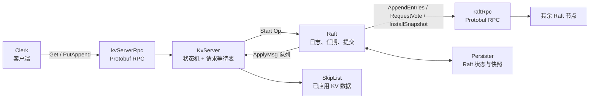

# 环境配置
## 我的环境与版本记录
由于我的电脑是cachyOS，因此我做了一些调整，其实大差不差，都是工具，当然由于muduo库的protobuf有要求，整体和目录都一致。
- 系统：CachyOS（Arch Linux 系）
- g++ ：(GCC) 16.1.1 20260625
- CMake：`3.26.4` 因为项目基于这个版本，所以我都架构在这个版本之上
- Protobuf：拉取git指定版本
- Boost：最新版
- Muduo：由本地 `muduo-master.zip` 构建，头文件位于 `/usr/local/include/muduo`，库位于 `/usr/local/lib`
# 框架梳理
这是一个 C++20 学习项目：每个进程启动一个 `KvServer`，而一个 `KvServer` 同时拥有两项职责：
1. 对客户端发布 `kvServerRpc`（`Get`、`PutAppend`）；
2. 持有一个 `Raft` 对象，并对其他节点发布 `raftRpc`（`RequestVote`、`AppendEntries`、`InstallSnapshot`）。

`Raft`节点  不理解 key 和 value，只把上层传入的 `Op` 当作命令字节串排序、复制和提交。`KvServer` 才是复制状态机：它在收到已提交的 `ApplyMsg` 后改动跳表，并把结果交还给等待中的客户端 RPC。

### 一个程序是如何进行测试raft集群的
参照`example/raftCoreExample/raftKvDB.cpp`的内容。
 `raftCoreRun` 在循环中调用 `fork()`，创建多个操作系统子进程；每个子进程随后独立构造自己的 `KvServer`。因此三个节点在同一台机器上仍具备分布式系统最关键的隔离边界：
![[Raft集群测试|1000]]
每个节点拥有独立的：
- 虚拟地址空间、`Raft::m_logs`、`m_currentTerm`、`m_commitIndex` 和锁；
- Muduo `TcpServer` 与不同监听端口；
- `Persister(me)` 对应的 Raft 状态和快照文件；
- 与其他节点建立的 TCP 连接和通过网络获得的 RPC reply。

节点之间虽然使用回环地址 `127.0.1.1`，但 `AppendEntries` / `RequestVote` 仍经过 socket、序列化、内核 TCP 栈和对方进程的 `RpcProvider`；它们不共享 Raft 内存，也不能直接读取彼此的日志。把进程部署在不同机器时，协议层和 Raft 状态机的基本结构不变，变化的是 IP、端口、网络延迟与故障方式。

线程和 Fiber 仍然存在，但它们只处理**一个节点内部**的并发：例如 Raft ticker、向多个 peer 并发发 RPC、Muduo 工作线程和应用消息消费。它们绝不代表多个副本，也不能代替多数派确认。所有的节点，都只与进程有关，进程内都只算做一个Raft节点。
### 一个Clerk是如何沟通Raft集群的

针对raftCoreRun创建的`*.conf` → Clerk::Init → m_servers[0..N-1]
Put/Get → 最近 Leader（初始为 node0）
       → 若 RPC 失败或 ErrWrongLeader，依次尝试下一个节点
       → Leader 把操作交给 Raft
       → Leader 通过 AppendEntries 复制给 Followers
       → 多数派提交并应用到 KV → 回复 Clerk
在测试中，针对如下问题会出现不同的情况

|场景|操作|预期现象|
|---|---|---|
|选主|不启动客户端，观察服务端日志|出现 `elect success`，一个节点成为 Leader|
|非 Leader 重试|客户端首次请求发给的 `node0` 恰好不是 Leader|Clerk 输出重试，随后请求成功|
|Leader 故障转移|从日志找 Leader 的节点编号；从 `conf` 找其端口，用 `ss -ltnp` 找 PID 后 `kill -TERM <pid>`|约 0.3–0.5 秒后其余节点重新选主；重新运行客户端仍能读写|
|Follower 故障|杀掉一个非 Leader 节点后运行客户端|另两个节点仍形成多数派，读写继续成功|
|无多数派|三节点中停掉两个节点|客户端会持续重试、不会返回成功；恢复多数派后才能提交|
|落后节点|对一个 Follower 执行 `kill -STOP <pid>`，持续写入，再 `kill -CONT <pid>`|观察 Leader 对该节点补发 `AppendEntries`；这是当前启动器下最接近追赶测试的方式|
|快照生成|完成 500 次写入后检查 `snapshotPersist*.txt` 和 `[SnapShot]` 日志|能验证快照生成与持久化文件写入|
# 重要组成部分
## 客户端、集群、节点之间的沟通 -- RPC
### Protobuf、RPC 与 TCP 分别负责什么
这三个概念经常一起出现，但职责不同：

| 层次 | 在本项目中的对象 | 职责 |
| --- | --- | --- |
| 协议描述 | `*.proto` | 定义消息字段、字段编号、服务及方法名，是接口的唯一事实来源。 |
| Protobuf | `*.pb.h`、`*.pb.cc`、`libprotobuf` | 生成 C++ 类型；将消息编码为二进制字节；提供描述符、反射、`Service`、`Stub` 等能力。 |
| 项目 RPC 框架 | `MprpcChannel`、`RpcProvider`、`RpcHeader` | 决定如何封装调用、用 TCP 发送、在服务端找到业务方法并返回结果。 |
| 网络与事件循环 | socket、Muduo `TcpServer`、`EventLoop` | 建立 TCP 连接、监听端口、收发字节流。 |

因此，**Protobuf 不是网络协议，也不会自动建立连接**。即使请求和响应都能 `SerializeToString`，仍需要本项目的 `MprpcChannel` 和 `RpcProvider` 把字节送到对端。

项目复用了 `google::protobuf` 的 RPC 父类接口。如果在 `.proto` 文件中显式开启 `option cc_generic_services = true;`，`protoc` 编译器会基于你定义的 `service` 自动生成对应的 C++ 抽象类。这些类依赖于以下三个核心组件：
- **`google::protobuf::Service`**：服务端接口的抽象基类。你可以直接在 C++ 中继承这个类，重写生成的具体 RPC 方法（或底层代理方法 `CallMethod`）来实现本地的业务逻辑。
- **`google::protobuf::RpcChannel`**：用于处理消息分发与传输的通道基类。在客户端发起调用时，它负责抽象“将请求发送到目标并获取响应”的过程。
- **`google::protobuf::RpcController`**：控制器基类，用于管理单次 RPC 调用的上下文状态，例如设置超时、取消调用、传递或获取错误状态码。

因此本项目通过 `option cc_generic_services = true;` 使用 Protobuf C++ 的通用 Service/RPC API。它会生成 `google::protobuf::Service` 子类和 `_Stub` 客户端代理；真正的传输实现仍由项目提供的 `google::protobuf::RpcChannel` 子类 `MprpcChannel` 完成。
### protobuf详解
`example/rpcExample/friend.proto`是最小示例：
```proto
syntax = "proto3";

package fixbug;
option cc_generic_services = true;

message GetFriendsListRequest // 请求消息类
{ 
  uint32 userid = 1;
}

message GetFriendsListResponse // 相应消息类
{
    ResultCode result = 1;
    repeated bytes friends = 2;
}

service FiendServiceRpc {
  rpc GetFriendsList(GetFriendsListRequest) returns(GetFriendsListResponse);
}
```

这里的含义如下：
- `syntax = "proto3"`：使用 proto3 的字段规则和默认值语义。
- `package fixbug`：在生成的 C++ 中对应 `fixbug` 命名空间。
- `message`：定义可序列化的数据结构；`GetFriendsListRequest` 会生成同名 C++ 类。
- `userid = 1`：`1` 是**字段编号**，不是 C++ 成员下标。它构成二进制格式的一部分，发布后不能为了“排序”随意改变。
- `repeated bytes friends = 2`：生成重复字段 API 
	- `repeated` 关键字表示该字段是一个**动态数组（列表）**。 具体到 `repeated bytes friends = 2;`，这意味着 `friends` 字段可以包含 0 个、1 个或多个连续的 `bytes` 类型数据
	- `repeated` 字段不会映射为原生的 C++ 数组，而是被封装成类似 `std::vector` 的容器类：`google::protobuf::RepeatedPtrField<std::string>`
- `service` / `rpc`：定义一个远程接口。由于开启 `cc_generic_services`，生成服务端基类和客户端 Stub。
### 不同的RPC调用方法
以当前 [friend.proto (line 25)](/home/w3nyui/桌面/learn/raft_KV/example/rpcExample/friend.proto:25) 为例，`GetFriendsList` 是一个远端函数；要新增另一个远端函数，应在同一个 service 中声明新 RPC，而不是根据 `userid` 分发函数。

```
message AddFriendRequest {
  uint32 userid = 1;
  uint32 friend_userid = 2;
}

message AddFriendResponse {
  ResultCode result = 1;
}

service FiendServiceRpc {
  rpc GetFriendsList(GetFriendsListRequest) returns(GetFriendsListResponse);
  rpc AddFriend(AddFriendRequest) returns(AddFriendResponse);
}
```

接着：

1. 在 [friendService.cpp (line 12)](/home/w3nyui/桌面/learn/raft_KV/example/rpcExample/callee/friendService.cpp:12) 的 `FriendService` 中重写生成的 `AddFriend(...)`，从 `request->userid()`、`request->friend_userid()` 取参数，写入 `response`，最后调用 `done->Run()`。
2. 在 [callFriendService.cpp (line 19)](/home/w3nyui/桌面/learn/raft_KV/example/rpcExample/caller/callFriendService.cpp:19) 中创建 `AddFriendRequest/Response`，然后调用 `stub.AddFriend(&controller, &request, &response, nullptr)`。
3. 重新生成代码，不手改 `friend.pb.h/.cc`：

```
cd example/rpcExample
protoc friend.proto --cpp_out=.
cd ../..
cmake --build build --target provider consumer -j
```

框架会自动把 `FiendServiceRpc` 与 `AddFriend` 写入 RPC 请求头；`RpcProvider` 根据这两个名字找到服务和方法，再调用你重写的 `FriendService::AddFriend`。`userid` 只是在 `AddFriend` 或 `GetFriendsList` 内决定“对哪个用户执行业务逻辑”，不决定远端函数本身。
### RPC_caller的一次获取
![[Pasted image 20260721182106.png|900]]
