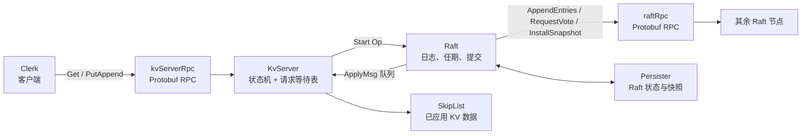
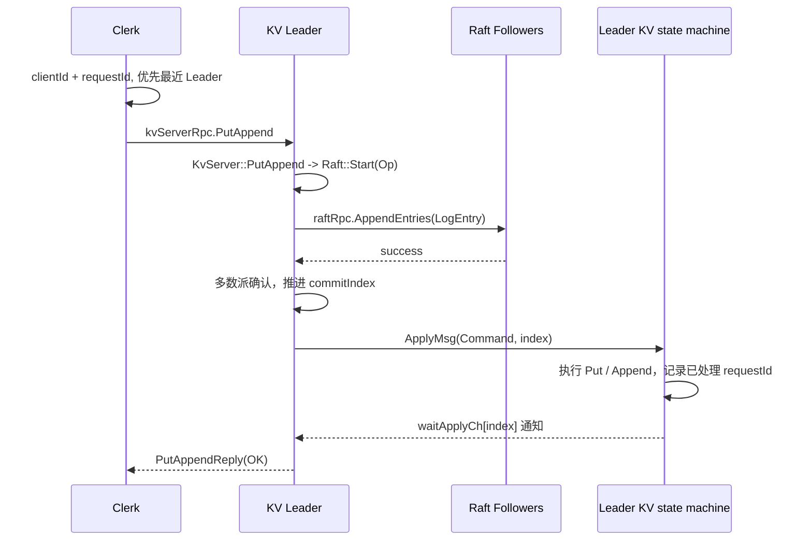
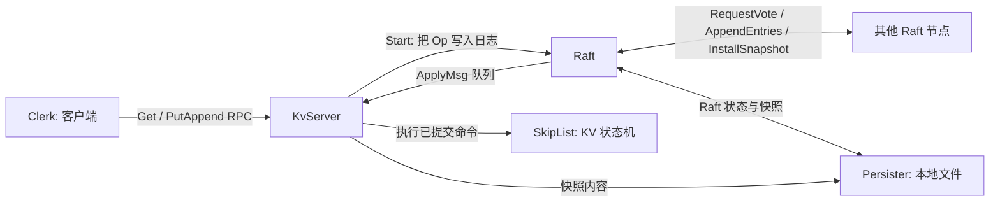
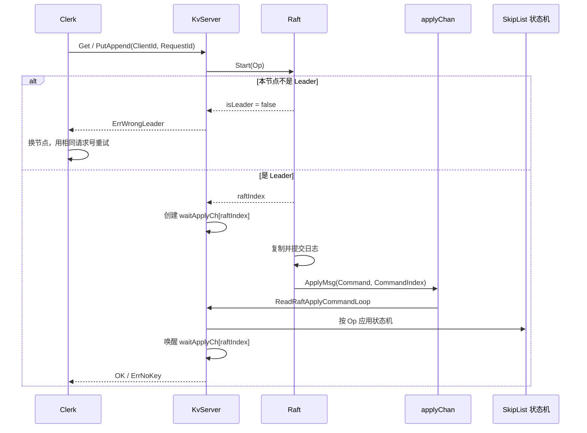

# 环境配置
## 我的环境与版本记录
由于我的电脑是cachyOS，因此我做了一些调整，其实大差不差，都是工具，当然由于muduo库的protobuf有要求，整体和目录都一致。
- 系统：CachyOS（Arch Linux 系）
- g++ ：(GCC) 16.1.1 20260625
- CMake：`3.26.4` 因为项目基于这个版本，所以我都架构在这个版本之上
- Protobuf：拉取git指定版本
- Boost：最新版
- Muduo：由本地 `muduo-master.zip` 构建，头文件位于 `/usr/local/include/muduo`，库位于 `/usr/local/lib`
# 框架梳理
这是一个 C++20 学习项目：每个进程启动一个 `KvServer`，而一个 `KvServer` 同时拥有两项职责：
1. 对客户端发布 `kvServerRpc`（`Get`、`PutAppend`）；
2. 持有一个 `Raft` 对象，并对其他节点发布 `raftRpc`（`RequestVote`、`AppendEntries`、`InstallSnapshot`）。

`Raft`节点  不理解 key 和 value，只把上层传入的 `Op` 当作命令字节串排序、复制和提交。`KvServer` 才是复制状态机：它在收到已提交的 `ApplyMsg` 后改动跳表，并把结果交还给等待中的客户端 RPC。

```mermaid
flowchart LR
  Clerk[Clerk\n客户端] -->|Get / PutAppend| KV_RPC[kvServerRpc\nProtobuf RPC]
  KV_RPC --> KV[KvServer\n状态机 + 请求等待表]
  KV -->|Start Op| Raft[Raft\n日志、任期、提交]
  Raft -->|AppendEntries / RequestVote / InstallSnapshot| RAFT_RPC[raftRpc\nProtobuf RPC]
  RAFT_RPC --> Peers[其余 Raft 节点]
  Raft -->|ApplyMsg 队列| KV
  KV --> SkipList[SkipList\n已应用 KV 数据]
  Raft <--> Persist[Persister\nRaft 状态与快照]
```
### 一个程序是如何进行测试raft集群的
参照`example/raftCoreExample/raftKvDB.cpp`的内容。
 `raftCoreRun` 在循环中调用 `fork()`，创建多个操作系统子进程；每个子进程随后独立构造自己的 `KvServer`。因此三个节点在同一台机器上仍具备分布式系统最关键的隔离边界：
![[Raft集群测试|1000]]
每个节点拥有独立的：
- 虚拟地址空间、`Raft::m_logs`、`m_currentTerm`、`m_commitIndex` 和锁；
- Muduo `TcpServer` 与不同监听端口；
- `Persister(me)` 对应的 Raft 状态和快照文件；
- 与其他节点建立的 TCP 连接和通过网络获得的 RPC reply。

节点之间虽然使用回环地址 `127.0.1.1`，但 `AppendEntries` / `RequestVote` 仍经过 socket、序列化、内核 TCP 栈和对方进程的 `RpcProvider`；它们不共享 Raft 内存，也不能直接读取彼此的日志。把进程部署在不同机器时，协议层和 Raft 状态机的基本结构不变，变化的是 IP、端口、网络延迟与故障方式。

线程和 Fiber 仍然存在，但它们只处理**一个节点内部**的并发：例如 Raft ticker、向多个 peer 并发发 RPC、Muduo 工作线程和应用消息消费。它们绝不代表多个副本，也不能代替多数派确认。所有的节点，都只与进程有关，进程内都只算做一个Raft节点。
### 一个Clerk是如何沟通Raft集群的

针对raftCoreRun创建的`*.conf` → Clerk::Init → m_servers[0..N-1]
Put/Get → 最近 Leader（初始为 node0）
       → 若 RPC 失败或 ErrWrongLeader，依次尝试下一个节点
       → Leader 把操作交给 Raft
       → Leader 通过 AppendEntries 复制给 Followers
       → 多数派提交并应用到 KV → 回复 Clerk
在测试中，针对如下问题会出现不同的情况

|场景|操作|预期现象|
|---|---|---|
|选主|不启动客户端，观察服务端日志|出现 `elect success`，一个节点成为 Leader|
|非 Leader 重试|客户端首次请求发给的 `node0` 恰好不是 Leader|Clerk 输出重试，随后请求成功|
|Leader 故障转移|从日志找 Leader 的节点编号；从 `conf` 找其端口，用 `ss -ltnp` 找 PID 后 `kill -TERM <pid>`|约 0.3–0.5 秒后其余节点重新选主；重新运行客户端仍能读写|
|Follower 故障|杀掉一个非 Leader 节点后运行客户端|另两个节点仍形成多数派，读写继续成功|
|无多数派|三节点中停掉两个节点|客户端会持续重试、不会返回成功；恢复多数派后才能提交|
|落后节点|对一个 Follower 执行 `kill -STOP <pid>`，持续写入，再 `kill -CONT <pid>`|观察 Leader 对该节点补发 `AppendEntries`；这是当前启动器下最接近追赶测试的方式|
|快照生成|完成 500 次写入后检查 `snapshotPersist*.txt` 和 `[SnapShot]` 日志|能验证快照生成与持久化文件写入|

# 项目数据流梳理
## 从 clerk -> raftKVDB
- `raftCoreExample`：端到端入口。`raftKvDB.cpp` fork 多个 KV/Raft 节点；`caller.cpp` 创建 Clerk 并循环 `Put`、`Get`。
- `raftClerk`：客户端库。维护所有节点代理、`clientId`、递增的 `requestId` 和最近成功的 Leader。
- `raftRpcPro`：协议真源。`kvServerRPC.proto` 定义 Clerk 到服务端的 `Get/PutAppend`；`raftRPC.proto` 定义节点间 `AppendEntries/RequestVote/InstallSnapshot`。
- `rpc`：自定义 RPC 框架。负责把 Protobuf 调用变为 TCP 请求，并在服务端按 service/method 分发。
- `raftCore`：核心。`KvServer` 是复制状态机适配层；`Raft` 是共识层；二者经 `ApplyMsg` 队列连接。
- `skipList`：当前状态机实际存储结构。Raft 只保证命令顺序一致，不关心 KV 如何存。
### 一次 Put 的完整链路

```mermaid
sequenceDiagram
  participant C as Clerk
  participant L as KV Leader
  participant F as Raft Followers
  participant K as Leader KV state machine

  C->>C: clientId + requestId, 优先最近 Leader
  C->>L: kvServerRpc.PutAppend
  L->>L: KvServer::PutAppend -> Raft::Start(Op)
  L->>F: raftRpc.AppendEntries(LogEntry)
  F-->>L: success
  L->>L: 多数派确认，推进 commitIndex
  L->>K: ApplyMsg(Command, index)
  K->>K: 执行 Put / Append，记录已处理 requestId
  K-->>L: waitApplyCh[index] 通知
  L-->>C: PutAppendReply(OK)
```
- `Clerk::Put` 调用私有 `PutAppend("Put")`。它递增一次 `requestId`，但在整个重试过程中保持该 ID 不变。 
- Clerk 先尝试 `m_recentLeaderId`。RPC 失败或服务端回复 `ErrWrongLeader`，就轮询下一个节点；成功后将该节点缓存为新的最近 Leader。  
    这不是 Leader 查询协议，只是一个高命中率的缓存优化。
- `raftServerRpcUtil` 创建 Protobuf Stub，调用生成的 `kvServerRpc_Stub::PutAppend`。它只把传输失败转换为 `false`。
- `MprpcChannel::CallMethod` 将请求编码为：  
    `varint(headerSize) | RpcHeader(service, method, argsSize) | protobuf args`，再通过 TCP 发送。服务端反向解析并基于描述符调用 `KvServer` 的 Protobuf 重写方法。
- `KvServer::PutAppend` 将协议参数转为内部 `Op {Operation, Key, Value, ClientId, RequestId}`，调用 `Raft::Start`。不是 Leader 时立即回 `ErrWrongLeader`。  
    `Op` 会用 Boost 序列化成 Raft 日志中 `LogEntry.Command` 的字节串。
- `Raft::Start` 只在 Leader 上追加日志、持久化，并返回日志索引；它不代表命令已经提交。
- `KvServer` 以该日志索引建立 `waitApplyCh[index]`，同步等待应用线程通知。这个索引是“当前 RPC”与“最终提交的日志命令”之间的关联键。
- Leader 的心跳循环构造 `AppendEntries`，把从 follower 的 `nextIndex` 到末尾的日志发送给每个 follower。
    follower 校验任期和前序日志、写入条目、更新自身 `commitIndex`，然后回复。
- 多数节点确认后，Leader 推进 `commitIndex`。当前实现还要求候选日志属于当前任期，这符合 Raft 的提交规则。
- `Raft::applierTicker` 将 `[lastApplied + 1, commitIndex]` 逐项包装为 `ApplyMsg` 并推到 `applyChan`。
- `KvServer::ReadRaftApplyCommandLoop` 消费 `ApplyMsg`。`GetCommandFromRaft` 对 `Put/Append` 先按 `(clientId, requestId)` 去重，再执行状态机，最后唤醒对应 `waitApplyCh[index]`。  
    因此“RPC 超时后重发”最多会把同一写命令送入日志多次，但只会对状态机生效一次。
- 原始 RPC 线程被唤醒后，重新核对 `clientId/requestId`。若该索引后来因 Leader 切换被另一命令覆盖，返回 `ErrWrongLeader` 让 Clerk 重试；匹配才回 `OK`。
# 重要组成部分
## 客户端、集群、节点之间的沟通 -- RPC
### Protobuf、RPC 与 TCP 分别负责什么
这三个概念经常一起出现，但职责不同：

| 层次 | 在本项目中的对象 | 职责 |
| --- | --- | --- |
| 协议描述 | `*.proto` | 定义消息字段、字段编号、服务及方法名，是接口的唯一事实来源。 |
| Protobuf | `*.pb.h`、`*.pb.cc`、`libprotobuf` | 生成 C++ 类型；将消息编码为二进制字节；提供描述符、反射、`Service`、`Stub` 等能力。 |
| 项目 RPC 框架 | `MprpcChannel`、`RpcProvider`、`RpcHeader` | 决定如何封装调用、用 TCP 发送、在服务端找到业务方法并返回结果。 |
| 网络与事件循环 | socket、Muduo `TcpServer`、`EventLoop` | 建立 TCP 连接、监听端口、收发字节流。 |

因此，**Protobuf 不是网络协议，也不会自动建立连接**。即使请求和响应都能 `SerializeToString`，仍需要本项目的 `MprpcChannel` 和 `RpcProvider` 把字节送到对端。

项目复用了 `google::protobuf` 的 RPC 父类接口。如果在 `.proto` 文件中显式开启 `option cc_generic_services = true;`，`protoc` 编译器会基于你定义的 `service` 自动生成对应的 C++ 抽象类。这些类依赖于以下三个核心组件：
- **`google::protobuf::Service`**：服务端接口的抽象基类。你可以直接在 C++ 中继承这个类，重写生成的具体 RPC 方法（或底层代理方法 `CallMethod`）来实现本地的业务逻辑。
- **`google::protobuf::RpcChannel`**：用于处理消息分发与传输的通道基类。在客户端发起调用时，它负责抽象“将请求发送到目标并获取响应”的过程。
- **`google::protobuf::RpcController`**：控制器基类，用于管理单次 RPC 调用的上下文状态，例如设置超时、取消调用、传递或获取错误状态码。

因此本项目通过 `option cc_generic_services = true;` 使用 Protobuf C++ 的通用 Service/RPC API。它会生成 `google::protobuf::Service` 子类和 `_Stub` 客户端代理；真正的传输实现仍由项目提供的 `google::protobuf::RpcChannel` 子类 `MprpcChannel` 完成。
### protobuf详解
`example/rpcExample/friend.proto`是最小示例：
```proto
syntax = "proto3";

package fixbug;
option cc_generic_services = true;

message GetFriendsListRequest // 请求消息类
{ 
  uint32 userid = 1;
}

message GetFriendsListResponse // 相应消息类
{
    ResultCode result = 1;
    repeated bytes friends = 2;
}

service FiendServiceRpc {
  rpc GetFriendsList(GetFriendsListRequest) returns(GetFriendsListResponse);
}
```

这里的含义如下：
- `syntax = "proto3"`：使用 proto3 的字段规则和默认值语义。
- `package fixbug`：在生成的 C++ 中对应 `fixbug` 命名空间。
- `message`：定义可序列化的数据结构；`GetFriendsListRequest` 会生成同名 C++ 类。
- `userid = 1`：`1` 是**字段编号**，不是 C++ 成员下标。它构成二进制格式的一部分，发布后不能为了“排序”随意改变。
- `repeated bytes friends = 2`：生成重复字段 API 
	- `repeated` 关键字表示该字段是一个**动态数组（列表）**。 具体到 `repeated bytes friends = 2;`，这意味着 `friends` 字段可以包含 0 个、1 个或多个连续的 `bytes` 类型数据
	- `repeated` 字段不会映射为原生的 C++ 数组，而是被封装成类似 `std::vector` 的容器类：`google::protobuf::RepeatedPtrField<std::string>`
- `service` / `rpc`：定义一个远程接口。由于开启 `cc_generic_services`，生成服务端基类和客户端 Stub。
### 不同的RPC调用方法
以当前 [friend.proto (line 25)](/home/w3nyui/桌面/learn/raft_KV/example/rpcExample/friend.proto:25) 为例，`GetFriendsList` 是一个远端函数；要新增另一个远端函数，应在同一个 service 中声明新 RPC，而不是根据 `userid` 分发函数。

```
message AddFriendRequest {
  uint32 userid = 1;
  bytes friend_userid = 2;
}

message AddFriendResponse {
  ResultCode result = 1;
}

service FiendServiceRpc {
  rpc GetFriendsList(GetFriendsListRequest) returns(GetFriendsListResponse);
  rpc AddFriend(AddFriendRequest) returns(AddFriendResponse);
}
```

接着：

1. 在 [friendService.cpp (line 12)](/home/w3nyui/桌面/learn/raft_KV/example/rpcExample/callee/friendService.cpp:12) 的 `FriendService` 中重写生成的 `AddFriend(...)`，从 `request->userid()`、`request->friend_userid()` 取参数，写入 `response`，最后调用 `done->Run()`。
2. 在 [callFriendService.cpp (line 19)](/home/w3nyui/桌面/learn/raft_KV/example/rpcExample/caller/callFriendService.cpp:19) 中创建 `AddFriendRequest/Response`，然后调用 `stub.AddFriend(&controller, &request, &response, nullptr)`。
3. 重新生成代码，不手改 `friend.pb.h/.cc`：

```
cd example/rpcExample
protoc friend.proto --cpp_out=.
cd ../..
cmake --build build --target provider consumer -j
```

框架会自动把 `FiendServiceRpc` 与 `AddFriend` 写入 RPC 请求头；`RpcProvider` 根据这两个名字找到服务和方法，再调用你重写的 `FriendService::AddFriend`。`userid` 只是在 `AddFriend` 或 `GetFriendsList` 内决定“对哪个用户执行业务逻辑”，不决定远端函数本身。

总而言之：
在 C++ RPC 项目中，通常为每个 RPC 方法定义对应的**请求和响应** Protobuf 消息，并在同一个 Service 中声明这些方法。客户端通过生成的 Stub 和 RPC Channel 发起调用，服务端通过继承生成的 Service 基类实现方法，RPC 框架负责网络通信与请求分发。
### RPC_caller的一次获取
![[Pasted image 20260721182106.png|900]]
## 客户端 Clerk
`Clerk`拥有四类状态：
- `m_servers`：每个 KV/Raft 节点对应一个 `raftServerRpcUtil` 代理。
- `m_clientId`：构造时由 `Uuid()` 生成，用于标识客户端。
- `m_requestId`：从 0 开始递增，为每次逻辑请求编号；重试时保持不变，服务端可据此去重。
- `m_recentLeaderId`：最近一次成功的节点编号，下一次请求优先向它发出，属于缓存优化。
`Clerk`读取`raftKvDB`集群创建(fork)时得到的节点 `IP + Port`并利用 `raftServerRpcUtil` 包装，对每一个 `rpc节点`(其IP、port)，生成一组`stub`，便于后续操作复用。

因此`Clerk`通过封装RPC通信`raftServerRpcUtil`，将“怎么发一次 RPC”和“这次业务请求该怎么完成”分开。

**RPC通信**：`raftServerRpcUtil` 只负责单个节点的一次 RPC 调用：其持有 `Protobuf Stub` 和 `MprpcChannel`，调用结束后仅以 `bool` 返回传输给业务层，例如 `controller.Failed()` 为真就返回 `false`。

**业务/集群服务**：`Clerk` 则负责 KV 业务语义：生成 `ClientId/RequestId`、优先访问缓存的 Leader、轮询其他节点、成功后更新 `m_recentLeaderId`。同时将`put`、`Append`、`Get`
 等业务封装管理。
 这里主要分析的是在`protocol`内定义的`Err`参数，这个参数分析的就是集群内部的失败原因。
	 由于RPC通信成功，指令已经下达到了远端集群，因此不会是：1.集群无法通信；2.网络错误
	 而是内部集群无法处理这个指令，因此可能是：1.指令错误；2.当前节点不是leader

那么当一个 `clerk` 下发一次指令如'Put'、'Get'、‘Appen'时，集群内部是怎样接受的呢？
## RPC的传输 -- MprpcChannel
在实现**客户端**与**服务器**的RPC沟通时，`protobuf` 的 `stub` 如何知道我该怎样发送一个信息，如何在中间插入更多的功能呢？那么就需要利用到 `Protobuf` 官方提供的是一套“可插拔 RPC”接口。官方在 stub 的调用中使用了一个纯虚类 `RpcChannel`的接口虚函数：
``` c++
channel_->CallMethod(method descriptor, request, response, ...);
```

因此我们需要实现一个 `channel` 类，继承`google::protobuf::RpcChannel` 并实现 `CallMethod`，才能让 Protobuf 生成的 Stub 知道如何通过你的 TCP 协议访问远端服务。

在这里，Protobuf 负责消息、服务描述和 Stub 调度接口；网络、连接、封包格式、服务发现及超时策略则可以按照项目需求，通过子类的`CallMethod(method descriptor, request, response, ...);`来实现。

那么我们就可以画出 Channel 与两者之间的链路：
Clerk
  -> raftServerRpcUtil
  -> kvServerRpc_Stub（protoc 生成）
  -> MprpcChannel::CallMethod（项目手写）
  -> TCP connect/send/recv
  -> RpcProvider（服务端项目手写）
  -> kvServerRpc 的 Get / PutAppend 实现

那么客户端的 `CallMethod` 目的就是把调用远端 `kvServerRpc.method` 变成 TCP 字节流。
-  根据 Raft 集群初始化时得到的 Ip + port，构建TCP连接与套接字fd
-  构建实际发送的字节串：varint32(header_size) + protobuf(RpcHeader) + protobuf(GetArgs)
	- 实际内容是：头长度 + 服务名、方法名、参数长度 + 业务请求参数
-  利用 `send()` 发送给目标 IP 与 port。
-  利用 `recv()` 同步等待返回内容
-  最终利用 `ParseFromArray()` 反序列化内容后返回给 `response`

那么发送出了RPC后，服务端该如何响应呢？
![[RPC沟通|1000]]
## RPC的接收 -- RpcProvider
`RpcProvider` 是项目中 RPC 的服务端框架：它把本地的 Protobuf 服务对象发布到 TCP 网络上，让其他进程能够按“服务名 + 方法名”远程调用。

它的主要工作是：
1. `NotifyService`：通过 Protobuf 反射读取服务及方法描述符，注册到 `m_serviceMap`。例如 `KvServer` 同时注册 KV 服务和 `Raft` 服务。
2. `Run`：创建并启动 Muduo `TcpServer`，监听指定端口，同时将节点 IP/端口写入节点信息文件，供其他 Raft 节点发现。
3. `OnMessage`：收到 TCP 字节后，解析请求头中的服务名、方法名和参数长度；查找已注册服务，反序列化参数，并通过 `service->CallMethod(...)` 反射调用真正的本地业务函数。
4. `SendRpcResponse`：业务方法完成后，将 Protobuf 响应序列化并通过原 TCP 连接返回调用方。

在 `KvServer` 中，它同时暴露 `KvServer` 的 `Get`/`PutAppend` 和 `Raft` 的节点间 RPC，因此 Clerk 到 KV 服务、以及 Raft 节点之间的 `RequestVote`、`AppendEntries` 都会经过它。

简言之：`MprpcChannel` 负责客户端“把函数调用发出去”，`RpcProvider` 负责服务端“接收请求、找到函数、执行并返回结果”。
### NotifyService()
它只接受 Protobuf 的服务基类指针 `google::protobuf::Service*`。具体做了三件事：
1. `service->GetDescriptor()` 取得服务描述，例如 `kvServerRpc` 或 `raftRpc`。
2. 遍历该服务在 `.proto` 中声明的全部 RPC 方法，把 `方法名 -> MethodDescriptor` 保存下来。
3. 保存 `服务名 -> {服务对象指针, 方法表}` 到 `m_serviceMap`。

所以注册完成后的结构近似于：
```
kvServerRpc
  service: KvServer*
  methods: PutAppend, Get

raftRpc
  service: Raft*
  methods: AppendEntries, InstallSnapshot, RequestVote
```
之后 `RpcProvider` 的 `OnMessage` 从请求中解析出服务名和方法名，查这张表，最终执行：
`service->CallMethod(method, ..., request, response, done);`
Protobuf 生成的 `CallMethod` 会继续动态分派到在 `KvServer` 或 `Raft` 中重写的实际业务函数。
### Run()
在 `KvServer` 中，会单独开一个后台线程(`thread t.detach()`)，在后台建成监听该节点的远端RPC请求。 而 `Run()` 函数的作用就是注册监听与回调到 Muduo 库内，把已经注册好的 Protobuf 服务真正变成一个可被网络访问的 RPC 服务端。
	 它负责完成“地址发布、创建 TCP Server、绑定回调、启动事件循环”这四件事。
![[RpcProvider的Run函数监听流程.excalidraw|400]]
最终，`Run()` 将之前只存在于内存路由表中的：
```
kvServerRpc -> KvServer
raftRpc     -> Raft
```
接到 `127.0.1.1:port` 这个 TCP 入口上。客户端或其他 Raft 节点的请求到达后，才会进入 `OnMessage()`，并按照服务名和方法名分派到对应对象。
### 最重要的方法调用 -- OnMessage()
`OnMessage` 是 `RpcProvider` 的“服务端请求分派器”。Muduo 在某个 TCP 连接收到数据时调用它；它把字节流还原成一次 RPC 调用，定位已注册的服务和方法，执行本地业务函数，并安排响应返回。

从函数定义开始：
```
void RpcProvider::OnMessage(
    const muduo::net::TcpConnectionPtr& conn,
    muduo::net::Buffer* buffer,
    muduo::Timestamp)
```
- `conn`：这次请求来自的 TCP 连接。后续响应必须沿这条连接写回。
- `buffer`：Muduo 已收到、尚未消费的字节。
- `Timestamp`：消息到达时间；可以写入日志分析。

整体 OnMessage() 流程：
![[RpcProvider的解析相应.excalidraw|500]]
### RPC接收方解析 + 动态分配详解
1. `OnMessage` 先用请求中的 `service_name` 和 `method_name` 查两层表，取得 `google::protobuf::Service*` 与 `MethodDescriptor*`。
2. `service->CallMethod(...)` 是 Protobuf 的反射入口。对于 `kvServerRpc`，生成代码内部按方法下标 `switch`，再通过 C++ 虚函数调用最终的 `KvServer::Get` 或 `KvServer::PutAppend`。
3. `done` 不是业务返回值，而是框架预先绑定好的“响应发送动作”。业务方法完成并调用 `done->Run()` 后，才会序列化 `reply` 并通过原来的 TCP 连接发回。

`RpcProvider` 在 `NotifyService()` 中读取 Protobuf 生成的服务描述符，将服务名映射到本地 `Service` 实例，并将该服务下的方法名映射到对应的**路由表**。
在实现了路由表后，`RpcProvider`的解析：`OnMessage()` 在做的就是利用客户端写入的 RpcHeader 来解析 **请求方法+序列字节流**，最后写入 `CallMethod()` 利用 `protocol` 官方的 `pb.cc` 实现动态路由，触发本地方法。
```c++
google::protobuf::Message *request = service->GetRequestPrototype(method).New();
// args_str 是前期从 Rpc 中解析出来的 方法字节
request->ParseFromString(args_str); // 反序列化 获得请求方法 request
```
最后 OnMessage() 还实现了注册回调，利用 `done->Run()` 实现了发送。
## 服务端的响应 -- KVServer
在构建分布式集群时，会 `fork()` 出子进程，每个子进程都是一个 `raft节点`，每个节点内都构建有一个 `KVServer`，这个 `KVServer` 注册了两种 RPC：
- 与客户端沟通的 :KvServerRPC
- 与其他 Raft 节点沟通的：raftRPC

之后 该节点初始化了 Raft节点，注册了与其他节点的连接。同时注册了该节点底层的跳表，该跳表只会在集群对某一OP实现**多数实现**后，才会修改本地KV状态机。
最后，`KVServer` 构造了一线程单独循环：`ReadRaftApplyCommandLoop()`，**阻塞等待**底层返回日志信息，用于将 `ApplyMsg` 的日志**持久化到** `skiplist`。

一个进程只创建一个 `KvServer`，但这个对象同时带着两层服务：


```mermaid
flowchart LR
  C[Clerk: 客户端] -->|Get / PutAppend RPC| K[KvServer]
  K -->|Start: 把 Op 写入日志| R[Raft]
  R <-->|RequestVote / AppendEntries / InstallSnapshot| P[其他 Raft 节点]
  R -->|ApplyMsg 队列| K
  K -->|执行已提交命令| S[SkipList: KV 状态机]
  R <-->|Raft 状态与快照| D[Persister: 本地文件]
  K -->|快照内容| D
```

其中最重要的边界是：

- `KvServer` 不自己决定命令顺序。它把业务命令交给 `Raft`。
- `Raft` 不理解 key 和 value。它只负责让各节点以相同顺序提交命令。
- 只有命令经 `Raft` 提交，并通过 `ApplyMsg` 返回后，`KvServer` 才修改本地 KV 状态机。

这就是“复制状态机”：每个节点执行相同命令序列，因此得到相同的 KV 数据。

`KvServer` 是 Raft 的上层复制状态机。它与所组合的 `Raft` 节点主要通过“直接方法调用 + 共享 ApplyMsg 队列”沟通。KvServer 与其组合的 Raft 节点有如下沟通方式：

| 方向               | 沟通方法                                                     | 功能                                                                      |
| ---------------- | -------------------------------------------------------- | ----------------------------------------------------------------------- |
| KvServer -> Raft | `Raft::Start(op, &index, &term, &isLeader)`              | `Get`、`Put`、`Append` 都先封装为 `Op` 并提交 Raft。仅 Leader 接受；返回日志索引供随后等待对应提交结果。 |
| KvServer -> Raft | `Raft::GetState(&term, &isLeader)`                       | `Get` 等待提交超时时，重新确认本节点是否还是 Leader；否则向 Clerk 返回 `ErrWrongLeader` 触发重试。    |
| KvServer -> Raft | `Raft::GetRaftStateSize()`、`Raft::Snapshot(index, data)` | KV 状态机发现 Raft 持久化状态超过阈值后，序列化跳表和去重记录为快照，通知 Raft 持久化快照并截断已覆盖日志。           |
| 初始化边界            | `Raft::init(..., persister, applyChan)`                  | `KvServer` 创建 Raft、共享持久化器和 `applyChan`，将这些依赖注入 Raft，建立状态机投递通路。          |
完整的一次请求简述如下：
Clerk RPC -> KvServer::PutAppend
          -> Raft::Start(op)
          -> Raft 达成提交
          -> applyChan: ApplyMsg
          -> KvServer::GetCommandFromRaft
          -> 执行 SkipList 写入、去重、唤醒等待该日志索引的 RPC

其中 `waitApplyCh[index]` 是 `KvServer` 内部的“按 Raft 日志索引等待完成”机制：Raft 并不直接回调客户端 RPC；KV 层收到 `ApplyMsg` 后，通过 `SendMessageToWaitChan` 通知最初提交该请求的处理函数。

最后，KvServer内带有两个小模块：Apply与Msg 这两者是Raft与KvServer的沟通与联系
1. ApplyMsg` 是 Raft 和业务状态机之间唯一的数据边界：
	- `CommandValid == true`：`Command` 中是可执行的序列化 `Op`，`CommandIndex` 是其 Raft 日志索引；
	- `SnapshotValid == true`：携带快照数据、边界任期和边界索引。

2. `Persister` 保存两块内容：
	- Raft 自己的元数据和日志：任期、投票对象、快照边界、日志；
	- 由 `KvServer` 制作的状态机快照：跳表内容和去重表。
### KvServer 与 Clerk 的RPC沟通
#### `PutAppend`
协议：`PutAppend(PutAppendArgs) -> PutAppendReply`。

参数包括：
- `Key`、`Value`
- `Op`：`Put` 或 `Append`
- `ClientId`、`RequestId`：请求唯一标识，用于去重

KvServer 不会直接改跳表，而是先将操作包装成 `Op`，调用本地 `m_raftNode->Start(...)` 进入 Raft 日志。只有 Leader 能接受；非 Leader 返回 `ErrWrongLeader`。之后它等待对应日志索引被 Raft 应用，应用线程再通过 `ClientId + RequestId` 防止网络重试导致重复写入。

#### `Get`
协议：`Get(GetArgs) -> GetReply`。

它带有 `Key`、`ClientId`、`RequestId`，返回 `Err` 和 `Value`。这个项目的 `Get` 也会先调用 `Raft::Start()`，即把读请求放入 Raft 日志并等待应用，而不是直接从本地跳表读取。这样只有确认自己仍是有效 Leader 的节点才会对外提供读结果，以此维护线性一致性。

最后，RPC 调用完成并不等于 KV 命令已经执行：`PutAppend`/`Get` 先经 Raft 复制和提交，再由 `getApplyLogs()` 通过 `applyChan` 交给 `KvServer::ReadRaftApplyCommandLoop()` 执行。这里的 RPC 是“提交请求的入口”，`ApplyMsg` 队列才是 Raft 与状态机之间的本地交接边界。

## Server下Raft语义的实现 -- Raft
### `Raft` 的成员

| 成员                | 含义                                | 目的                    |
| ----------------- | --------------------------------- | --------------------- |
| `m_peers`         | 指向其他节点的 `RaftRpcUtil` 列表          | 所有节点间 RPC 的出口         |
| `m_persister`     | 本节点的文件持久化器                        | 保存 Raft 状态和快照         |
| `m_me`            | 本节点编号                             | 确定自己在 `m_peers` 中的位置  |
| `m_currentTerm`   | 当前任期                              | 识别新旧领导者，Raft 的第一层安全边界 |
| `m_votedFor`      | 当前任期投给谁                           | 保证每个节点每任期至多投一票        |
| `m_logs`          | 尚未被快照截断的日志                        | 保存待复制、待提交的 `Op` 命令    |
| `m_commitIndex`   | 已被多数派确认的最大日志索引                    | 不大于它的日志才允许交给状态机       |
| `m_lastApplied`   | 已经交给状态机的最大日志索引                    | 防止同一条日志重复投递           |
| `m_nextIndex[i]`  | 领导者下次要向节点 `i` 发送的日志索引             | 日志不匹配时向前回退并重试         |
| `m_matchIndex[i]` | 已确认节点 `i` 拥有的最大日志索引               | 帮助领导者判断是否已有多数副本       |
| `m_status`        | `Follower`、`Candidate` 或 `Leader` | 决定节点会等待、拉票还是复制日志      |
| `applyChan`       | 与 `KvServer` 共享的应用队列              | 把“已提交”转化为“执行到状态机”     |
| 两个时间点             | 选举和心跳的最近重置时间                      | 驱动选举超时和领导者心跳          |
| 快照索引与任期           | `m_lastSnapshotIncludeIndex/Term` | 说明被截断日志的边界，维持日志索引连续性  |
| `m_ioManager`     | 协程调度器                             | 运行选举超时和心跳定时循环         |
### Raft所处的位置
`KvServer` 是 **Raft 上层的复制状态机适配器**：它不直接把 RPC 写入本地数据库，而是先把请求包装成 `Op` 交给 **`Raft`**；只有该日志被多数节点提交、Raft 通过 `ApplyMsg` 交回后，它才修改本地 KV 数据。

因此可以说，**`Raft`** 就是这个 KvServer 的核底层心，上层只控制发送，而下层要根据指令，做出集群处理：多数派表决，才能认可这个指令是否成功，能否提交、写入日志、写入 KV-base。
### Raft整体数据流

```mermaid
sequenceDiagram
  participant C as Clerk
  participant K as KvServer
  participant R as Raft
  participant Q as applyChan
  participant S as SkipList 状态机

  C->>K: Get / PutAppend(ClientId, RequestId)
  K->>R: Start(Op)
  alt 本节点不是 Leader
    R-->>K: isLeader = false
    K-->>C: ErrWrongLeader
    C->>C: 换节点，用相同请求号重试
  else 是 Leader
    R-->>K: raftIndex
    K->>K: 创建 waitApplyCh[raftIndex]
    R->>R: 复制并提交日志
    R->>Q: ApplyMsg(Command, CommandIndex)
    Q->>K: ReadRaftApplyCommandLoop
    K->>S: 按 Op 应用状态机
    K->>K: 唤醒 waitApplyCh[raftIndex]
    K-->>C: OK / ErrNoKey
  end
```
这里最重要的关联键是 **Raft 日志索引**：`waitApplyCh[raftIndex]` 把一次 RPC 与同一条日志的应用结果关联起来。接到通知后，RPC 处理函数还会比较 `ClientId` 和 `RequestId`，防止 Leader 更替后同一索引已被别的日志占用而误报成功。
### Raft Init()
`Raft::init` 是单个 Raft 节点的启动入口，由 KV Server 在建立好所有节点的 RPC 连接后调用。
它主要完成：

1. 保存运行依赖：保存集群节点 `peers`、当前节点编号 `me`、持久化器 `persister`，以及向 KV 状态机投递已提交日志的 `applyChan`。
2. 建立初始 Raft 状态：节点初始为 `Follower`，任期 `0`，未投票 `votedFor = -1`，`commitIndex` 与 `lastApplied` 为 `0`，日志清空。
3. 初始化 Leader 专用复制进度：为每个节点设置 `matchIndex` 和 `nextIndex`，初值都是 `0`。真正成为 Leader 后会依靠这些数组跟踪各 Follower 的日志同步位置。
4. 初始化快照和计时器：快照边界设为 `(index=0, term=0)`，同时重置选举计时器与心跳计时器，避免节点一启动就立即发起选举或心跳。
5. 从磁盘恢复：调用 `readPersist` 读取已保存的 `currentTerm`、`votedFor`、快照边界和日志；若已有快照，将 `lastApplied` 推进到快照索引，防止把快照前的日志再次交给状态机。
6. 启动后台循环：
    - `leaderHearBeatTicker`：节点成为 Leader 后定期发送心跳/日志。
    - `electionTimeOutTicker`：Follower/Candidate 超时后发起选举。
    - `applierTicker`：持续把 `[lastApplied + 1, commitIndex]` 的已提交日志推送给 KV Server。 这里需要完整而的理解：Raft节点先提交Log,而后再由线程获取当前节点内的 “**可以执行但还没执行**”的日志

可以概括为：
```
接入 RPC、持久化器和状态机队列
        ↓
创建内存中的 Follower 初始状态
        ↓
恢复崩溃前保存的任期、投票、日志、快照元数据
        ↓
启动选举、心跳、日志应用三条后台执行路径
```

需要注意的内容：Raft、日志、KvServer(状态机)的各个log更新状态。

|阶段|关键状态|含义|
|---|---|---|
|1. 本地持久化日志|`m_logs` + `persist()`|节点先把日志写进自己的稳定存储，崩溃后可恢复|
|2. Raft 提交|`m_commitIndex`|多数副本确认后，这条日志被认定为不可撤销、可以执行|
|3. 应用到状态机|`m_lastApplied`|已提交日志被包装为 `ApplyMsg`，交给 KV Server 执行|
### Raft节点间的RPC沟通
#### `RequestVote`  超时选举
协议：`RequestVote(RequestVoteArgs) -> RequestVoteReply`。

Candidate 会带上：
- `Term`：自己发起选举的任期。
- `CandidateId`：候选人编号。
- `LastLogIndex`、`LastLogTerm`：候选人最后一条日志的位置和任期。

接收方在函数中检查：
1. Candidate 的任期是否过旧。
2. 本任期是否已经投过票。
3. Candidate 的日志是否至少和自己一样新。

满足条件才返回 `VoteGranted = true`。Candidate 收到多数票后成为 Leader。发送端封装在 `sendRequestVote()`，实际通过 `m_peers[server]->RequestVote(...)` 发起远程调用。

#### `AppendEntries`  心跳包与沟通包
协议：`AppendEntries(AppendEntriesArgs) -> AppendEntriesReply`。

这是 Raft 最核心的 RPC，有三项职责：
1. **心跳**：`Entries` 为空时，Leader 仍周期性发送它，以维持领导权。
2. **日志复制**：`Entries` 非空时，Follower 验证前置日志后追加或覆盖冲突日志。
3. **传播提交进度**：`LeaderCommit` 告诉 Follower Leader 已提交到哪里；Follower 将自己的 `m_commitIndex` 推进到 `min(LeaderCommit, lastLogIndex)`。

请求中的关键字段：
- `PrevLogIndex`、`PrevLogTerm`：证明即将追加的日志前面存在共同前缀。
- `Entries`：要复制的日志条目。
- `LeaderCommit`：Leader 已提交的最大索引。

如果前置日志不匹配，Follower 返回 `Success = false` 和 `UpdateNextIndex`。Leader 据此回退该 Follower 的 `nextIndex`，再发送更早的日志，直到两边重新对齐。接收端实际逻辑是 `AppendEntries1()`。

#### `InstallSnapshot`  快速恢复
协议：`InstallSnapshot(InstallSnapshotRequest) -> InstallSnapshotResponse`。

当 Leader 发现某个 Follower 的 `nextIndex` 已落在 Leader 快照边界之前，就不能仅靠旧日志追赶，改为调用此 RPC。

请求包含：
- `LastSnapShotIncludeIndex`、`LastSnapShotIncludeTerm`：快照覆盖到哪条日志。
- `Data`：KV 状态机快照内容。
- `Term`、`LeaderId`：用于任期和领导者合法性校验。

Follower 接收后截断过期日志，更新快照边界、`m_commitIndex` 与 `m_lastApplied`，并将快照作为 `ApplyMsg` 通知 KV Server 恢复状态机。

## 一次完整的Put/Get流程详解
在clerk触发一个put请求时，具体发生了什么？
整体可以概括为如下：
	`Put` 不是“写入 Leader 的 Log 就成功”，而是“请求先由 Leader 追加到本地日志，再通过 AppendEntries 复制到多数派；Leader 推进 commitIndex 后，Raft 将日志按序 Apply 给 KvServer，KvServer 执行状态机并唤醒等待该日志索引的 RPC，最后客户端才得到 OK”。

一次正确的执行数据流：
1. Clerk 为一次逻辑 Put 生成稳定的 `(ClientId, RequestId)`，向最近 Leader 发 `PutAppend`。
2. RPC 到达 KvServer；KvServer 把参数封装成 `Op`，调用 Raft `Start`。
3. 非 Leader 立即返回 `ErrWrongLeader`；Leader 将 `Op` 序列化成 LogEntry，追加日志并持久化，返回逻辑 `raftIndex`。
4. KvServer 为 `raftIndex` 建等待队列，并等待 Apply，不等待某个单独的“提交回调”。
5. Leader heartbeat ticker 对每个 peer 根据 `nextIndex` 选择 `prevLogIndex/prevLogTerm/entries`(合适的日志内容)；必要时改发快照。
6. Follower 检查 term、重置选举计时器、校验前置日志；匹配后追加/覆盖日志并返回成功，同时按 `leaderCommit` 更新自己的 commitIndex。
7. Leader 收到**多数成功 ack**，确认当前 term 日志达到多数派，推进 commitIndex。
8. 每个节点的 applier ticker 顺序产生 ApplyMsg；KvServer 消费消息、按请求 ID 去重、执行 Put。
9. Leader KvServer 用 `raftIndex -> waitApplyCh` 唤醒原 RPC，并检查 `(ClientId, RequestId)` 防止同索引错配。
10. Clerk 收到 `OK` 返回；若失败或超时则继续轮询节点，重试仍使用同一个请求身份。

### 阶段一：Clerk 发送 Put
入口是 `Clerk::Put`（`src/raftClerk/clerk.cpp:74`），它调用 `PutAppend(key, value, "Put")`。

#### 1 请求身份和重试

`Clerk::PutAppend`（`src/raftClerk/clerk.cpp:41`）第一次执行时：
1. `m_requestId++`，为这次逻辑请求生成一个序号。
2. 读取 `m_clientId`。同一个 Clerk 生命周期内它不变。
3. 从 `m_recentLeaderId` 开始尝试节点。
4. 构造 `PutAppendArgs{key, value, op, clientId, requestId}`。
5. 如果 TCP/RPC 失败，或者返回 `ErrWrongLeader`，按环形顺序尝试下一个节点。
6. 收到 `OK` 后把该节点记为新的 `m_recentLeaderId` 并返回。

因此这是“至少一次发送 + 服务端按请求 ID 去重”：网络超时可能发生在服务端已经执行之后，客户端不能凭超时判断请求是否到达，所以重试必须复用同一个 `(ClientId, RequestId)`。

#### 2 Clerk 侧 RPC 封装

`raftServerRpcUtil::PutAppend`（`src/raftClerk/raftServerRpcUtil.cpp:24`）只做三件事：
1. 创建 `MprpcController`（调用 MprpcChannel 重写后的 channel ）。
2. 调用生成的 `kvServerRpc_Stub::PutAppend`。
3. 用 `controller.Failed()` 区分网络/编解码失败。

业务层的 `ErrWrongLeader` 在 Protobuf reply 里，不是 `controller.Failed()`。这两个错误通道必须分开理解。

### 阶段二：RPC 到达 KvServer

自定义 RPC 的字节路径是：
```text
MprpcChannel::CallMethod
  -> varint(header_size) + RpcHeader(service, method, args_size) + protobuf(args)
  -> TCP send
  -> RpcProvider::OnMessage
  -> 按 service_name / method_name 查表并反序列化
  -> kvServerRpc::CallMethod
  -> KvServer::PutAppend(controller, request, response, done)
```

`KvServer` 的 Protobuf 重载（`kvServer.cpp:381`）调用业务重载 `KvServer::PutAppend(args, reply)`，业务函数返回后执行 `done->Run()`。这里的 `done` 只负责把 response 发回 Clerk，**不是 Raft 的提交通知**。

### 阶段三：KvServer 把请求交给 Raft

`KvServer::PutAppend`（`src/raftCore/kvServer.cpp:220`）先把参数转换为普通 C++ 对象：
```text
Op.Operation = "Put"
Op.Key       = args->key()
Op.Value     = args->value()
Op.ClientId  = args->clientid()
Op.RequestId = args->requestid()
```

然后调用：
```cpp
m_raftNode->Start(op, &raftIndex, &term, &isLeader);
```

#### 1 `Raft::Start` 做什么

`Raft::Start`（`src/raftCore/raft.cpp:966`）持有 `m_mtx`：
1. 若 `m_status != Leader`，返回 `isLeader=false`、索引和 term 为 `-1`；KvServer 立即返回 `ErrWrongLeader`。
2. 调用 `Op::asString()`，用 Boost 文本归档把完整命令序列化成字符串。
3. 创建 `raftRpcProctoc::LogEntry`：
   - `Command = serialized Op`
   - `LogTerm = m_currentTerm`
   - `LogIndex = getNewCommandIndex()`，即当前逻辑尾索引 + 1
4. 追加到 `m_logs`。
5. 调用 `persist()`，保存 currentTerm、votedFor、快照边界和日志。
6. 返回新日志索引、term 和 `isLeader=true`。

这里的 `m_logs` 不是简单的“从 0 开始的 vector 下标”。快照裁剪后，日志有一个逻辑索引边界 `m_lastSnapshotIncludeIndex`；物理下标通过：
```cpp
physicalIndex = logIndex - m_lastSnapshotIncludeIndex - 1;
```
转换，代码封装在 `getSlicesIndexFromLogIndex`（`raft.cpp:759`）。

#### 2 KvServer 建立等待点
只有 Leader 的 `Start` 成功后，KvServer 才创建：
```text
waitApplyCh[raftIndex] -> LockQueue<Op>
```

随后调用 `timeOutPop(CONSENSUS_TIMEOUT, &raftCommitOp)`，当前超时配置是 500 ms。它等待的条件不是“AppendEntries 返回”，而是后面状态机线程把同一索引的 `Op` 推入这个队列，说明状态机已经改变，命令请求完成。

### 阶段四：Leader 的心跳判断与日志选择

#### 1 Leader 何时发送

`leaderHearBeatTicker`（`src/raftCore/raft.cpp:489`）只在 `m_status == Leader` 时等待心跳间隔；当前配置：
```text
HeartBeatTimeout = 25 ms
minRandomizedElectionTime = 300 ms
maxRandomizedElectionTime = 500 ms
```

睡醒后它检查 `m_lastResetHearBeatTime` 是否在等待期间被更新：
- 已更新：说明这段时间内已有一次心跳触发，继续等待；
- 未更新：调用 `doHeartBeat()`。

`doHeartBeat()` 为每一个 Follower 单独构造一个 **AppendEntries** 请求。即使 `entries` 为空，它仍然是 AppendEntries RPC，只是通常称作“空心跳”。

#### 2 每个 Follower 的三个复制状态

Leader 对 peer `i` 维护：

| 状态 | 含义 |
| --- | --- |
| `m_nextIndex[i]` | 下次发给该 Follower 的第一条日志逻辑索引 |
| `m_matchIndex[i]` | 已知该 Follower 与 Leader 匹配到的最大逻辑索引 |
| Leader 的 `m_logs` | Leader 自己的完整（快照边界之后）日志 |

新 Leader 当选后，代码将每个 `nextIndex` 初始化为 `lastLogIndex + 1`，`matchIndex` 置为 0；这意味着先乐观地认为 Follower 与自己一样新，失败后再回退。

#### 3 `doHeartBeat` 如何选择 `prevLog` 和 `entries`

对 Follower `i`：
1. 若 `m_nextIndex[i] <= m_lastSnapshotIncludeIndex`，旧日志已经被快照裁掉，发送 `InstallSnapshot`，不发送 AppendEntries。
2. 否则调用 `getPrevLogInfo(i, &preLogIndex, &preLogTerm)`：
   - 通常 `preLogIndex = nextIndex[i] - 1`；
   - `preLogIndex` 正好位于快照边界时，`preLogTerm` 使用 `m_lastSnapshotIncludeTerm`。
3. 若 `preLogIndex` 不是快照边界，复制 `m_logs` 中从 `nextIndex[i]` 到 Leader 尾部的所有条目。
4. 若没有新条目，`entries_size() == 0`，这就是空心跳。
5. `leadercommit = m_commitIndex` 一并发送，让 Follower 知道 Leader 已提交到哪里。

所以“logs 选择”不是把整个日志无条件发送，而是以 `nextIndex` 为起点，发送：
```text
prevLogIndex = nextIndex[peer] - 1
prevLogTerm  = Leader 在 prevLogIndex 的 term
entries      = Leader 在 nextIndex[peer] ... lastLogIndex 的后缀
```

### 阶段五：Follower 的 AppendEntries 判断
Follower 入口是 `Raft::AppendEntries1`（`src/raftCore/raft.cpp:8`）。判断顺序非常重要。

#### 1 任期检查与心跳重置
1. `args.term < m_currentTerm`：拒绝，返回当前 term，**不重置选举定时器**。过期 Leader 的消息不能阻止新选举。
2. `args.term > m_currentTerm`：更新 term、清空 `votedFor`、转为 Follower，并持久化。
3. term 相等时也强制转为 Follower：同一 term 收到合法 Leader 的 AppendEntries，Candidate 不能继续竞选。
4. 通过前面的 term 检查后才执行 `m_lastResetElectionTime = now()`。

这就是“心跳判断”的核心：心跳不是特殊消息，仍然必须经过 term 和日志前缀检查；只有当前或更新任期的 Leader 消息才能重置 Follower 的选举计时器。

#### 2 前置日志检查

Follower 必须确认 `prevLogIndex/prevLogTerm` 与自己的日志相同：
- `prevLogIndex > getLastLogIndex()`：Follower 太短，返回 `lastLogIndex + 1`。
- `prevLogIndex` 位于快照之前：理论上需要让 Leader 走快照路径。
- `matchLog(prevLogIndex, prevLogTerm)` 为真：前缀匹配，接受 entries。
- 前缀存在但 term 不匹配：拒绝，并返回一个更靠前的 `UpdateNextIndex`。

只有前缀匹配时，Follower 才会逐条检查收到的 entries：索引超出本地尾部就追加；同索引 term 不同就覆盖该位置。最后将：
```text
m_commitIndex = min(LeaderCommit, Follower 的 lastLogIndex)
```
这样 Follower 不会因为 Leader 的 commitIndex 超过自己已经保存的日志而越界。

### 阶段六：Leader 如何认定“已提交”

`sendAppendEntries` 收到成功回复后，在锁内执行：
1. `m_matchIndex[server] = max(old, prevLogIndex + entries_size)`；
2. `m_nextIndex[server] = m_matchIndex[server] + 1`；
3. 本轮成功数达到多数派时，若本轮最后一条日志的 term 等于当前 term，推进 `m_commitIndex`。

为什么要限制“当前 term”？这是 Raft 的关键安全规则：Leader 不能仅凭多数副本存有旧任期日志，就直接把旧任期日志标成 committed；**只要当前任期有一条日志提交，之前任期的日志才会因日志顺序一起安全提交**。

标准实现通常根据所有 `matchIndex` 计算最大的多数派索引 `N`，再检查 `log[N].term == currentTerm`。本项目保留了 `leaderUpdateCommitIndex()`（`raft.cpp:571`），但当前 `sendAppendEntries` 主要使用本轮 `appendNums` 和本轮 entries 尾索引推进，学习时应知道这是实现策略而非 Raft 唯一写法。

还要注意：Leader 推进 `m_commitIndex` 后，不会通过一个独立“提交回调”通知 KvServer；`applierTicker` 下一次循环才观察到这个变化。

### 阶段七：提交日志如何 Apply 到 KV

#### 1 Raft 的 Apply ticker

`applierTicker`（`src/raftCore/raft.cpp:155`）循环调用 `getApplyLogs()`：
```text
while (m_lastApplied < m_commitIndex):
    m_lastApplied++
    读取该逻辑索引的 LogEntry
    生成 ApplyMsg{CommandValid=true, Command, CommandIndex}
```

它严格按索引递增生成消息，然后把每条消息推入共享的 `applyChan`。`ApplyMsg` 是 Raft 与状态机之间的接口，不是网络 RPC。

#### 2 KvServer 应用和去重

`KvServer::ReadRaftApplyCommandLoop` 阻塞 `applyChan->Pop()`，收到 `CommandValid` 后调用 `GetCommandFromRaft`：

1. 从 `message.Command` 反序列化 `Op`。
2. 查询 `m_lastRequestId[ClientId]`。
3. 若 `RequestId <= lastRequestId`，视为重复，不再次修改状态机。
4. 否则执行 `ExecutePutOpOnKVDB`（或 `ExecuteAppendOpOnKVDB`），并更新去重水位。
5. 调用 `SendMessageToWaitChan(op, message.CommandIndex)`，唤醒等待该索引的 RPC。

这说明幂等性属于 KV 服务层，而不是 Raft 层。Raft 只复制一串命令字节，并不知道 `ClientId`、`RequestId` 的业务含义。

#### 3 原 PutAppend RPC 如何结束

等待线程从 `timeOutPop` 返回后还要比较：
```text
raftCommitOp.ClientId == op.ClientId
raftCommitOp.RequestId == op.RequestId
```

原因是 **Leader 可能在等待期间失去领导权**，新 Leader 可能在同一 `raftIndex` 写入了不同命令。索引相同并不代表命令相同；比较请求身份可以避免旧 Leader 对错误命令返回 OK。

如果 500 ms 内没有收到 Apply：
- 若 `ifRequestDuplicate` 已经看到该请求，返回 OK；这表示命令可能已经应用，只是通知晚了；
- 否则返回 `ErrWrongLeader`，Clerk 换节点重试。

超时路径不会撤销日志。**日志是否最终提交由 Raft 复制和选举结果决定。**

最好的做法就是将 Apply 日志 选举 合体。

### 快照、日志裁剪与落后节点

#### 1 本地生成快照

KvServer 在 Apply 后检查 Raft 状态大小；超过阈值时：
1. `MakeSnapShot()` 序列化跳表数据和 `m_lastRequestId`；
2. 调用 `Raft::Snapshot(appliedIndex, snapshot)`；
3. Raft 删除该索引及之前的日志，保存 `lastSnapshotIncludeIndex/Term` 与快照。

裁剪后必须同时记住快照最后一条日志的 index 和 term，因为它充当后续 AppendEntries 的“虚拟前置日志”。

#### 2 Leader 给过于落后的 Follower 安装快照

`doHeartBeat` 发现 `nextIndex[peer] <= lastSnapshotIncludeIndex` 时，启动 `leaderSendSnapShot`：
1. 从 `Persister` 读取快照；
2. 发送 `InstallSnapshot`；
3. 成功后令 `matchIndex[peer] = snapshotIndex`、`nextIndex[peer] = snapshotIndex + 1`；
4. Follower 截断旧日志，更新提交/应用索引，向自己的 `applyChan` 投递 `SnapshotValid`；
5. KvServer 调用 `CondInstallSnapshot` 并恢复跳表和去重表。

这也是“日志选择”的第三种结果：不是选择 entries，而是选择 snapshot。
